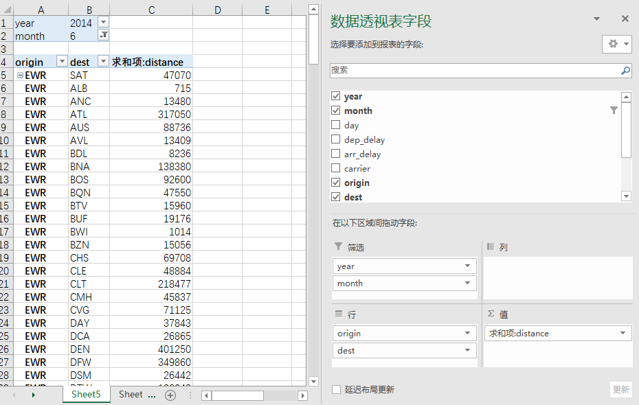

# data.table


data.table包是我最常用的R包，是我目前觉得最好用的数据处理包。我简单接触过python，julia两种语言，并没有深入比较，所以我这个好用的印象仅仅是一家之言。

data.table包是我用了较长一段时间tidyverse系列后发现的“数据处理包”。已经忘记最初是什么吸引了我，我猜测可能是“大数据处理利器”之类的标签吸引了我，因为我喜欢“快”。但是和大部分人可能不同的是，初次接触时，语法的“怪异”并没有给我带来多少麻烦，因为我本来就没有编程基础以及很深的R语言基础。所以我死记硬背一些常用的用法，尤其喜欢拿Excle的一些用法参照，去实现Excle上面的部分操作，从读取、增、改、删除、筛选、计算列等常规操作入手。慢慢熟悉data.table语法之后，将会享受data.table带来的便利，其简洁的语法以及高效的计算速度（相比tidyverse系列）。

另外，Python中也有该包，目前正在积极开发中，期待ing，毕竟python也是很好用，在不同需求下选择不同的语言实现功能。

官方关于data.table的基础介绍请参阅:

https://cran.r-project.org/web/packages/data.table/vignettes/datatable-intro.html


## 基础介绍

### 基本格式

```{r eval=FALSE}
DT[i, j, by]
##   R:                 i                 j        by
## SQL:  where | order by   select | update  group by
```

data.table个人理解主要有三大类参数,i 参数做筛选,j参数做计算,by参数做分组.拿Excel透视表类别,i位置参数当作『筛选』,by位置用来做汇总字段『行』,j位置当作『值』,如下所示:


1.代码实例

代码求2014年6月,从各始发机场到各目的机场的飞行距离求和.

```{r}
library(data.table)
flights <- fread("./data/flights.csv")
flights[year==2014 & month==6,.(求和项distance=sum(distance)),by=.(origin,dest)]
```

2.代码解释

i 的部分：条件year==2014 和 month==6 ;

j 的部分：求和项distance=sum(distance)，写在.()中或者list()中；

by 的部分.(origin,dest),重点是写在.()中,和Excel透视表一一对应。


至于为什么要用.()包裹起来，最开始默认为格式强制要求。就这个问题我想说：大部分人可能觉得是比较“怪异”的用法，并且不理解，从而可能留下data.table不好用，很古怪的印象，但是我觉得任何东西存在即合理，你学一个东西总得接受一些你可能不认可的东西，这样可能才是真正的学习，就像拿Python来做数据分析，我刚开始觉得pandas很难用，很反人类，但是后来知道python代码可以直接打包封装成exe后，觉得真香，说这么多主要是想表达我们学会挑选合适的工具用，适应它，用好它就可以了。


## i j by 使用

使用data.table处理数据，首先第一步是获取数据，data.table中自带读取数据的函数fread函数。接下来我们就用该函数读取数据演示i,j,by的简单使用。

### 读取数据

data.table 包读取数据主要用fread 函数,在我实际工作中接触的数据大部分以数据库,csv,Excel形式存在.fread 函数可以直接读取CSV格式文件,无论是本地文件或者在线文件.

本文会照搬很多官方关于data.table的demo.

```{r}
library(data.table)
input <- if (file.exists("./data/flights.csv")) {
   "./data/flights.csv" #本地文件
} else {
  "https://raw.githubusercontent.com/Rdatatable/data.table/master/vignettes/flights.csv" #在线文件需翻墙
}
flights <- fread(input) #具体参数请参照文档  实际工作中可能会用到的encoding参数,编码 encoding='UTF-8'

head(flights)

```

本文读取本地文件,如果该数据集下载失败,可更改地址为(http://www.zhongyufei.com/datatable/data/flights.csv)

```{r eval=FALSE}
flights <- fread("http://www.zhongyufei.com/datatable/data/flights.csv")
```


数据集记录的是 2014 年,纽约市3大机场(分别为:JFK 肯尼迪国际机场、 LGA 拉瓜迪亚机场,和 EWR 纽瓦克自由国际机场)起飞的航班信息。

具体的记录信息(特征列)，包括起飞时间、到达时间、延误时长、航空公司、始发机场、目的机场、飞行时长，和飞行距离等。


### 行筛选

行筛选是一种很常见的数据操作行为，类似我们Excel中的筛选，即按照一定条件筛选符合要求的数据。条件筛选一般分为单条件筛选、多条件筛选；
在筛选时涉及到条件判断，R语言中常用的条件判断分为逻辑运算、关系运算。常用的关系运算符 >、 <、==、!=、>=、<=分别代表大于、小于、等于、不等于、大于等于、小于等于。常用的逻辑运算符 &、|、！等。


```{r eval=FALSE}
#单条件筛选
filghts[year == 2014] #筛选year==2014
#多条件筛选 用 & 链接
flights[ year == 2014 & month == 6] 
# | 相当于中文条件或 
flights[ month == 5 | month == 6] 
# %in% 类似sql中in用法
flights[month %in% c(1,3,5,7,9)] 
# %between% 类似sql中between and 用法
flights[month %between% c(1,7)]
```

### 列筛选

数据集较大字段较多时，由于无效信息较多可以做适当精选，这时需要我们筛选列。与sql中的select用法一致，即保留想要的字段。.()或list()是data.table中的比较特殊的实现列筛选的用法。常规数字索引，字符向量索引同样有效。

```{r}
#注意前面的. .()
flights[,.(year,month,day,dep_delay,carrier,origin)] 
# flights[,list(year,month,day,dep_delay,carrier,origin)]  same above

# not run
# flights[,1:3]

# not run
# flights[,c('year','month','day')]
```

setcolorder函数可以调整列的顺序，将常用的字段信息排在前面可以用过该函数实现。

```{r}
# not run
# setcolorder(x = flights,neworder = c( "month","day","dep_delay" ,"arr_delay","carrier" )) 
# 按照指定列顺序排序 其余字段保持不变,不是建立副本,是直接修改了flights 数据的列顺序
```


### 行列筛选总结

行筛选在 i 的位置上进行, 列筛选在 j 的位置上进行;data.table中j的位置比较灵活多变，但是i的位置大部分时候都是进行条件筛选。我们通过上述的行列筛选已经大概知道data.table中i,j的用法。也就是我们常规数据清洗过程中的数据筛选过程，筛选符合要求的数据记录。

```{r}

dt <- flights[ year == 2014 & month == 6 & day >=15,.(year,month,day,dep_delay,carrier,origin)] 
head(dt)

```


### j 常规计算

根据最开始的Excel透视表截图，我们想要获得如截图一样的结果该怎么实现呢？代码如下：

```{r,eval=FALSE}
flights[year==2014 & month==6,.(求和项distance=sum(distance),平均距离=mean(distance)),by=.(origin,dest)]
```

在i的位置做筛选，j的位置做计算，by指定分组字段。在j的位置可以做各种各样的计算，R中自带的函数，或者是自己定义的函数。

```{r}
myfun <- function(x){
    x^2/2
}
flights[year==2014 & month==6,.(myfun(distance)),by=.(origin,dest)]
```


### by 分组

分组是按照某种分组实现一定条件下某种聚合方式的计算。分组可以是单字段，多字段以及条件字段等。

1.按月分组

```{r}
flights[,.(sum(distance)),by=.(month)]
```

2.多条件分组

```{r}
dt <- flights[,.(sum(distance)),by=.(carrier,origin)]
head(dt)
#可直接重新命名
dt <- flights[,.(sum(distance)),by=.(newcol1 = carrier,newcol2 = origin)]
head(dt)
```


3.按月份是否大于6分组

即得到是否大于6的两类分组

```{r}
dt <- flights[,.(sum(distance)),by=.(month>6)] #by里面可以做计算
head(dt)
```

## 常规操作

### 新增更新列


新增或删除或更新列是我们数据清洗过程中的常规操作，`data.table中`实现该类功能是通过`:=`符号实现。

- 新增

如下所示:新增addcol列，最后的[]是为了显示新增列的数据框,可不增加。

```{r}
#data.table()函数创建data.table数据框
dt <- data.table(col1=1:10,col2=letters[1:10],col3=LETTERS[1:10],col4=1:10)
# 新增列 :=
dt[,addcol:=rep('新列',10)][] #最后的[]是为了显示新增列的数据框,可不增加
#dt[,addcol:=rep('新列',10)] 不会显示返回结果,加上[]会显示返回
# 新增多列
dt[,`:=`(newcol1=rep('newcol1',10),newcol2=rep('newcol2',10))][]
```

- 删除

删除列即将列赋值NULL即可

```{r}
# 删除列
dt[,col1:=NULL][]
# 删除多列
dt[,c('newcol1','newcol2'):=NULL][]
```


- 更新

更新即重新赋值，将现有列参与计算等于是重新赋值，可以看成是更新列。

```{r}
# 更新列
dt[,col1:=11:20][]
# not run 
# 两列间计算 也可以理解为更新
dt[,newcol:=col1/col4]
```


### 排序

当我们清洗数据时，我们需要将数据框排序，我们可以使用`setorder`或`setorderv`函数实现排序。函数是`data.table`包的函数，比base R 中的`order`函数要节省内存。
注意：按照函数文档说法：Note that queries like x[order(.)] are optimised internally to use data.table's fast order。即x[order(.)]这样的用法会被优化为data.table的排序方法。


```{r}
set.seed(45L)
DT = data.table(A=sample(3, 10, TRUE),
         B=sample(letters[1:3], 10, TRUE), C=sample(10))

setorder(DT, A, -B) #将DT按照A、B排序 A 升序,-B降序

# 和上面同样的效果 但是函数变成 setorderv
setorderv(DT, c("A", "B"), c(1, -1))
```


### 行筛选

上文已经大致讲过行筛选，但是行筛选使用有一定的技巧，涉及到运算的快慢。主要是逻辑条件的设置，交集并集之间的差异。除了上文中的关系运算筛选，逻辑运算筛选除外，data.table中还有几个常用的筛选函数。

- 数字向量筛选 

%in%用法与 sql 中 in 用法类似。

```{r eval=FALSE}
# 筛选 %in% 
flights[ hour %in% seq(1,24,2) ]

```

- 字符向量筛选

%chin%用法与 %in% 类似，但仅仅针对字符。

```{r eval=FALSE}
# 字符筛选
flights[ origin %chin% c('JFK','LGA')]
# not run 同上 %chin% 对字符速度筛选速度更快
#flights[ origin %in% c('JFK','LGA')]

```

- between 筛选 

该函数的新特性矢量化挺实用。

```{r}
#between 函数参数
#between(x, lower, upper, incbounds=TRUE, NAbounds=TRUE, check=FALSE)
X <-  data.table(a=1:5, b=6:10, c=c(5:1))
X[b %between% c(7,9)]
X[between(b, 7, 9)] #效果同上
X[c %between% list(a,b)] # 矢量化
```

- like 筛选

%like% 用法与SQL中 like 类似。

```{r}
# %like% 用法与SQL中 like 类似
DT = data.table(Name=c("Mary","George","Martha"), Salary=c(2,3,4))
DT[Name %like% "^Mar"]
```

### 特殊符号

.SD,.BY,.N,.I,.NGRP和.GRP,.SDcols等,只能用在 j 的位置,.N 可以用在 i 的位置.

```{r}
DT = data.table(x=rep(c("b","a","c"),each=3), v=c(1,1,1,2,2,1,1,2,2), y=c(1,3,6), a=1:9, b=9:1)
DT
X = data.table(x=c("c","b"), v=8:7, foo=c(4,2))
X

# 用在i的位置
DT[.N] #取DT最后一行,.N 计数函数
DT[,.N] #DT 共有多少行记录 返回一个整数
DT[, .N, by=x]  #分组计数
DT[, .SD, .SDcols=x:y]  # 选择x 到y 列
#DT[, .SD, .SDcols=c("x","y")] 与上面不一样

DT[, .SD[1]] #取第一行
DT[, .SD[1], by=x] #按x列分组后
DT[, c(.N, lapply(.SD, sum)), by=x] #按照x分组后 行数计数和每列求和
```


## 常用函数

### 排序函数 frank

`frank`和`frankv`函数参数如下：

```{r eval=FALSE}
frank(x, ..., na.last=TRUE, ties.method=c("average",
  "first", "last", "random", "max", "min", "dense"))

frankv(x, cols=seq_along(x), order=1L, na.last=TRUE,
      ties.method=c("average", "first", "random",
        "max", "min", "dense"))
```

官方案例,如下所示:

```{r}
# on vectors
x = c(4, 1, 4, NA, 1, NA, 4)
# NAs are considered identical (unlike base R)
# default is average
frankv(x) # na.last=TRUE
frankv(x, na.last=FALSE)

# on data.table
DT = data.table(x, y=c(1, 1, 1, 0, NA, 0, 2))
frankv(DT, cols="x") # same as frankv(x) from before
frankv(DT, cols="x", na.last="keep")
frankv(DT, cols="x", ties.method="dense", na.last=NA)
frank(DT, x, ties.method="dense", na.last=NA) # equivalent of above using frank
```


* frankv在排序时,NA被认为是一样的,基础base R 中认为不一样.


```{r}
x <-  c(4, 1, 4, NA, 1, NA, 4) 
frankv(x)
rank(x)
```


* 升序降序选择

order参数只能为1或者-1.默认为1代表升序

```{r}
frankv(x,order = 1L)
frankv(x,order = -1L)
```


* 排序方式选择

默认 average,还有dense,random,first,last,max,min等方式。其中dense是紧凑排名，random是随机让相同的随机排列后排名


```{r eval=FALSE}
x <- c(1,1,1,2,3)
frankv(x)  #大小相同 排名相同,下一位排名除以2
frankv(x,ties.method = 'min')  #大小相同 排名相同,取最小排名
frankv(x,ties.method = 'max')  #大小相同 排名相同,取最大排名
frankv(x,ties.method = 'first') #相同大小排名以后往后递增 根据实际情况决定
frankv(x,ties.method = 'dense')
frankv(x,ties.method = 'random')

```

* NA处理

默认是将NA排在最后,NAs是相同的，与base R 不一样。

na.last参数等于TRUE时，缺失值被排最后；如果等于FALSE,放在前面；如果等于NA，将被移除；如果等于"keep",将会保留NA.

```{r}
frankv(c(NA,NA,1,2,3), na.last = TRUE,ties.method = 'first')
frankv(c(NA,NA,1,2,3), na.last = FALSE,ties.method = 'first')
frankv(c(NA,NA,1,2,3), na.last = NA,ties.method = 'first')
frankv(c(NA,NA,1,2,3), na.last = 'keep',ties.method = 'first')
```


### 判断函数

- fifelse

fifelse()类似`dplyr::if_else()`函数,相比base::ifelse() 更快。

```{r}
x <-  c(1:4, 3:2, 1:4,5)
fifelse(x > 2L, x, x - 1L)

fifelse(x > 2L,fifelse(x >= 4L,x + 1L,x),x-1L)
```

- fcase 

与sql中的case when，与dplyr中的`case_when()`函数用法相似。相比fifelse相比，嵌套更加方便。

```{r}
x = 1:10
fcase(
	x < 5L, 1L,
	x > 5L, 3L
)

# not run 两种函数实现方式
fifelse(x > 5,fifelse(x >8,2,1),0)
fcase(
  x > 8,2,
  x > 5,1,
  default = 0
)
```


### 交集 差集 合并


相当于base R 中 union(),intersect(),setdiff() 和setequal() 功能.all参数控制如何处理重复的行,和SQL中不同的是,data.table将保留行顺序.

```{r eval=FALSE}

fintersect(x, y, all = FALSE)
fsetdiff(x, y, all = FALSE)
funion(x, y, all = FALSE)
fsetequal(x, y, all = TRUE)

x <-  data.table(c(1,2,2,2,3,4,4))
x2 <-  data.table(c(1,2,3,4)) # same set of rows as x
y <-  data.table(c(2,3,4,4,4,5))

fintersect(x, y)            # intersect
fintersect(x, y, all=TRUE)  # intersect all

fsetdiff(x, y)              # except
fsetdiff(x, y, all=TRUE)    # except all
funion(x, y)                # union
funion(x, y, all=TRUE)      # union all
fsetequal(x, x2, all=FALSE) # setequal
fsetequal(x, x2)            # setequal all
```

### 连接

两个数据框之间左连,右连等操作,类似数据库中的left_join right_join,inner_join 等函数.

键入?merge()查看函数帮助,data.table 包中和base R 中都有merge 函数,当第一个数据框是data.table格式时启用data.table::merge(). 

```{r eval=FALSE}
?merge()
merge(x, y, by = NULL, by.x = NULL, by.y = NULL, all = FALSE,
all.x = all, all.y = all, sort = TRUE, suffixes = c(".x", ".y"), no.dups = TRUE,
allow.cartesian=getOption("datatable.allow.cartesian"),  # default FALSE
...)
```

x.y为连个数据框,当两个数据框连接字段相同时,用by=c('','')连接,不同时采用,by.x=,by.y= ,all,all.x,all.y等参数决定连接方式,sort 默认为排序,当不需要排序时更改参数,allow.cartesian=是否允许笛卡尔,默认不允许,当需要时设置为TURE.


### 透视表功能

主要是两个函数`dcast`以及`melt`实现长宽转换，实现Excel中部分透视表功能。具体的函数参数请自行查阅文档。

- dcast函数能实现长转宽

参数如下：fun.aggregate函数指定聚合函数，value.var参数指定参与聚合的字段。formula指定聚合维度，格式用x+y~z，其中x,y在行的位置，z在列的位置。

```{r eval=FALSE}
dcast(data, formula, fun.aggregate = NULL, sep = "_",
    ..., margins = NULL, subset = NULL, fill = NULL,
    drop = TRUE, value.var = guess(data),
    verbose = getOption("datatable.verbose"))
```

示例如下：


```{r}
dt <- data.table(分公司=rep(c('华东','华南','华西','华北'),1000),
              季度=rep(c('一季度','二季度','三季度','四季度'),1000),
              销售额=sample(100:200,4000,replace = TRUE))
dcast(dt,分公司~季度,value.var = "销售额",fun.aggregate = sum)
```

从版本V1.9.6起可以同时对多个值实现不同聚合后的长转宽。

fun参数即 fun.aggregate的简写，可以是自定义的函数。


```{r}
dt <-  data.table(x=sample(5,20,TRUE), y=sample(2,20,TRUE),
                z=sample(letters[1:2], 20,TRUE), d1 = runif(20), d2=1L)
dcast(dt, x + y ~ z, fun=list(sum,mean), value.var=c("d1","d2"))
dcast(dt, x + y ~ z, fun=list(sum,mean), value.var=list("d1","d2")) #注意value.var是向量和列表时的区别
```


- melt函数实现宽转长

```{r eval=FALSE}
melt(data, id.vars, measure.vars,
    variable.name = "variable", value.name = "value",
    ..., na.rm = FALSE, variable.factor = TRUE,
    value.factor = FALSE,
    verbose = getOption("datatable.verbose"))
```

示例如下:

```{r}
ChickWeight = as.data.table(ChickWeight)
setnames(ChickWeight, tolower(names(ChickWeight)))
DT <- melt(as.data.table(ChickWeight), id=2:4) # calls melt.data.table
DT
```


### 非重复计数

`uniqueN`相当于`length(unique(x))`,但是计算更快，内存效率更高。

```{r}
x <-sample(1:10,50,replace = TRUE)
uniqueN(x)

DT <- data.table(A = rep(1:3, each=4), B = rep(1:4, each=3),
                 C = rep(1:2, 6), key = "A,B")

uniqueN(DT, by = key(DT))
uniqueN(DT)
```

### rleid

该函数根据分组生成长度列。

即将0011001110111101类似这种分组成1 1 2 2 3 3 4 4 4 5 6 6 6 6 7 8。在特定时候是很便捷的一个函数。如在计算股票连续上涨或下跌天数时。

```{r}
rleid(c(0,0,1,1,0,0,1,1,1,0,1,1,1,1,0,1))
```

参数如下所示：

```{r eval=FALSE}
rleid(..., prefix=NULL)
rleidv(x, cols=seq_along(x), prefix=NULL)
```

```{r}
DT = data.table(grp=rep(c("A", "B", "C", "A", "B"), c(2,2,3,1,2)), value=1:10)
rleid(DT$grp) # get run-length ids
rleidv(DT, "grp") # same as above
rleid(DT$grp, prefix="grp") # prefix with 'grp'
```

### shift

向前或向后功能,通俗来说就是像前或向后移动位置。示例如下：

```{r}
x = 1:5
# lag with n=1 and pad with NA (returns vector)
shift(x, n=1, fill=NA, type="lag")
```

其中参数n控制偏移量，n正负数和type的参数相对应。, n=-1 and type='lead' 与 n=1 and type='lag'效果相同。

在data.table上使用：

```{r}
DT = data.table(year=2010:2014, v1=runif(5), v2=1:5, v3=letters[1:5])
cols = c("v1","v2","v3")
anscols = paste("lead", cols, sep="_")
DT[, (anscols) := shift(.SD, 1, 0, "lead"), .SDcols=cols]
```

## 运用

### 自定义函数计算

1.自定义函数处理列

按照自定义函数计算修改单列或多列

```{r}
# 测试函数

fun <- function(x){
  x <- x^2+1
}

DT <-  data.table(x=rep(c("b","a","c"),each=3), v=c(1,1,1,2,2,1,1,2,2), y=c(1,3,6), a=1:9, b=9:1)

DT[,.(newcol=fun(y)),by=.(x)]

#Not run
#DT[,lapply(.SD,fun),.SDcols=c('y','a'),by=.(x)] #多列参与计算


# 批量修改列
#Not run

# myfun <- function(x){
#   return(x)
# }
# 
# dt <- dt[,colnames(dt):=lapply(.SD[,1:ncol(dt)],myfun)] #很重要的用法

```


### 带汇总的聚合运算

按照by的字段级别汇总.

1. rollup

分组聚合后设置id=TRUE将各个级别的汇总显示清晰,当by字段只有一个是和正常聚合计算没有区别.以下是官方案例.

```{r}
#Usage
#rollup(x, j, by, .SDcols, id = FALSE, ...)
n = 24L
set.seed(25)
DT <- data.table(
    color = sample(c("green","yellow","red"), n, TRUE),
    year = as.Date(sample(paste0(2011:2015,"-01-01"), n, TRUE)),
    status = as.factor(sample(c("removed","active","inactive","archived"), n, TRUE)),
    amount = sample(1:5, n, TRUE),
    value = sample(c(3, 3.5, 2.5, 2), n, TRUE)
)
rollup(DT, j = sum(value), by = c("color","year","status")) # default id=FALSE
#rollup(DT, j = sum(value), by = c("color","year","status"), id=TRUE)
```


个人运用,实际工作中常常需要汇总项,汇总项在Excel透视表中很简单,在R中我之前是构造重复的数据源聚合汇总出现汇总项,极大浪费内存,运算速度减慢.


* 新方法 rollup

```{r}
set.seed(25)
N <- 1000
dt <- data.table(col1=sample(LETTERS[1:5],N,replace = T),col2=sample(letters[1:5],N,replace = T),num=1:N)

rollup(dt,j=c(list(sum(num))),by=c('col1','col2'))
#同上 添加汇总项名称 total
#rollup(dt,j=c(list(total=sum(num))),by=c('col1','col2'))
#添加id=TRUE参数,多出的grouping 列显示聚合级别
#rollup(dt,j=c(list(total=sum(num))),by=c('col1','col2'),id=TRUE)
```

2.groupingsets

按照指定字段聚合.包作者说相同与SQL中的 GROUPING SETS 操作.详情参照[postgresql](http://www.postgresql.org/docs/9.5/static/queries-table-expressions.html#QUERIES-GROUPING-SETS)


```{r}
res <- groupingsets(DT, j = c(list(count=.N), lapply(.SD, sum)), by = c("color","year","status"),
             sets = list("color", c("year","status"), character()), id=TRUE)
head(res)
```

注意groupingsets函数中sets参数,用list()包裹想要聚合的字段组合,最后还有一个character(),加上该部分相当于全部聚合.当by只有一个字段时,相当于汇总.用法类似sql中"()".


```{r eval=FALSE,echo=FALSE}
library(DBI)
con <- dbConnect(odbc::odbc(), .connection_string = "Driver={SQL Server};server=Vega;database=ghzy;uid=zhongyf;pwd=Zyf123456;", timeout = 10)
```


上述语句结果等同于下面sql.

```{sql eval=FALSE}
select color ,year, status,count(*) count,sum(amount) amount,sum(value) value 
FROM dbo.DT
GROUP BY
GROUPING SETS(
(color),
(year,status),
() ---- 类似 character()
)
```

最后还有cube()函数,可?cube查看用法


### 行列转变

* 一列变多行

用tstrsplit()函数实现

```{r}
n <- 10
dt <- data.table(name=LETTERS[1:n],char=rep('我-爱-R-语-言'),n)
res <- dt[,.(newcol=tstrsplit(char,'-')),by=.(name)]
head(res)
```

* 多行变一列

```{r}
res[,.(char=paste0(newcol,collapse = '-')),by=.(name)]
#同上
#res[,.(char=stringr::str_c(newcol,collapse = '-')),by=.(name)]
# A	我-爱-R-语-言			
# B	我-爱-R-语-言			
# C	我-爱-R-语-言			
# D	我-爱-R-语-言			
# E	我-爱-R-语-言			
# F	我-爱-R-语-言			
# G	我-爱-R-语-言			
# H	我-爱-R-语-言			
# I	我-爱-R-语-言			
# J	我-爱-R-语-言
```

