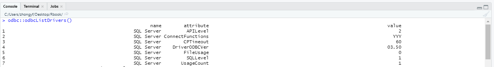
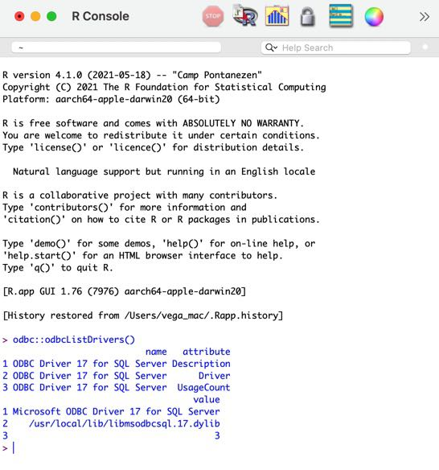
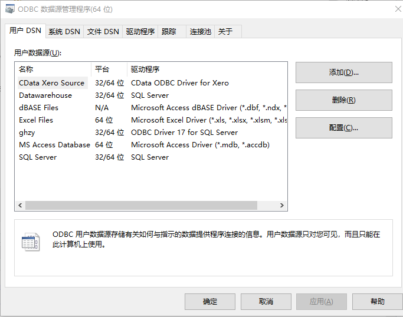

# database {#database}


我们作为数据分析师有必要和数据库打交道吗？实际工作中，数据量达到一定的程度，当你开始需要使用 Excel PowerPivot 做数据透视表[^PowerPivot]时，你就必须开始和数据库打交道，因为这时数据源超过Excel上限了，已经没办法承接。

[^PowerPivot]:PowerPivot 是一种数据建模技术，用于创建数据模型，建立关系，以及创建计算。 可使用 PowerPivot 处理大型数据集，构建广泛的关系，以及创建复杂（或简单）的计算，这些操作全部在高性能环境中和所你熟悉的 Excel 内执行。


现实中的数据大部分都是脏数据，我们需要从数据库获取数据并清洗，再使用R、 Excel 、Power BI、tebleau等工具连接使用。那我们使用什么工具完成ETL[^ETL]呢？经过实践发现，使用R语言完成该过程对我们个人用户来说足够使用。

[^ETL]:Extract-Transform-Load,将数据从来源端经过抽取（extract）、转换（transform）、加载（load）至目的端的过程。


即使你暂时没有接触使用数据库，也建议你未来用数据库存储数据，尤其是当有一定数据量时;在我最开始接触数据时，数据一般保存在Excel中,那时候数据量大概在50万行左右，当表格中sumifs等公式较多时，Excel表格将会很卡顿，甚至发送崩溃。当需要大批量vlookup时，在Excel中操作也是一件很痛苦的事情。


目前工作中打交道数据库主要是MSSQL,Oracle,MySQL等，R中与数据库交互的包主要有odbc,DBI,RODBC,RMySQL,ROracle等包。本文主要从以上数据库介绍记录“R与数据库的连接交互”，主要分为：


- 安装 SQL Server 数据库

- odbc 包介绍

- DBI 包介绍

- 其它R包介绍

- 与数据库交互常见问题

- dbplyr 包介绍

- 参考资料


> DBI库在查询或上传工作中效率比RODBC高,特别数据量较大时,上传效率差异巨大,具体[差异](https://github.com/r-dbi/odbc)请点击查看详情。所以建议采用DBI包，但是RODBC对中文支持友好，在练习阶段可以尝试使用，加深印象。

> RSQLite是练习使用R中的数据库的最简单方法，因为程序包本身包含[SQLite](https://www.sqlite.org/index.html)，无需任何外部软件。


## 安装数据库 {#database:install}

如果暂时没有数据库使用经验，如果是使用Windows系统，直接去微软官网下载安装数据库即可。如果决定用R做数据分析相关工作，尤其时商业环境下，使用数据库有较强的必要性。安装数据库后，利用数据库做数据分析的练习测试也是不错的体验,另外也可以积累ETL相关经验。

仅简单介绍 MS SQL Server 安装

- Win环境下安装

MS[下载](https://www.microsoft.com/zh-cn/sql-server/sql-server-downloads)，选择开发版或精简版(Developer、Express)其中一个版本下载即可。


成功下载后，按照提示一步步确认即可安装成功。另外使用`SSMS`工具，微软配套的MS SQL SERVER数据库链接工具连接数据库。至于详细的数据库配置尤其是远程连接、账户等信息请自行查阅相关资料。

- Linux环境下安装

[官网安装指南](https://docs.microsoft.com/zh-cn/sql/linux/sql-server-linux-setup?view=sql-server-ver15)

以下用于 SQL Server 2019 的命令指向 Ubuntu 20.04 存储库。 如果使用的是 Ubuntu 18.04 或 16.04，请将以下路径更改为 /ubuntu/18.04/ 或 /ubuntu/16.04/，而不是 /ubuntu/20.04/。


```{bash eval=FALSE}
# 导入公共存储库的密钥
wget -qO- https://packages.microsoft.com/keys/microsoft.asc | sudo apt-key add -

# 为 SQL Server 2019 注册 Microsoft SQL Server Ubuntu 存储库
sudo add-apt-repository "$(wget -qO- https://packages.microsoft.com/config/ubuntu/20.04/mssql-server-2019.list)"

# sudo add-apt-repository "$(wget -qO- https://packages.microsoft.com/config/ubuntu/18.04/mssql-server-2019.list)"

# 安装 SQL Server
sudo apt-get update
sudo apt-get install -y mssql-server

# 验证服务是否运行
systemctl status mssql-server --no-pager
```

至于其他安装如sql server 命令行工具请[查阅官网安装](https://docs.microsoft.com/zh-cn/sql/linux/quickstart-install-connect-ubuntu?view=sql-server-linux-ver15&preserve-view=true)。


接下来我们就R语言与数据库的交互包展开介绍。


## odbc包{#database:odbc-package}

官方说明:The goal of the odbc package is to provide a DBI-compliant interface to Open Database Connectivity (ODBC) drivers. This allows for an efficient, easy to setup connection to any database with ODBC drivers available, including SQL Server, Oracle, MySQL, PostgreSQL, SQLite and others. The implementation builds on the nanodbc C++ library。

odbc可以运用于包括(SQL Server, Oracle, MySQL,PostgreSQL,SQLite)等odbc驱动程序于`DBI`兼容的接口，相比起来`DBI`包适用范围更广。

[odbc项目地址](https://github.com/r-dbi/odbc)

### 安装包

- Windows

Windows与ODBC库捆绑在一起，但是每个数据库的驱动程序需要单独安装。windows系统上可以通过以下命令直接安装。

```{r eval=FALSE}
#安装包
install.packages('odbc')
```


- 其它系统

其它系统在安装前需要安装依赖环境，如下所示:

```{bash eval=FALSE}
 # Macos
 brew install unixodbc
 
 # Debian /Ubuntu
 apt-get install unixodbc unixodbc-dev
```

### 驱动安装

由于Win系统绑定ODBC库，不需要安装依赖环境即可正常安装使用R包odbc，其它系统经过上面依赖环境安装，现在系统已经能正常安装odbc包。

最后通过`odbc::odbcListDrivers()`查看系统上是否存在可用驱动程序。


查看可用系统可用驱动：

```{r}
head(odbc::odbcListDrivers())
```


1.Windows

默认情况下，win系统即使不安装也可使用驱动"SQL Server",如下所示：



如果想要安装最新的SQL Server驱动，该如何安装呢?具体安装教程请查看微软[安装说明](https://docs.microsoft.com/zh-cn/sql/connect/odbc/download-odbc-driver-for-sql-server?view=sql-server-ver15)

win系统最新的SQL Server驱动[ODBC Driver 17 for SQL Server下载地址](https://download.microsoft.com/download/2/c/c/2cc12eab-a3aa-45d6-95bb-13f968fb6cd6/zh-CN/17.7.2.1/x64/msodbcsql.msi)

其它系统上如果安装sql server驱动请参照[安装说明](https://docs.microsoft.com/zh-cn/sql/connect/odbc/download-odbc-driver-for-sql-server?view=sql-server-ver15)

2.Macos

Macos安装驱动

```{bash eval=FALSE}
brew install unixodbc

# Microsoft SQL Server ODBC Drivers (Recommended)
brew tap microsoft/mssql-release https://github.com/Microsoft/homebrew-mssql-release
brew update
brew install msodbcsql17 mssql-tools
```

成功安装后如下所示:



### 连接数据库

连接数据库需要注意时区、编码，尤其是涉及到时间时区时如果设置有误，可能导致时间数据错误。当你在Win系统上连接Sql Server时，如果你使用的数据库是中文环境时，设置`encoding`参数中文将不会乱码。如果是linux上通过odbc连接SqlServer,一般情况下可以不用设置编码，另外设置encoding为gbk会报错。

数据库连接有几种方式，详情请参照[数据库连接字符串](https://www.connectionstrings.com/),我们以SQL Server2019数据库，驱动`ODBC Driver 17 for SQL Server`举例。

1.标准模式

连接字符串

```{bash eval=FALSE}
Driver={ODBC Driver 17 for SQL Server};Server=myServerAddress;Database=myDataBase;UID=myUsername;PWD=myPassword;
```

参数形式:

```{r eval=FALSE}
con <- odbc::dbConnect(drv=odbc(),driver="ODBC Driver 17 for SQL Server",server='172.16.88.2',database='spb',uid='zhongyf',pwd='Zyf123456',encoding='UTF-8',timezone="Asia/Shanghai")
```

字符串形式：

```{r eval=FALSE}
con <- odbc::dbConnect(drv = odbc(),.connection_string='Driver={ODBC Driver 17 for SQL Server};Server=172.16.88.2;Database=spb;UID=zhongyf;PWD=Zyf123456;',encoding='UTF-8',timezone="Asia/Shanghai")
```

2.信任连接

通过windows身份认证连接，通过数据库管理员配置相关账户权限即可。

```{bash eval=FALSE}
Driver={ODBC Driver 17 for SQL Server};Server=myServerAddress;Database=myDataBase;Trusted_Connection=yes;
```


```{r eval=FALSE}
library(odbc)
con <- odbc::dbConnect(odbc(),
  Driver = "SQL Server", Server = "Vega", Database = "ghzy",
  Trusted_Connection = "True"
)

```

3.连接SQL Server实例[^SQLServer实例]

```{bash eval=FALSE}
Driver={ODBC Driver 17 for SQL Server};Server=serverName\instanceName;
Database=myDataBase;Trusted_Connection=yes;
```


[^SQLServer实例]:在一台计算机上可以安装多个SQL Server,每个SQL Server就是一个实例，实例分为默认实例和命令实例。

4.非标准端口

SQL Server数据库的默认端口是1433，连接非标端口字符串如下所示：

```{bash eval=FALSE}
Driver={ODBC Driver 17 for SQL Server};Server=myServerName,myPortNumber;Database=myDataBase;UID=myUsername;PWD=myPassword;
```


通过配置DSN也可连接数据库，但是这样写的脚本在同事间分享不方便，故不推荐。

win10开始-->运行 打开ODBC数据源(64) 配置。




```{r eval=FALSE}
con <- dbConnect(odbc::odbc(), dsn="ghzy")
dbGetInfo(con) #查看连接信息


$dbname
[1] "spb"

$dbms.name
[1] "Microsoft SQL Server"

$db.version
[1] "12.00.5203"

$username
[1] "dbo"

$host
[1] ""

$port
[1] ""

$sourcename
[1] "ghzy"

$servername
[1] "personalSQL"

$drivername
[1] "msodbcsql17.dll"

$odbc.version
[1] "03.80.0000"

$driver.version
[1] "17.05.0002"

$odbcdriver.version
[1] "03.80"

$supports.transactions
[1] TRUE

$getdata.extensions.any_column
[1] FALSE

$getdata.extensions.any_order
[1] FALSE

attr(,"class")
[1] "Microsoft SQL Server" "driver_info"          "list"   
```


### 读写数据库

1.查询

`odbc::dbGetQuery()`函数执行sql语句并返回数据

```{r  eval=FALSE}
dt <- odbc::dbGetQuery(con,'select * from DT')
head(dt)
```


2.写入数据库

```{r eval=FALSE}
odbc::dbWriteTable(con,name = '表名',value = dt,overwrite = T ) # 是否覆盖
odbc::dbWriteTable(con,name = '表名',value = dt,append = T ) # 是否追加
```

由于odbc包的函数都是DBI中一些函数的实现，我们将其它的一些函数放在接下来的DBI包中讲解。


综上，我们使用odbc包主要是作为连接[开放式数据库](https://docs.microsoft.com/zh-cn/sql/odbc/microsoft-open-database-connectivity-odbc?view=sql-server-ver15)(odbc)中介使用。


## DBI包{#database:DBI-package}

R包DBI将与DBMS[^DBMS]的连接分为“前端”和“后端”，DBI定义了一个由DBI后端实现的接口,接口定义了一些类和方法,支持以下一些操作：

- 连接/断开与DBMS的连接
- 在DBMS中创建和执行语句
- 从语句中提取结果


通过DBI可以连接大部分主流关系型数据库，如:PostgreSQL,SQL Server,Oralce,MySQL,SQLite。


[^DBMS]:Database Management System,即数据库管理系统


[DBI介绍](https://dbi.r-dbi.org/)


### 安装

从CRAN安装发行的DBI版本：

```{r eval=FALSE}
install.packages('DBI')
```

从Github安装开发的DBI版本：

```{r eval=FALSE}
# install.packages("devtools")
devtools::install_github("r-dbi/DBI")
```


### 连接数据库

- 连接MS SQL SERVER 

通过以下代码即可连接微软的sql server,服务器172.16.88.2(即IP地址)的数据库，成功连接后即可与数据库交互。

```{r eval=FALSE}
library(DBI)
con <- dbConnect(
  drv = odbc::odbc(), 
  Driver = "SQL Server", 
  server = "172.16.88.2",
  database = "spb", 
  uid = "zhongyf", 
  pwd = "Zyf123456"
)
```


查询数据库编码方式,从而选择连接数据库时相应的编码方式。

```{r eval=FALSE}
con <- dbConnect(
  drv = odbc::odbc(), Driver = "ODBC Driver 17 for SQL Server",
  server = "172.16.88.2", database = "spb", uid = "zhongyf", pwd = "Zyf123456"
)

#查看编码是否是936 代表中文简体
sql <- "SELECT COLLATIONPROPERTY( 'chinese_prc_ci_as', 'codepage' )"

dbGetQuery(con,sql)

# same above
# dbExecute(con,sql)

# 关闭数据库连接
DBI::dbDisconnect(con)
```


- 连接mysql

`MySQL()`函数来源`RMySQL`包，用来创建`<MySQLDriver>`驱动，以下代码可连接到阿里云的MySQL数据库。

```{r eval=FALSE}
library(RMySQL)
con <- dbConnect(MySQL(),
  dbname = "test", user = "test_admin", password = "30HL1234M7#￥lD6gxjB",
  host = "prd-public-mypersonal.mysql.test.zhangjiabei.rds.aliyuncs.com"
)
```

或者通过本地已安装驱动连接数据库

```{r eval=FALSE}
con <- DBI::dbConnect(odbc::odbc(),
  Driver = "MySQL ODBC 8.0 Unicode Driver",
  Server = "localhost", UID = "root", PWD = "123456", Database = "mysql",
  Port = 3306
)

```

mysql数据库默认端口是3306,访问不通时记得检查3306端口是否开放。


- 连接oracle

由ROracle包构造驱动。

```{r eval=FALSE}
library(ROracle)
drv <-dbDriver("Oracle")
connect.string <- '(DESCRIPTION =
                    (ADDRESS = (PROTOCOL = TCP)(HOST = 192.16.88.129)(PORT = 1521))
                  (CONNECT_DATA =
                      (SERVER = DEDICATED)
                    (SERVICE_NAME = bidev)
                  ))' #连接字符串

con <- dbConnect(drv,username = "query", password = "query",dbname = connect.string)
```


### 读写数据库


dbGetQuery()函数查询数据并直接返回,dbExecute()执行sql语句，是`dbSendStatement()`的封装。

```{r dbi-read-write,eval=FALSE}
# dbGetQuery 直接查询
res_table <- dbGetQuery(con,'select * from table') #直接获取sql查询结果

#dbReadTable直接读取
dbReadTable(con,'tbl_name') #直接读取数据库中某表

# dbSendQuery 执行一个查询任务 
res <- dbSendQuery(conn = con,statement = 'select * FROM tab')
dbFetch(res)
dbClearResult(res)

# dbExecute
dbExecute(con,'delete from table where num <=1000') # 执行sql语句

# dbWriteTable()
# 上传数据,指定表名,需上传的数据框df,overwrite是否覆盖,append是否可追加
dbWriteTable(conn = con,name = '表名',value = df,overwrite=TURE,append=FALSE)
```

参数化查询


```{r}
library(DBI)
con <- dbConnect(RSQLite::SQLite(), ":memory:")
dbWriteTable(con, "iris", iris)

iris_result <- dbSendQuery(con, "SELECT * FROM iris WHERE [Petal.Width] > ?")
dbBind(iris_result, list(2.3))
dbFetch(iris_result)
dbBind(iris_result, list(3))
dbFetch(iris_result)
dbClearResult(iris_result)
dbDisconnect(con)
```

实际运用中，我们从数据库(SQL Server)查询不同订单周期时的销售数据：


```{r eval=FALSE}
con <- dbConnect(odbc::odbc(), .connection_string = "driver={ODBC Driver 17 for SQL Server};server=172.16.88.2;database=test;uid=zhongyf;pwd=Zyf123456", timeout = 10)

result <- dbSendQuery(con, "SELECT * FROM sales_order WHERE [单据日期] between ? and ? ") # ?在本处是占位符
dbBind(result,params = list('2021-01-01','2021-01-05'))
dbFetch(result)

dbBind(result,params = list('2021-05-01','2021-05-05'))
dbFetch(result)
dbClearResult(result)
```

>以上方式可以实现参数化查询，减少代码量，但是由于查询速度相比`dbGetQuery()`较慢，我一般不采用。
> 关于sql语句中?的用法请自行查阅?dbBind()。DBI当前未指定占位符格式,将来可能会支持统一的占位符语法


### 其它函数介绍

查看数据库信息,查看表名,删除表，关闭连接等常用操作.

```{r else-functions,include=FALSE}
library(nycflights13)
library(DBI)
con <- dbConnect(RSQLite::SQLite(), ":memory:")
dbWriteTable(con,'测试表',iris)
dbWriteTable(con,'flights',flights)
```


- 查看数据库信息

```{r}
dbGetInfo(con)
```

- 数据库读写权限

返回连接账户是否只有只读权限。

```{r}
dbIsReadOnly(con)
```

- 查看全部表名

win下SQL Server中文表名会乱码

```{r}
dbListTables(con) 
```

- 读取表

```{r}
dt <- dbReadTable(con,'测试表')
head(dt)
```

- 查询

```{r}
rs <- dbSendQuery(con, "SELECT * from flights limit 100 ")
dt <- dbFetch(rs)
head(dt)
dbClearResult(rs) # 记得清除结果
```


- 是否存在表

```{r}
dbExistsTable(con,'测试表') 
```

- 创建表

```{r eval=FALSE}
con <- dbConnect(RSQLite::SQLite(), ":memory:")
dbCreateTable(con, "iris", iris)
dbAppendTable(con, "iris", iris)
dbReadTable(con, "iris")
dbDisconnect(con)
```


- 删除表

```{r}
dbRemoveTable(con,'测试表')
# same above
# dbExecute(con,'delete from 测试表')
```

- 是否有效

```{r eval=FALSE}
dbIsValid(con)

rs <- dbSendQuery(con, "SELECT * from flights")
dbIsValid(rs)
dbClearResult(rs)
dbIsValid(rs)
```

- 执行任务

执行语句,返回受影响的行数。

```{r eval= FALSE}
dbExecute(conn, statement, ...)
dbExecute(con,'delete from 测试表')
```


- 关闭连接

在完成连接后，最后关闭连接。

```{r}
dbDisconnect(con)
```


通过学习odbc,DBI包，我们已经对R与数据库交互有一定了解。连接数据库并返回我们查询的结果，最后上传数据到数据库中，以上三步能正确使用即可满足我们数据分析师绝大部分需求。但是我们可能会对odbc与DBI的关系感到困惑,由于我并不太了解数据库，仅谈谈自己的理解，不一定正确。

> 以上三步，配合R的定时任务，可以完成ETL(Extract-Transform-Load).

odbc提供了与odbc类数据库的连接方式，odbc基于DBI包，我们在安装odbc包时会自动安装DBI包。odbc负责连接odbc类数据库，DBI提供后端服务，换句话说odbc连接数据库，其它的交互通过DBI包完成。通过比较以下连接方式来理解：

```{r eval=FALSE}
# 方式一  odbc 
con <- DBI::dbConnect(odbc::odbc(),
  Driver = "MySQL ODBC 8.0 Unicode Driver",
  Server = "localhost", UID = "root", PWD = "123456", Database = "test",
  Port = 3306
)

# 方式二 RMySQL
library(RMySQL)
con <- dbConnect(MySQL(),
  dbname = "test", user = "root", password = "123456",
  host = "localhost"
)
```

方式二与方式一都可以成功连接本地的mysql数据库，方式二是通过RMySQLB包的`MySQL()`功能提供的驱动程序。

但是不同的连接方式可能导致读写效率有明显的差异，详见oracle连接差异。

```{r eval=FALSE}
library(ROracle)
# 方式一
# use ROracle packages connect databse
drv <-dbDriver("Oracle")
connect.string <- '(DESCRIPTION =(ADDRESS = (PROTOCOL = TCP)(HOST = 172.16.88.131)(PORT = 1521))(CONNECT_DATA = (SERVER = DEDICATED)(SERVICE_NAME = ghbi) ))'
con_oracle <- dbConnect(drv,username = "pub_query", password = "pub_query",dbname = connect.string,encoding='utf8')

# 方式二
# use odbc packages connect databse
con_odbc <- dbConnect(odbc::odbc(), .connection_string = "Driver={Oracle in OraClient11g_home1};DBQ=172.16.88.131:1521/ghbi;UID=pub_query;PWD=pub_query;", timeout = 10)

# Oracle in OraClient11g_home1 根据实际驱动更改
# 通过odbc::odbcListDrivers() 查看
```


## 其他R包{#database:else-package}

通过前文了解，以下R包(RODBC除外)的作用仅仅是提供驱动即可，再通过DBI包与数据库交互。


### RODBC包

RODBC包是R语言对ODBC数据库接口的封装,可连接所有的ODBC数据库，但是读写效率较低。


1.安装包

```{r eval=FALSE}
install.packages('RODBC')
```


2.SQL SERVER 数据库举例

```{r eval=FALSE}
library(RODBC)
con <- odbcDriverConnect("driver={SQL Server};server=192.168.2.62;database=dbname;uid=zhongyf;pwd=Zyf123456")
con
RODBC::sqlQuery(con,'select * from test')
```

`

* 怎样安装驱动

请参照[驱动安装](https://github.com/r-dbi/odbc#installation)

ODBC for sql server driver 下载地址[地址](https://docs.microsoft.com/zh-cn/sql/connect/odbc/download-odbc-driver-for-sql-server?view=sql-server-ver15)

3.数据库字符串

请参照[数据库连接字符串](https://www.connectionstrings.com/)


```{r eval=FALSE}
#ODBC Driver 17 for SQL Server
cn <- odbcDriverConnect("Driver={ODBC Driver 17 for SQL Server};Server=localhost;Database=name;UID=username;PWD=123456;") #server 数据库 UID 数据库账户 PWD 数据库账户密码
```

sql server 请参照[sql server连接字符串](https://www.connectionstrings.com/microsoft-odbc-driver-17-for-sql-server/)


### ROracle包


在第一次安装这个包时遇到了很多困难，首先需要安装oracle客户端，其次配置好环境变量，最后安装包。R与Oracle的连接需要安装[Oracle Instant Client](https://www.oracle.com/database/technologies/instant-client.html)，

1. 安装客户端

安装oracle客户端，根据电脑的位数选择相应的32位或64位，根据要连接数据库版本，可以去官网自行下载，本机需要下载的[客户端地址](https://www.oracle.com/technetwork/database/enterprise-edition/downloads/112010-win64soft-094461.html)

2. 配置环境变量

根据自己所使用的系统，配置环境变量

```{bash eval=FALSE}
OCI_INC='D:\app\zhongyf\product\11.2.0\client_1\oci\include'
OCI_LIB64='D:\app\zhongyf\product\11.2.0\client_1\BIN'
```


3. 安装包

安装Roracle包需要配置相应版本的Rtools并添加到环境变量，另外配置两个oracle的环境变量。代码中有注释,按照自己安装版本路径修改。

由于ROracle依赖于Oracle Instant Client,安装之前一定要先安装好客户端。

```{r eval=FALSE}
install.packages('ROracle')
```

4. 连接数据库

`Roracle`可以通过`DBI`包链接，除了驱动和连接字符串有差异，其他部分一样。

```{r eval=FALSE}
library(ROracle)
drv <-dbDriver("Oracle")
connect.string <- '(DESCRIPTION =
                    (ADDRESS = (PROTOCOL = TCP)(HOST = 192.16.88.129)(PORT = 1521))
                  (CONNECT_DATA =
                      (SERVER = DEDICATED)
                    (SERVICE_NAME = bidev)
                  ))' #连接字符串

con <- dbConnect(drv,username = "query", password = "query",dbname = connect.string)
```

5. 乱码问题 

如果连接oracle数据库，中文乱码设置以下环境变量即可，或者在启动文件配置该环境变量。

linux下可以在文件Renviron中添加，记得引号，路径为[/opt/R/4.0.2/lib/R/etc/Renviron]

```{r eval= FALSE}
# 查询数据库编码
select userenv('language') from dual
Sys.setenv(NLS_LANG="SIMPLIFIED CHINESE_CHINA.AL32UTF8")
```

由于ROracle包的安装存在一定难度，具体安装说明可以参考微信公众号-宇飞的世界[R包ROracle安装](https://mp.weixin.qq.com/s/QLwedZ5mTybqSXdHMTGRIw)


### RMySQL包

RMySQL包的主要作用可以提供驱动与mysql数据库进行连接，在本机未安装mysql的驱动的情况下.该包正在逐渐被淘汰，可以使用RMariaDB包替换。

1.安装

Win系统下直接安装即可，其它平台下需提前安装依赖环境。

```{bash eval=FALSE}
#On recent Debian or Ubuntu install libmariadbclient-dev

sudo apt-get install -y libmariadbclient-dev
#On Fedora, CentOS or RHEL we need mariadb-devel:

sudo yum install mariadb-devel
#On OS-X use mariadb-connector-c from Homebrew:

brew install mariadb-connector-c

```

```{r eval=FALSE}
install.packages('RMySQL')
```


2.连接使用

上述连接方式一致，仅仅是指驱动差异

```{r eval=FALSE}
library(RMySQL)
con <- RMySQL::dbConnect(drv = RMySQL::MySQL(),host='localhost',dbname="mysql",username="root",password='123456')
```

`RMariaDB`包与`RMySQL`包用法基本一致，在连接时注意驱动的选择即可。

```{r eval=FALSE}
install.packages('RMariaDB')
library(RMariaDB)
con <- RMySQL::dbConnect(drv = RMariaDB::MariaDB() ,host='localhost',dbname="dbtest",username="root",password='123456')
```

### RSQLite

RSQLite是练习使用R中的数据库的最简单方法，因为程序包本身包含SQLite，无需任何外部软件。

[项目地址](https://rsqlite.r-dbi.org/)

1.安装

```{r eval=FALSE}
install.packages("RSQLite")
```

2.基础用法  

```{r}
library(DBI)
# 在内存中创建一个临时数据库
con <- dbConnect(RSQLite::SQLite(), ":memory:")

dbListTables(con)
```

```{r}
dbWriteTable(con, "mtcars", mtcars)
dbListTables(con)
```

```{r}
dbReadTable(con, "mtcars")
```

```{r}
res <- dbSendQuery(con, "SELECT * FROM mtcars WHERE cyl = 4")
dbFetch(res)
dbClearResult(res)
dbDisconnect(con)
```

基础用法与DBI功能一致。

### 大数据相关R包

- sparklyr <https://spark.rstudio.com/>

- RClickhouse <https://github.com/hannesmuehleisen/clickhouse-r>


#### RClickhouse

按照官网[安装教程](https://clickhouse.tech/docs/en/getting-started/install/)安装。


1.R包安装

```{r eval=FALSE}
install.packages("RClickhouse")
```

2.配置远程连接

[参考资料](https://blog.csdn.net/zhangpeterx/article/details/95059059)

3.安装驱动

[驱动下载](https://github.com/ClickHouse/clickhouse-odbc/releases/tag/2018-05-15)

4.连接

```{r eval=FALSE}
library(RClickhouse)
library(DBI)

# 本地默认连接
con_local <- dbConnect(RClickhouse::clickhouse(), host="localhost", port=9000L, user="default", password="")
dbExecute(con_local,"CREATE DATABASE IF NOT EXISTS tutorial")

# 指定库远程连接
con_remote <- dbConnect(RClickhouse::clickhouse(), host="192.168.2.237", port=9000L, user="default", password="",dbname='tutorial')

```

win系统上配置odbc时，注意ODBC版本，[clickhouse-odbc下载](https://github.com/ClickHouse/clickhouse-odbc/releases)。最初我使用的odbc版本太旧，Excel无法成功连接clickhouse数据库。

clickhouse测试下来，感觉速度也没有特别快，不知道是不是因为我是用的虚拟机测试的原因。另外上传表和常规方式不一样，也挺麻烦，建议先保持观望。


## 常见问题{#database:FAQ}

在使用R包连接数据库时有些常见的问题，整理如下。

### 乱码问题

R中中文乱码问题一直都很麻烦，并且常常遇见，尤其是使用win系统时。

- MS SQL SERVER 乱码

修改encoding参数，在win系统下，可以考虑使用RODBC包连接查询数据库，因为该包将自动转换编码，不会存在乱码问题。但是上传效率奇慢，为了减少包依赖保持代码一致性使用odbc连接数据库时遇到乱码，在连接数据库时设定encoding即可。

```{r eval = FALSE}
# win
con_spb <- dbConnect(odbc(),
  .connection_string =
    "driver={SQL Server};server=172.16.88.2;database=spb;uid=zhongyf;pwd=Zyf123456", 
  timeout = 10, timezone = "Asia/Shanghai", encoding = "gbk"
)

# linux 
con_spb <- dbConnect(odbc(),
  .connection_string =
    "driver={SQL Server};server=172.16.88.2;database=spb;uid=zhongyf;pwd=Zyf123456",
  timeout = 10, timezone = "Asia/Shanghai", encoding = "utf8"
)
```

- MySQL乱码

1.代码修改

```{r eval=FALSE}
#执行查询语句前执行
dbSendQuery(con,'SET NAMES gbk')
```

2.ODBC配置

如果是通过ODBC数据源连接,可通过配置需改,如下所示：


- oracle乱码

linux上通过ROracle连接oracle数据库，中文乱码。可以通过设置环境变量或配置.Renviron文件修改oracle语言环境。

```{r}
Sys.setenv(NLS_LANG="SIMPLIFIED CHINESE_CHINA.AL32UTF8")
```


### 无法连接问题

- SQL Servver无法连接

如果是自己安装配置的数据库，无法通过IP地址连接，可能是没有开启远程连接。

- mysql无法连接

首先需要装mysql的驱动,确保`RMySQL`成功安装 如果是测试自己安装的mysql,可以先用Navicat连接,如果出现Authentication plugin 'caching_sha2_password' cannot be loaded的错误。

可能是由于 mysql8 之前的版本中加密规则是mysql_native_password,而在mysql8之后,加密规则是caching_sha2_password,通过修改加密规则可解决无法连接问题。

```{sql eval=FALSE}

--cmd 登录本地数据
mysql -u root -p
--输入密码
password: 

--执行命令
ALTER USER 'root'@'localhost' IDENTIFIED BY 'password' PASSWORD EXPIRE NEVER;   #修改加密规则 
---ALTER USER 'root'@'%' IDENTIFIED BY 'password' PASSWORD EXPIRE NEVER; 看账号权限注意与上面的区别

ALTER USER 'root'@'localhost' IDENTIFIED WITH mysql_native_password BY 'password'; #更新一下用户的密码 
```


### 远程连接

当你需要远程连接时，需要确保数据库的远程连接已经开启。在数据库中开启某账户远程连接权限,在公司的话，数据库连接问题咨询公司的IT人员。自己个人电脑上安装的MS SQL SERVER数据库需要自行开启远程连接。

另外如果是云服务器上搭建的数据库,需要开启数据库端口，如Mysql默认端口3306;如果是阿里云的Rds数据库,找DBA管理员要数据库地址以及端口信息。


### 跳板机连接

有些数据库是无法外网访问的，需要通过跳板机跳转后后才有权限访问，或者给某公网IP配置权限后才能访问。


- R解决方案

在本地使用[Putty](https://www.putty.org/)或通过R包ssh解决。


```{r eval=FALSE}
library(ssh)
session <- ssh_connect(host = 'user@ip:port',passwd = 'password')
ssh_tunnel(session = session,port = 3306,target = 'ip:port')
```


- python解决方案

```{python eval=FALSE}
import mysql.connector
import sshtunnel

with sshtunnel.SSHTunnelForwarder(
        (_host, _ssh_port),
        ssh_username=_username,
        ssh_password=_password,
        remote_bind_address=(_remote_bind_address, _remote_mysql_port),
        local_bind_address=(_local_bind_address, _local_mysql_port)
) as tunnel:
    connection = mysql.connector.connect(
        user=_db_user,
        password=_db_password,
        host=_local_bind_address,
        database=_db_name,
        port=_local_mysql_port)
    ...
```


关于数据库无法连接的问题，请咨询公司DBA管理人员。


## dbplyr{#database:dbplyr-package}

`dbplyr`将`dplyr`包的函数转化为`SQL`语句去服务器获取数据；在数据量较大、计算较多时，可以将远程连接数据库中的表当作内存中的数据框使用，当本机内存不够大时，这样做的好处不言而喻。

至于为什么使用`dbplyr`而不是直接编写`SQL`,因为：
 
 - `dbplyr`写起来简洁高效，基本跟用`dplyr`没有差别
 
 - 能利用数据库所在服务器的算力，配合上并行计算，在处理大量数据时，大大加快速度。
 
 - 不同数据库的语法存在差异，当源数据存在不同数据库时，用R的`dbplyr`包清洗数据时能加快效率
 
 - 通过`dplyr`动词方便实现复杂的逻辑，当过程越多越复杂时`dbplyr`的优势越明显，不用一层层嵌套语句。 
 

[dbplyr项目介绍](https://dbplyr.tidyverse.org/)

### 安装

dbplyr包是tidyverse系列核心包之一，可以通过安装tidyverse或仅安装dbplyr。

```{r eval=FALSE}
install.packages("tidyverse")

# 从CRAN安装发行版
install.packages("dbplyr")

# 开发版
library(devtools)
devtools::install_github("tidyverse/dbplyr")
```


### 基础用法


```{r eval=FALSE}
library(dplyr)
library(dbplyr)

mf <- memdb_frame(x = 1, y = 2)

mf %>% 
  mutate(
    a = y * x, 
    b = a ^ 2,
  ) %>% 
  show_query()
```


```{r eval=FALSE}
library(dplyr)
#connect database
con <- DBI::dbConnect(RSQLite::SQLite(), path = ":memory:")
# 上传数据
copy_to(con, nycflights13::flights, "flights",
  temporary = FALSE, 
  indexes = list(
    c("year", "month", "day"), 
    "carrier", 
    "tailnum",
    "dest"
  )
)

# 查看库中全部表名
#dbListTables(con)

#tbl()引用表flights

flights_db <- tbl(con, "flights")
flights_db

# 开始查询
flights_db %>% select(year:day, dep_delay, arr_delay)
flights_db %>% filter(dep_delay > 240)
flights_db %>% 
  group_by(dest) %>%
  summarise(delay = mean(dep_time))
```

部分简单不复杂的sql语句可以用dplyr的语法代替.

```{r eval=FALSE}
tailnum_delay_db <- flights_db %>% 
  group_by(tailnum) %>%
  summarise(
    delay = mean(arr_delay,na.rm = T),
    n = n()
  ) %>% 
  arrange(desc(delay)) %>%
  filter(n > 100)
tailnum_delay_db
tailnum_delay_db %>% show_query()
tailnum_delay <- tailnum_delay_db %>% collect() #把数据从数据库加载到R内存中
```


### 无法正确转化


在使用过程中发现无法识别`lubridate`包的函数，但是`dbplyr`对于不认识的函数都将保留。利用这个特性，可以使用数据库中原生的相关函数：如下所示，在Oracle中`to_date`函数。

以下的自定义函数可以实现按照想要`group_by`的字段汇总金额、数量、吊牌额、折扣率等,其中关于时间周期的筛选就利用了该特性。

- date

```{r eval=FALSE}
#个人写的针对目前公司数仓写的包中获取销售数据的一段代码

get_sales_data <- function(con,...,start_date,end_date,brand_name,channel_type = NULL ,area_name = NULL,boss_name = NULL,category_name = NULL,shop_no = NULL){

  store_table <- store(con,brand_name = brand_name,channel_type = channel_type ,area_name = area_name,boss_name = boss_name,shop_no = shop_no) #门店信息
  
  sku_table <- sku(con,category_name =  category_name ) #商品信息
  
  tbl(con, in_schema("DW", "DW_SALE_SHOP_F")) %>% #DW层
    select(BILL_DATE1, SKU_NO, SHOP_NO, BILL_QTY, BILL_MONEY2, PRICE) %>%
    filter(between(
      BILL_DATE1, to_date(start_date, "yyyy-mm-dd"),
      to_date(end_date, "yyyy-mm-dd")
    )) %>%
    mutate(年 = year(BILL_DATE1), 月 = month(BILL_DATE1)) %>%
    inner_join(store_table) %>%
    inner_join(sku_table) %>%
    group_by(...) %>%
    summarise(
      金额 = sum(BILL_MONEY2, na.rm = TRUE),
      数量 = sum(BILL_QTY, na.rm = TRUE),
      吊牌金额 = sum(BILL_QTY * PRICE, na.rm = TRUE)) %>%
    collect() %>%
    mutate(折扣率:= 金额 / 吊牌金额) %>% 
    arrange(...)

  # return(res)
}

```


- like

```{r eval=FALSE}
mf %>% 
  filter(x %LIKE% "%foo%") %>% 
  show_query()
```


- 特殊用法

特殊情况可以使用`sql()`函数

```{r eval=FALSE}
mf %>% 
  transmute(factorial = sql("x!")) %>% 
  show_query()
```


## 参考资料{#database:reference-material}


1.`DBI`包资料 <https://dbi.r-dbi.org/reference/>

2.`dbplyr`包资料 <https://dbplyr.tidyverse.org/>

3.rstudio关于数据库介绍 <https://db.rstudio.com/databases>

4.数据库连接字符串介绍  <https://www.connectionstrings.com/>

5.驱动安装 <https://github.com/r-dbi/odbc#installation>

6.关于Roracle的安装介绍 <https://mp.weixin.qq.com/s/QLwedZ5mTybqSXdHMTGRIw>

7.DBI消息 <https://www.r-consortium.org/blog/2017/05/15/improving-dbi-a-retrospect>