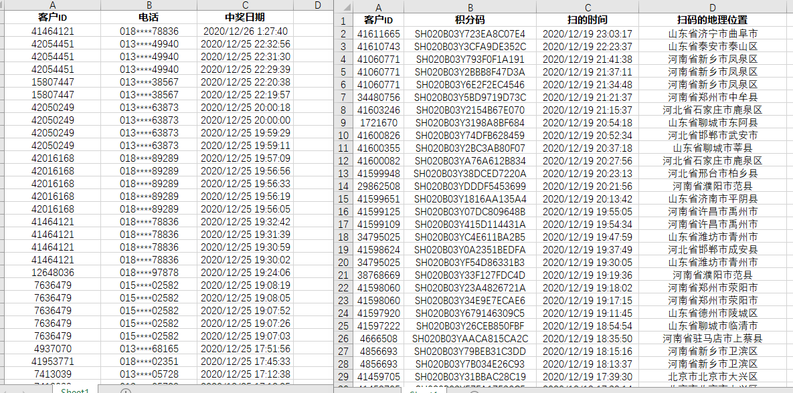

# 时间处理 {#datetime }

时间处理看起来是一件简单的事情，因为我们每天都在使用，但事实上是一件复杂的事情。闰年导致每年的天数并不一致，每天也并不是24小时。可以自行搜索“夏令时”，“为什么一天是24小时”或"Why do we have 24 hours in a day"等问题了解关于时间的概念。

但是我们做数据分析，可能仅需要简单的计算时间，并不是必须了解“时间”。我们大部分时候能处理同环比，间隔天数等常规问题即可。

由于能力有限以及处理的日期数据类型有限，本章节仅就常规商业数据分析中时间处理提供一种解决办法。

本章主要分为三大部分：

- Base R中时间处理函数

- lubridate包提供的日期时间处理方法

- 常规运用以及和Excel的时间系统对比


## base R {#datetime:base-R}

R中内置Date,POSIXct和POSIXlt三个关于日期和时间的类[^类]。


[^类]:类是面向对象编程的一个术语，一个对象通常有0个1个或多个类。在R中用`class()`函数查看所属对象的类。

### Date {#datetime:base-R-date}

如果我们的数据结构中只有日期，没有时间，我们仅需要使用Date类。

```{r}
class(Sys.Date())
```

1.创建日期

```{r}
date1 <- as.Date('2021-05-18')
# as.Date(32768, origin = "1900-01-01")
# date1 <- as.Date('2021-05-18',origin = "1900-01-01")
```

当日期字符不规则时必须指定format参数

```{r}
date2 <- as.Date("5/14/2021",format="%m/%d/%Y")
```

想想如何才将将"2021年5月8日"转换成日期：

```{r}
as.Date("2021年5月18日",format="%Y年%m月%d日")
```

重点是时间的format，详情可以通过`?strptime()`查看。


2.日期计算

两日期之间间隔

```{r}
date1 - date2
difftime(date1,date2,units = 'days')
```

日期加减天数

```{r}
date1 - 4

date2 + 4
```

向量化计算

```{r}
three_date <- as.Date(c('2021-05-01','2021-05-05','2021-05-10'))
diff(three_date)
```

在计算顾客购物间隔天数时比较有用。

3.创建日期向量

```{r}
date3 <- as.Date('2020-01-01')
date4 <- as.Date('2021-01-01')
date_col <- date3:date4
head(date_col)
```

以上方式创建日期向量会数字化，正确方式如下所示:

```{r}
# seq(date3,date4)
seq(date3,date4,by="30 days")
seq(date3,date4,by="8 weeks")
```

### POSIXct {#datetime:base-R-POSIXct}

如果在数据中有时间，最好使用该类；

```{r}
Sys.time() #获取当前时间
class(Sys.time())
```

1.创建POSIXct类

```{r}
tm1 <- as.POSIXct("2021-5-19 16:05:45")
tm1
tm2 <- as.POSIXct("19052021 16:05:45",format = "%d%m%Y %H:%M:%S")
tm2
# 比较是否相同
identical(tm1,tm2)
```


2.时区

时区如果不正确指定，将导致我们在做时间计算时可能出现错误，一般相差8小时,因为我们在东八区。

默认时区

```{r}
Sys.timezone()
```


```{r}
as.POSIXct("2021-5-19 16:05:45",tz = 'CST6CDT') #不知道什么原因 CST需要变成CST6CDT不会报错
```

```{r}
as.POSIXct("2021-5-19 16:05:45",tz = 'GMT') - as.POSIXct("2021-5-19 16:05:45",tz = 'CST6CDT')
as.POSIXct("2021-5-19 16:05:45",tz = 'UTC') - as.POSIXct("2021-5-19 16:05:45",tz = 'CST6CDT')
```


3.计算

比较

```{r}
tm1 <- as.POSIXct("2021-5-19 16:05:45") 
tm2 <- as.POSIXct("2021-5-19 16:15:45") 
tm2 > tm1
```

加减计算，默认单位秒

```{r}
tm1 + 300
tm2 - 300

```

```{r}
tm2 - tm1
```


### POSIXlt {#datetime:base-R-POSIXlt}

通过此类，我们可以很便捷提取时间中的特定成分。其中"ct"代表日历时间,"it"代表本地时间,该类对象是list(列表)。

创建时间

```{r}
t1 <- as.POSIXlt('2021-5-19 16:05:45')
t1
unclass(t1)

```

提取

```{r}
t1$mday
t1$wday
```


截断

```{r}
trunc(t1,'day')
trunc(t1,'min')
```


## lubridate {#lubridate}

`lubridate`包是对Base R中POSIXct类的封装。所以无论从函数名还是功能等方面，lubridate包中的函数功能更加清晰明了。从获取当前日期、时间，解析时间日期中的年、月、日、星期，计算年月间隔天数等常用的时间日期功能，`lubridate`包中都有相对应的功能函数。

在处理日期时间数据时，我常用`lubridate`解决，本节将介绍包中部分函数用法。


### 安装包 {#lubridate:install}

```{r eval=FALSE}
install.packages("tidyverse")
# 仅仅只安装lubridate
install.packages('lubridate')
# 开发版
devtools::install_github("tidyverse/lubridate")
```


```{r}
# 加载包
library(lubridate,warn.conflicts = FALSE)
```

### 当前时间日期 {#lubridate:current-datetime}

- `now`函数

now()函数是当前时间，只有一个参数tzone,默认为系统的timezone。

```{r}
now()
# now(tzone = 'Asia/Shanghai')
# base R
base::Sys.time()
```

- `today`函数

时区同样默认为系统的timezone。

```{r}
today(tzone = 'Asia/Shanghai')
#base R
base::Sys.Date()
```


### 构造日期时间 {#lubridate:make-datetime}

使用数值直接创建日期时间。

函数`make_date()`和`make_datetime()`函数默认时区[^lubridate默认时区]为"UTC"。

[^lubridate默认时区]:lubridate包中大部分函数默认时区为“UTC”，在涉及时间处理时需要注意时区。


```{r eval=FALSE}
make_date(year = 2021, month = 5, day = 1, tz = "Asia/Shanghai")

make_datetime(
  year = 1970L,
  month = 1L,
  day = 1L,
  hour = 0L,
  min = 0L,
  sec = 0,
  tz = "Asia/Shanghai"
)
```

- make_datetime

```{r}
make_datetime(
  year = year(today()),
  month = month(today()),
  day = day(today()),
  hour = hour(now()),
  min = minute(now()),
  sec = second(now()),
  tz = "asia/shanghai"
)
```


- as_datetime

```{r}
as_datetime('2020-01-09 09:15:40',tz='asia/shanghai')
as_date('2020-01-09') #ymd格式
# same above
#as_date('2020/01/09')
#as_date('20200109')
```


### 解析日期时间

数据源中日期列可能是各种的字符形式，需要转换为时间格式方便进行日期计算。商业环境中的数据是混乱的，生产库可能是不同的数据库系统，导致时间日期格式混乱，如果公司没有统一的用户层数据源，我们就需要自己清洗数据，将不同形式的日期格式转化为标准格式。

- 解析日期

```{r message=FALSE,warning=FALSE,echo=TRUE}
# 整数和字符都可以
ymd(20200604) 
ymd('20200604')
mdy(06042020)
dmy(04062020)
```

- 解析时间

```{r}
ymd_hm("20100201 07-01", "20100201 07-1", "20100201 7-01")
ymd_hms("2013-01-24 19:39:07")
```


当需要处理unix时间戳时应.POSIXct()函数转化.

[unix在线转换](https://unixtime.51240.com/)

```{r}
.POSIXct(1591709615)
ymd_hms(.POSIXct(1591709615))
```

在使用unix时间戳转换时一定注意R环境和数据系统环境时区是否一直。

>曾经我在使用阿里云的RDS数据库时没注意时区差异，导致我清洗出来的时间数据错误。

```{r}
ymd_hms(.POSIXct(1591709615),tz = 'Asia/Shanghai')
```


### 提取日期时间成分 {#lubridate:extracting-information}

```{r}
#获取年
year(now())  
#获取月
month(now())
# 当前时间所在年份天数
yday(now())
# 当前时间所在月天数
mday(now())
# 周几
wday(now(),label = TRUE,week_start = 1)
# 所在时刻
hour(now())
# 所在时刻
minute(now())
# 所在时刻
second(now())

```


### 处理时区 {#lubridate:time-zones}

数据时区与本地R环境一致时，数据中的时区没必要处理，但是当数据是跨时区的或者不同生产系统的时区不一致，我们需要将数据时区处理一致。

1.时区查看

时区和所用系统设置相关

```{r}
Sys.timezone()
# windows 系统默认的时区 中国台北
# linux 上是"Asia/Shanghai"
# mac 上是"Asia/Shanghai"
```

这里还有一个奇怪的点，Windows系统下时区设置为`(UTC+08:00)北京,重庆,香港特别行政区,乌鲁木齐`,但是R返回的时区是`Asia/Taipei`。


```{r}
now()
```

`now()`输出结果中，CST是时区概念。

CST可以同时代表四个时间

- Central Standard Time (USA) UT-6:00
- Central Standard Time (Australia) UT+9:30
- China Standard Time UT+8:00
- Cuba Standard Time UT-4:00

2.时区调整

lubridate中用`with_tz()`，`force_tz()`处理时区问题

```{r}
time <- ymd_hms("2020-12-13 15:30:30")
time

# Changes printing
with_tz(time, "Asia/Shanghai")
# Changes time
force_tz(time, "Asia/Shanghai")

```

3. 时区差异

从下面三个时间观察时区，CST时间:中央标准时间;UTC时间:世界协调时间(UTC)是世界上不同国家用来调节时钟和时间的主要时间标准。

如:当UTC时间为0点时，中国CST时间为8点，因为零时区和中国北京时区相差8个时区.

* <https://home.kpn.nl/vanadovv/time/TZworld.html#asi>

```{r}
lubridate::now() # now函数调用系统默认时区
as_datetime(now()) #as_datetime默认是UTC
as_datetime(now(),tz = 'asia/shanghai')
```


### 时间间隔

`lubridate`中将时间间隔保存为`interveal`类对象。

```{r}
arrive <- ymd_hms("2020-12-04 12:00:00", tz = "asia/shanghai")
arrive

leave <- ymd_hms("2020-12-10 14:00:00", tz = "asia/shanghai")
leave

res <- interval(arrive, leave) 
# same above
res <- arrive %--% leave
```

查看类

```{r}
class(res)
```


两个时间间隔是否重复
 
```{r}
jsm <- interval(ymd(20201020, tz = "asia/shanghai"), ymd(20201231, tz = "asia/shanghai"))
jsm
int_overlaps(jsm, res)
```

更多详细用法`?interveal`

```{r eval=FALSE}
interval(start = NULL, end = NULL, tzone = tz(start))

start %--% end

is.interval(x)

int_start(int)

int_start(int) <- value

int_end(int)

int_end(int) <- value

int_length(int)

int_flip(int)

int_shift(int, by)

int_overlaps(int1, int2)

int_standardize(int)

int_aligns(int1, int2)

int_diff(times)
```


### 时间日期计算

时间日期计算以`number line`为依据计算。原文是`Because the timeline is not as reliable as the number line`，我没理解这句话。

```{r}
minutes(2)
dminutes(2)
dhours(2)
```

注意闰年时计算年份的差异

```{r}
leap_year(2019)
ymd(20190101) + dyears(1)
ymd(20190101) + years(1)

leap_year(2020)
ymd(20200101) + dyears(1)  # 注意查看闰年时的差异
ymd(20200101) + years(1)
```

`lubridate`中的函数都已向量化

```{r}
meeting <- ymd_hms("2020-12-01 09:00:00", tz = "asia/shanghai")
meeting <- meeting + weeks(0:5)
meeting %within% jsm
```

除法计算

```{r}
res / ddays(1)
res / dminutes(1)


res %/% months(1)
res %% months(1)
```

`as.period`用法

```{r}
as.period(res %% months(1))
```

对于日期而言，因为月天数、年天数不一致，导致不能直接加减天数，如下：

```{r}
jan31 <- ymd("2020-01-31")
jan31 + months(0:11)
```

`lubridate`中不存在的日期返回`NA`

解决方案是：`%m+%`或`%m-%`

```{r}
jan31 %m+% months(0:11)
jan31 %m-% months(0:11)
```


## 综合运用

### 日报同环比计算

零售行业基本都存在日报，作为数据分析师大概率是需要出日报的，但根据所在部门情况会有所不同。很多人都已经在sql或exel中实现了，本案例不完全实现日报，主要是教大家为了实现同环比，怎么利用R做日期范围筛选。

首先我们看看R里面怎么做日期的同环比计算：

- 常用函数

`round_date()`函数根据要求周期回滚日期


```{r}
floor_date(today(),unit = 'year')
floor_date(today(),unit = 'month') 
floor_date(today(),unit = 'week')
```

以上同系列函数从名字就能大概看出端倪，其中关键参数是unit，可选想如下:
1s,second,minute,5 mins,hour,dat,week,months,bimonth,quarter,season,halfyear,year。


```{r eval=FALSE}
round_date(
  x,
  unit = "second",
  week_start = getOption("lubridate.week.start", 7)
)

floor_date(
  x,
  unit = "seconds",
  week_start = getOption("lubridate.week.start", 7)
)

ceiling_date(
  x,
  unit = "seconds",
  change_on_boundary = NULL,
  week_start = getOption("lubridate.week.start", 7)
)

```

change_on_boundary参数

```{r}
ceiling_date(ymd_hms('2021-01-1 00:00:00'),'month')
ceiling_date(ymd_hms('2021-01-1 00:00:00'),'month',change_on_boundary = T)
```


- 计算年同比

```{r}
n <- 1 
date <- today()
# current 
current_start_date <-  floor_date(date,unit = 'year')
current_start_date
date 

# last year
last_start_date <- floor_date(date,unit = 'year') %m-% years(n)
last_start_date
last_end_date <- date %m-% years(n)
last_end_date
```

以上,n表示间隔年数，大部分时候都是1。但特殊时候，比如2021年同比2020年2-4月(新冠疫情)基本没有同比意义，所以在此设置为参数。

- 计算月同比

`rollback()`函数返回上个月的最后一天或当前月的第一天

```{r}
rollback(today())
rollback(today(),roll_to_first = TRUE)
```


- 计算月环比

计算环比时，`%m+%`或`%m-%`可以很好解决月份天数不一的问题

```{r}
as_date('2020-03-30') %m-% months(1)

# 环比月截止日
today()
today() %m-% months(1)
```


经过以上计算，得到一对对时间周期，然后在订单或者其它数据中筛选即可获得同环比维度数据。

- 模拟计算

```{r}
# 构造数据
bill_date <- as_date((as_date('2019-01-01'):as_date('2020-12-01')))
area <-  sample(c('华东','华西','华南','华北'),size = length(bill_date),replace = TRUE)
category <- sample(c('品类A','品类B','品类C','品类D'),size = length(bill_date),replace = TRUE)
dt <- tibble::tibble(bill_date = bill_date ,money = sample(80:150,size = length(bill_date),replace = TRUE),area = area,category = category)
head(dt)
```

- 自定义函数

```{r}
library(dplyr,warn.conflicts = FALSE)
library(lubridate)
y_to_y <- function(.dt,date,n = 1,...){
  
  date <- ymd(date)
  
  if(is.na(date)){
    stop('请输入正确日期格式，如20200101')
  } 
  
  # current 
 current_start_date <-  floor_date(date,unit = 'year')
 
 # last year
 last_start_date <- floor_date(date,unit = 'year') %m-% years(n)
 last_end_date <- date %m-% years(n)
 
 .dt %>% mutate( 类型 = case_when(between(bill_date,current_start_date,date) ~ "当前",
               between(bill_date,last_start_date,last_end_date) ~ "同期",
               TRUE ~ "其他")) %>% 
   filter(类型 != "其他") %>% 
   group_by(...) %>% 
   summarise(金额 = sum(money,na.rm = TRUE)) %>% 
   ungroup() 
 
 #%>% pivot_wider(names_from = '类型',values_from = '金额')
 
}
```

```{r}
y_to_y(dt,date = '20201001',n = 1,area,类型) %>% 
  tidyr::pivot_wider(id_cols = 'area',names_from = '类型',values_from = '金额') %>% 
  mutate(增长率 = 当前 / 同期)

y_to_y(dt,date = '20201001',n = 1,area,类型,category) %>% 
  tidyr::pivot_wider(id_cols = c('area','category'),names_from = '类型',values_from = '金额') %>% 
  mutate(增长率 = 当前 / 同期)
```


### 清洗不同类型日期格式

如将`c('2001/2/13 10:33','1/24/13 11:16')`转换为相同格式的日期格式;

通过一个简单自定义函数解决，本质是区分不同类型日期后采用不同函数去解析日期格式

```{r message=FALSE}

library(lubridate)
library(tidyverse)

date1 <- c('2001/2/13 10:33','1/24/13 11:16')

myfun <- function(x){
  
  n_length <- length(x)
  res <- vector(length = n_length)
  
  for(i in 1:n_length){
    n <- strsplit(x[i],'/') %>% `[[`(1) %>% `[[`(1)
    if(str_length(n)==4){
      res[i] <- ymd_hm(x[i],tz = 'Asia/Shanghai')
    } else {
      res[i] <- mdy_hm(x[i],tz = 'Asia/Shanghai')
    }
  }
  as_datetime(res,tz = 'Asia/Shanghai')
}

myfun(date1)

```


### 扫码后中奖时间匹配

假定有两张表，一张是用户扫码表，一张是用户中奖表，如下所示：



由于中奖时间和扫码时间不完全一致，导致没办法直接通过`客户ID`以及`时间`关联匹配找到客户每次中奖时的积分码,现在要求找到客户每次中奖时对应的积分码？

思路：通过观察数据，发现扫码后如果中奖，一般几秒钟内会有中奖记录，那我们就可以通过"每次中奖时间最近的一次扫码时间的积分码"就是该次中奖对应的积分码解决问题。这样我们通过简单编写自定义函数即可获取答案，即一个时间点从一串时间中找到离自己最近时间点。

```{r eval=FALSE}
testfun <- function(x,y){
  result <- data.frame() #应采用列表存储结果向量化
  n  <-  length(x)
  for( i in 1:n){
    res <- x[i]-y
    res <- abs(res) %>% which.min() #本处不对，应该判断res大于0的部分中谁最小
    kong <- data.frame(中奖时间 = x[i],扫的时间 = y[res])
    result <- rbind(kong,result)
    
  }
  return(result)
}
res <- testfun(dt$时间,scan_dt$时间)
```

改进代码

```{r  eval= FALSE}
testfun <- function(x,y){
  n  <-  length(x)
  result <- list()
  
  for( i in 1:n){
    y <- y[x>y]
    res <- x[i]-y
    res <- res %>% which.min() 
    kong <- data.frame(中奖时间 = x[i],扫的时间 = y[res])
    result[[i]] <- kong
  }
  return(result)
}

res <- testfun(dt$时间,scan_dt$时间)
```


理论上不同用户可以在同一时间扫码且同时中奖，那上面的代码即不可以获取正确答案。但是我们只要通过按照用户ID切割数据框后稍微改造上面的自定义函数即可。

```{r eval=FALSE }
testfun <- function(dt){
  
  x <- dt$中奖时间
  y <- dt$扫的时间
  n  <-  length(x)
  result <- list()
  
  for( i in 1:n){
    y <- y[x>y]
    res <- x[i]-y
    res <- res %>% which.min() 
    kong <- data.frame(中奖时间 = x[i],扫的时间 = y[res])
    result[[i]] <- kong
  }
  result <- dplyr::bind_rows(result)
  return(result)
}
dtlist <- split(alldt,'客户ID')
purrr::map_dfr(dtlist,testfun)

```


虽然可以通过寻找最近一次的扫码记录判断积分码，但是因为网络延迟或中途接电话等各种原因导致扫码时间和中奖时间相差并不是几秒，导致情景复杂，那我们就应该在设计系统时就设计好锁定对应关系，从根本上解决问题。


## 补充资料

### Excel and R 

Excel是我们天天打交道的工具，但是R与Excel都有自己的时间系统，而且还不统一，在计算时会给我们带来误解。

[Excle日期系统](https://support.microsoft.com/zh-cn/office/excel-%e4%b8%ad%e7%9a%84%e6%97%a5%e6%9c%9f%e7%b3%bb%e7%bb%9f-e7fe7167-48a9-4b96-bb53-5612a800b487?ui=zh-CN&rs=zh-CN&ad=CN)

下面就Excel和R中的差异做简单阐述。

#### 差异


`R`中日期起始时间是`1970-01-01`,Excel中起始日期[^exceldate](Windows)是`1900-01-01`,转化成数字两者相差25568。如下所示：

[^exceldate]:Excel中存在两套日期系统

```{r}
as.Date('1970-01-01')
as.Date(25568,origin='1900-01-01') # 1970-01-02
as.Date(25568,origin='1899-12-31') # 1970-01-01
```

Excel中1900-01-01代表数字1，但是R中1970-01-01代表0。这也是比较怪异的点，毕竟R一般都是从1开始。

```{r}
as.numeric(as.Date('1970-01-01'))
```

这样导致:
R日期`r Sys.Date()`转化成数字是`r as.integer(Sys.Date()) `,
Excel中日期`r Sys.Date() `转化成数字是`r as.integer(as.integer(Sys.Date())+25569) `,**两者相差25569**。


~~在用R读取Excel文件时，涉及到数字日期转化时需要注意其中差异。~~


#### Excel时间函数


在`Excel`的`Power Pivot`中有一组DAX智能函数，如：

- 基础函数

`date`,`datediff`,`datevalue`,`edate`,`eomonth`,`quarter`,`TIMEVALUE`等等

- 智能函数

`dateadd`,` DATESBETWEEN`,`DATESMTD`,`TOTALMTD`,`TOTALQTD`,`TOTALYTD`等等

`Excel`中因为有了以上时间智能函数，用度量值在透视表中计算同环比变得简单。
假如熟悉DAX时间智能函数，在`R`中设计相关功能或实现时可以借鉴参考DAX函数的思路。比如在R中写自动化报表时，涉及到同环比计算时就可以按照这个模式设计。


### 参考资料

1. lubridate <https://cran.r-project.org/web/packages/lubridate/vignettes/lubridate.html>

2. date and time <https://www.stat.berkeley.edu/~s133/dates.html>

3. dax时间函数 <https://docs.microsoft.com/en-us/dax/time-intelligence-functions-dax>

4. Excel日期系统 <https://support.microsoft.com/zh-cn/office/excel-%e4%b8%ad%e7%9a%84%e6%97%a5%e6%9c%9f%e7%b3%bb%e7%bb%9f-e7fe7167-48a9-4b96-bb53-5612a800b487?ui=zh-CN&rs=zh-CN&ad=CN>

* <https://www.rdocumentation.org/packages/lubridate/versions/1.7.8>

* pdf 下载  <https://rawgit.com/rstudio/cheatsheets/master/lubridate.pdf>

