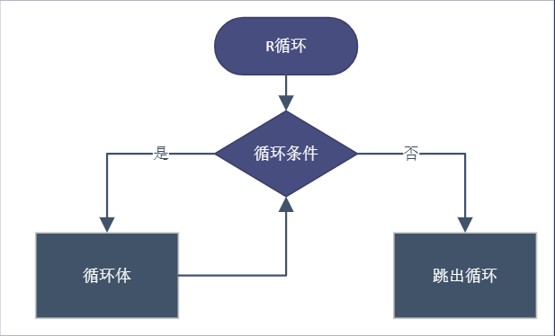

# 循环结构{#R:loop-structure}

所有现代编程语言都提供允许重复指令或指令快的特殊构造。在R中当需要重复做某动作时,可运用循环结构。比如1+2+3,我们可以直接写表达式，但是1+2+3+...+100，我们不可能直接写表达式，这时就可以借用循环重复计算。

```{r}
1+2+3
```

<center>



</center>

## R循环介绍{#R:loop-description}

通过命令`?Control`可以查看R中的循环结构。循环结构中关键词`for`，`while`,`repeat`，以及`break`,`next`。

**我们终极目是:清晰了解循环结构后，用向量化或purrr包提供的功能摆脱循环。**


### 简单示例{#R:loop-example}

利用循环实现1到100连续相加求和

```{r}
total <- 0
for(i in 1:100){
  total <- total+i
}
print(paste0('1到100连续相加求和等于:',total))

# loop structure
# for (var in seq) {expr}
```


### 循环结构{#three:loop-structure}

R中有三种循环结构：

- for 

for循环是大家使用最多的循环结构，for循环的迭代次数是固定的，并且事先知道。如最开始的示例中，1连续相加到100,共计加法次数是100次。

for循环示例如下：

```{r message=FALSE,warning=FALSE}
library(tidyverse)
df <- tibble(
  a = rnorm(10),
  b = rnorm(10),
  c = rnorm(10),
  d = rnorm(10)
)

output <- vector("double", ncol(df))  # 1. output
for (i in seq_along(df)) {            # 2. sequence
  output[[i]] <- median(df[[i]])      # 3. body
}
output
```

代码解释：

上面代码中 `vector`函数创建一个空向量带指定长度，有两个参数，第一个时向量类型('逻辑','整数','双精度','字符'等)，第二个是向量长度 `vector(length=5)`,类型默认是逻辑型。

`seq_along`可以`?seq`查看用法.

hadely 解释如下:

You might not have seen seq_along() before. It’s a safe version of the familiar 1:length(l), with an important difference: if you have a zero-length vector, seq_along() does the right thing:

```{r}
#wrong
seq_along(c())
1:length(c())

# generates the integer sequence 1, 2, ..., length(along.with). (along.with is usually abbreviated to along, and  seq_along is much faster.)
```

> 循环中尽可能利用R中的向量化,比如指定output的长度,当数据量大的时候效率提升将比较明显,养成向量化的意识对提高代码效率有显著效果.


- while

当我们不知道要循环迭代的次数时，可以考虑使用while循环结构。

示例如下：


```{r eval=FALSE}
readinteger <- function(){
  n <- readline(prompt="Please, enter your ANSWER: ")
}

response <- as.integer(readinteger())

while (response!=42) {   
  print("Sorry, the answer to whatever the question MUST be 42");
  response <- as.integer(readinteger());
}

```


- Repeat

repeat循环与while循环类似。如下所示，直到满足if条件后才会跳出循环结构。

```{r}
i <- 1
total <- 0
repeat{
  total <- total+i
  i <- i+1
  if(i > 100){
    print(paste0('连续相加求和等于:',total))
    break
  }
}
```


### 循环控制{#loop:control}

R中如何中断或退出循环呢？除了自然结束的for循环，while,repeat是如何结束的呢，在R中，我们可以通过`break`以及`next`控制循环，上一示例中我们已经看到`break`是如何跳出循环的。

- next 用法

```{r}
for(i in letters[1:6] ){
  if(i == "d"){
  next
  }
  print(i)
}
```

- break 用法

当条件满足时，跳出循环。

```{r}
m=10 
n=10
ctr=0
mymat = matrix(0,m,n)

for(i in 1:m) {
  for(j in 1:n) {   
    if(i==j) { 
      break;
    } else {
       # you assign the values only when i<>j
      mymat[i,j] = i*j
      ctr=ctr+1
      }
  }
  print(i*j) 
}
# 共赋值多少次
print(ctr)
```


### 嵌套循环

嵌套循环即在循环体中再循环。

```{r}
# not run
v <- vector(length = 100)
for(i in 1:10){
  for(j in 1:10){
    v[i*j] = i * j 
  }
}
```


## 循环变化{#loop:changes}

### 修改已有对象

```{r}
res <- 1:100
for(i in seq_along(res)){
  res[i] <- res[i] * i
}
str(res)
```


### 循环模式

共有三种遍历向量的方法,之前展示的都是遍历数字索引`for (i in seq_along(xs))`,并使用提取值`x[[i]]`。除此之外，还有两种方式:

- 循环遍历元素

`for(i in xs)`,例如我们需要保存文件时,可以利用这种循环模式

- 遍历名称

`for (nm in names(xs))`,我们可以使用`x[[nm]]` 该名称访问.当我们要在文件名中使用名称时会比较方便.

```{r eval=FALSE}
results <- vector("list", length(x))
names(results) <- names(x)
```

数字索引的循环模式最常用,因为可以根据位置提取名称和值.

```{r eval=FALSE}
for (i in seq_along(x)) {
  name <- names(x)[[i]]
  value <- x[[i]]
}
```


### 未知长度输出

有时候我们的循环我们不确定输出的长度是多少.这样会逐步增加向量的长度,如下所示：

```{r}
means <- c(0, 1, 2)

output <- double()
for (i in seq_along(means)) {
  n <- sample(100, 1)
  output <- c(output, rnorm(n, means[[i]]))
}
str(output)
```

但是这种方式浪费时间，当数据量大时候效率会很低下。因为时间复杂度为($O(n^2)$)，解决方案是将结果保存在列表中,然后在完成循环后合并为单个向量:

```{r}
out <- vector("list", length(means))
for (i in seq_along(means)) {
  n <- sample(100, 1)
  out[[i]] <- rnorm(n, means[[i]])
}
str(out)
str(unlist(out)) #unlist将列表向量化
```

