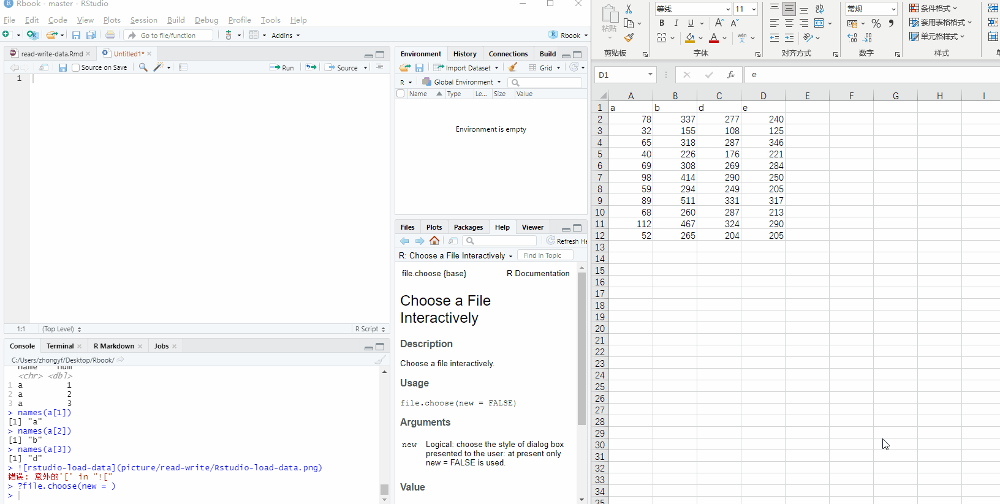
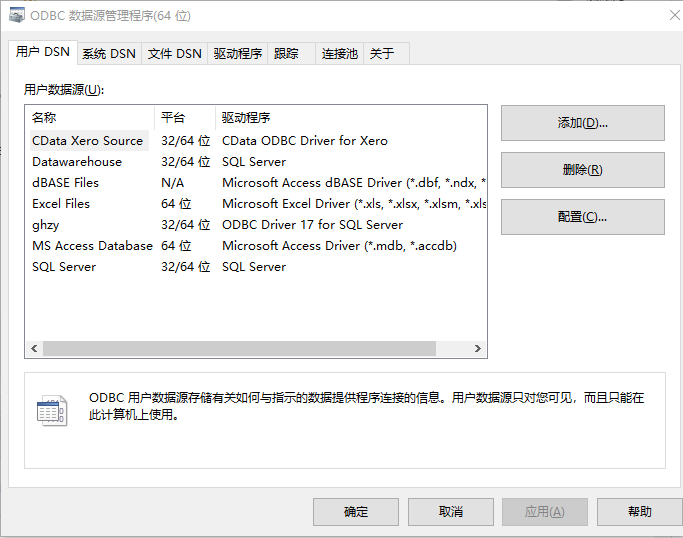
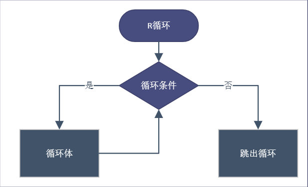

--- 
title: "R 语言学习笔记"
knit: "bookdown::render_book"
author: "Yufei Zhong"
date: "`r Sys.Date()`"
site: bookdown::bookdown_site
documentclass: book
bibliography: [book.bib, packages.bib]
biblio-style: apalike
link-citations: yes
description: "宇飞的 R 语言学习笔记,主要集中在数据清洗相关包的介绍，从数据导入(本地数据 数据库)到数据清洗，到固定报表输出的自动化流程。"
---
```{r include=FALSE, cache=FALSE}
set.seed(1014)
options(digits = 3)

knitr::opts_chunk$set(
  comment = "#>",
  collapse = TRUE,
  out.width = "90%",
  fig.align = 'center',
  fig.width = 6,
  fig.asp = 0.618,  # 1 / phi
  fig.show = "hold"
)

options(dplyr.print_min = 6, dplyr.print_max = 6)
```


# 欢迎 {#welcome .unnumbered}


本文主要是我作为商业数据分析师的 R 语言学习笔记，主要是数据清洗相关包的介绍。


使用R语言自动完成如下报表:

```{r result= 'flextable-tbl-daily-report',echo=FALSE,warning=FALSE,message=FALSE}
library(flextable)
library(tidyverse)
library(formattable)

dt <- openxlsx::read.xlsx('./data/welcome/flextable-data.xlsx')
dt <- dt %>% mutate(
across(c(当前销额,同比销额,当前销量,同比销量),formattable::comma,digits=0),
across(c(`当前%`,`同比%`,`金额增长%`,`销量同比%`,`当前折扣`,`同比折扣`),formattable::percent,digits = 1)
) %>% dplyr::select(1:12)

ft <- flextable(dt) %>% 
  merge_v(j = ~一级部门) %>% 
  bg(bg = "#e05297", part = "header") %>% 
  color(color = "white", part = "header") %>% 
  add_footer_lines(paste0('数据更新时间:',Sys.Date())) %>% 
  #valign(valign = "top") %>%
  theme_box() %>% 
  align(j = 1:12, align = "center", part = 'body') %>% 
  autofit()
    
ft
```


## 内容概要{#abstract .unnumbered}

主要内容是为了将数据报表，数据报告，数据可视化等需求利用 R 语言自动化实现，从而解放双手。

- 数据导入导出

读 Excel:readxl,openxlsx;写 Excel:openxlsx,writexl,读写 CSV,TSV,TXT 等:readr,vroom,data.table;

- 数据操作 dplyr

- 数据整洁 tidyr

- 字符处理 stringr

- 日期时间处理 lubridate

- 因子处理 forcats

- 数据处理利器 data.table

- 数据库使用 

主要是 odbc,DBI,ROracle,RMySQL等

- 循环结构
- 循环迭代之purrr包介绍
- 自定义函数功能

- 文件系统管理

数据操作处理分为:tidyverse 系列，data.table 两大语法体系。


## 授权说明 {#sec:licenses .unnumbered}

::: {.rmdwarn data-latex="{警告}"}
本书采用[Creative Commons Attribution-ShareAlike 4.0 International License](https://creativecommons.org/licenses/by-nc-nd/4.0/) 许可，请君自重。
项目中代码使用 [MIT协议](https://github.com/zyf19940501/Rbook) 开源。
:::


Creative Commons Attribution-ShareAlike 4.0 International License.

## 运行信息{#session  .unnumbered}

```{r}
xfun::session_info(packages = c(
  "knitr", "rmarkdown", "bookdown","collapse",
  "data.table", "DT", "reactable","flextable",
  "patchwork", "plotly", "shiny","formattable",
  "ggplot2", "dplyr", "tidyverse","DBI","ROracle","dbplyr"
), dependencies = FALSE)
```


## 关于本人{#author  .unnumbered}

一名热爱R语言的商业数据分析师。`R`极大拓展了我数据处理能力,让我很轻松方便处理数据，有更多精力时间聚焦在具体问题上。

因个人能力有限，本书难免出现错误，如发现错误，欢迎联系本人更正。


Email: <598253220@qq.com> 

公众号: 宇飞的世界 

语雀: https://www.yuque.com/zyufei


<!--chapter:end:index.Rmd-->

```{r include=FALSE, cache=FALSE}
set.seed(1014)
options(digits = 3)

knitr::opts_chunk$set(
  comment = "#>",
  collapse = TRUE,
  out.width = "90%",
  fig.align = 'center',
  fig.width = 6,
  fig.asp = 0.618,  # 1 / phi
  fig.show = "hold"
)

options(dplyr.print_min = 6, dplyr.print_max = 6)
```

# 数据导入导出 {#data:read-write-description}


作为一名普通的数据分析师，我日常接触最多的数据是业务系统中的销售订单表、商品库存表、会员信息表，门店信息表，商品信息表等之类的业务表，但最初接触R时，看到的演示代码以及数据集大部分都是R包中内置的数据集，没有很明确操作数据的意义，没有代入感。在刚开始学习使用R做数据处理后，我就想使用自己的数据集来操作数据，用 R 去实现 Excel 的透视表或 sql 功能。这时就首先需要将原始数据导入[^loaddata]R中。

现实生活中数据来源复杂，商业环境中数据源同样具有多样性，如 SAP,不同的数据库、OA系统、EXCEL 手工文件等;我们想要统一数据做分析，就需要将不同的数据源整合导入R中。

我们从读取方式简单区分为本地文件数据、数据库数据，本章主要说明常用的 Excel 文件和csv[^csv]、txt 等文本文件的读写方式。关于数据库的数据的读取，可以参照后续 database [数据库章节](#database)。

相信大家随便使用搜索引擎搜索诸如"将 Excel 导入 R "的关键词都能得到一些行之有效的方法，但是不够系统全面。本章主要简述R中数据导入导出的相关 R 包，如`readxl`,`writexl`,`openxlsx`,`readr`, `vroom`等主要处理 csv 或 Excel 的 R 包。


[^loaddata]:由于 R 是将数据加载至内存中，故数据集大小超过内存大小将导入失败。

[^csv]:csv 即 Comma-Separated Values，逗号分隔值，分隔符也可是不是逗号。
csv 文件是一种以纯文本形式存储的表格数据,可以通过记事本打开。与 Excel 不同的是，CSV 是一种文本格式，也不受 Excel 最大行数(1048576)限制。
csv 文件也被称作平面文件，结构简单，平面文件比结构文件占用更少的空间；平面文件在数据仓库项目中广泛用于导入数据。 

>当有其它数据格式需求的时候，那时候的你肯定已经会自行查找相关R包使用了。


在本章开始前，假定已经有一些 R 相关基础。如使用 Rstudio 查看导入的数据，R 的数据结构等有一定认识。本章节主要分为:

- excel 读写

- csv 等平面文件读写 

- 文件路径


## readxl {#readxl:description}

readxl 软件包使 R 获取 Excel 数据变得方便简洁。与现有的软件包(例如：xlsx)相比，readxl 没有外部依赖性，xlsx 等包依赖 java 环境。readxl 包容易在所有的操作系统安装使用。

readxl[项目地址](https://readxl.tidyverse.org/)，本节大部分代码来源项目官网介绍，可自行查阅官网。

### 安装{#readxl:install}

从 CRAN 安装最新发行版本的最简单方法是安装整个 tidyverse。

```{r eval=FALSE}
install.packages("tidyverse")
```

> 由于readxl不是tidyverse核心加载包，使用时仅需加载library(readxl)

或者是从CRAN仅安装readxl;

```{r eval = FALSE}
install.packages("readxl")
```

从github安装开发版：

```{r eval = FALSE}
# install.packages("devtools")
devtools::install_github("tidyverse/readxl")
```


### 用法 {#readxl:usage}

readxl 包的核心函数是读取函数`read_excel()`，该函数能将 Excel 文件数据加载到R中。readxl 包中包含了几个示例文件，我们在接下来的案例中使用。


1.读取

通过`readxl_example()`查看 readxl 包中自带 xlsx 文件。

```{r}
library(readxl)
readxl_example()
readxl_example("clippy.xls")
```

需要注意`read_excel()`可读取 xls 和 xlsx 文件，函数会自动识别。

> xls 和 xlsx 的区别: xls 是 excel2003 及以前版本生成的文件格式，而 xlsx 是 excel2007 及以后版本生成的文件格式。xlsx 格式是向下兼容的，可兼容 xls 格式。老旧的业务使用的格式可能是 xls 格式。

```{r}
xlsx_example <- readxl_example("datasets.xlsx") #返回 datasets.xlsx文件所在路径
dt <- read_excel(xlsx_example)
```

查看数据

```{r}
head(dt)
```

将 Excel 中的数据通过`read_excel()`读取保存到R中，该对象属于`tbl_df`类，是 tidyverse 系列的包数据框结构，是对 base R中的`data.frame`结构的改造，但是兼容`data.frame`。

```{r}
# 查看dt类
class(dt)

# 查看数据类型
str(dt)
```


> 关于`tbl_df`类，可以查阅`vignette("tibble")`。


2.指定 sheet 读取

通过函数`excel_sheets()`查看 Excel 的sheet名称

```{r}
excel_sheets(xlsx_example)
```


当我们要读取 Excel 文件有多个 sheets 时，通过指定 sheet 参数,读取指定的 sheet，sheet 参数可以 是 sheet 的名称或顺序号。

```{r}
read_excel(xlsx_example, sheet = "chickwts")
# not run
#read_excel(xlsx_example, sheet = 1)
#read_excel(xlsx_example, sheet = 3)
```

3.指定读取范围

读取 Excel 文件指定范围。`read_excel()`中 range 参数接受单元格范围，最简单的表示方式即 Excle 中单元格表示方法,如 range = "D12:F15" or range = "R1C12:R6C15"。

```{r}
read_excel(xlsx_example, sheet = "iris")

dt1 <- read_excel(xlsx_example, sheet = "iris",range = 'a1:e6')

dt2 <- read_excel(xlsx_example, sheet = "iris",range = 'R1C1:R6C5')

# dt1 dt2 是否相等
identical(dt1,dt2)
```

4.read_excel参数

readxl::read_excel 参数如下,请`?read_excel()`查看参数。

```{r eval=FALSE}
read_excel(path, sheet = NULL, range = NULL, col_names = TRUE,
  col_types = NULL, na = "", trim_ws = TRUE, skip = 0,
  n_max = Inf, guess_max = min(1000, n_max),
  progress = readxl_progress(), .name_repair = "unique")
```


| read_excel参数 | 解释                                                  |
| -------------- | ----------------------------------------------------- |
| path           | xls或xlsx文件的路径                                   |
| sheet          | 默认是第一个sheet，可以是数字或sheet的名称            |
| range          | Excel中表示范围的字符，或者通过cell_类方法指定        |
| col_name       | 默认为TRUE,用第一行做列名;或者用默认名称,或者指定列名 |
| col_types      | 默认为NULL，猜测各列类型，可指定各列的类型            |
| trim_ws        | 默认去掉表头字段中两边的空格                          |
| skip           | 读取之前要跳过的行数，默认为空                        |
| n_max          | 读取的最大行数                                        |
| guess_max      | 猜测列类型的最大行数,默认为1000                       |
| progress       | 读取过程是否显示进度                                  |
| .name_repair   | 自动处理列名，避免列名不为空以及不重复                |


col_types 参数个人觉得比较重要，可以指定列的类型，可以避免一些错误。可用选项:"skip", "guess", "logical", "numeric", "date", "text" or "list"。

.name_repair 参数能自动避免重复字段，可避免手工 Excel 出现字段名不唯一的情况。


### 批量读取 {# batch:read}

实际工作中，某文件夹下有相同格式的 Excel 文件(sheet名称以及列字段相同)，想要合并全部 Excel 数据，熟悉 Excel 的可以通过 Excel 的`power query`的获取数据完成合并，那么在R中该如何实现呢？

示例：

文件夹内 excel 文件

```{r echo=FALSE}
fs::dir_tree('data/read-write/',regexp = 'xlsx$')
```


将文件夹『data/read-write』里以 a-z 开头的 xlsx 文件合并读取，R代码如下：

- base R

不借助R包，使用 base R 实现

```{r}
allfiles <- list.files(path = 'data/read-write/',pattern = '^[a-z].xlsx$',full.names = TRUE)
datalist <- lapply(allfiles,readxl::read_excel)
do.call(rbind,datalist)
```

- purrr

使用 purrr 包合并读取

```{r }
allfiles <- list.files(path = './data/read-write/',pattern = '^[a-z].xlsx$',full.names = T)

purrr::map_dfr(allfiles,read_excel)
```

`list.files()`函数按照规则返回某文件目录下的全部文件。关于R语言中文件系统操作可以查看章节[R语言文件系统操作](#file:system-operation)

### 批量输出

我们按照一定条件拆解数据集，分别输出，代码如下：

```{r}
library(tidyverse)
library(readxl)

dt <- read_xlsx(path = './data/read-write/批量读写.xlsx')

dt %>% 
  group_by(name) %>% 
  group_walk(~ write.csv(.x,file = file.path('data/read-write',paste0(.y$name,'.csv'))))
list.files(path = 'data/read-write/')

```


> 暂时不用理解批量读取和输出的代码具体含义，可以先记住用法。


## writexl {#writexl}


截止到2021年5月17日，writexl包功能比较简单，仅有输出 Excel 功能。快速、不依赖 java 和 Excle 是它绝对的优势，并且输出文件相比`openxlsx`包较小。

[项目地址](https://docs.ropensci.org/writexl/)

### 用法 {#writexl:usage}

1.安装 

从CRAN安装发行版

```{r eval = FALSE}
install.packages("writexl")
```

2.函数参数

`write_xlsx()`函数参数如下：

```{r eval=FALSE}
write_xlsx(
  x,
  path = tempfile(fileext = ".xlsx"),
  col_names = TRUE,
  format_headers = TRUE,
  use_zip64 = FALSE
)
```


| write_xlsx参数 | 解释                                      |
| -------------- | ----------------------------------------- |
| x              | 要输出的数据框和数据框列表                |
| path           | 输出 Excel 的文件名称                       |
| col_names      | 是否输出表头，默认为TRUE                  |
| format_headers | 是否将表头居中并加粗，默认为TRUE          |
| use_zip64      | 是否支持4Gb文件大小，不是所有的系统都支持 |

> use_zip64:不确定该参数的理解是否正确，请自行阅读官方文档，绝大部分时候不用理解该参数。


3.输出Excel

`write_xlsx()`函数将数据框保存到 Excel。如想要输出多个 sheet 时，用`list(mysheet1 = iris,mysheet2 = iris)`表示即可，代码如下：

```{r eval=FALSE}
library(writexl)
writexl::write_xlsx(iris,path = 'iris.xlsx')

# 输出多sheet
write_xlsx(list(mysheet1 = iris,mysheet2 = iris),path = 'iris.xlsx')

```


4.效率比较

和[`openxlsx`](#openxlsx:description)包比较输出效率。

```{r eval=FALSE }
library(microbenchmark)
library(nycflights13)
microbenchmark(
  writexl = writexl::write_xlsx(flights, tempfile()),
  openxlsx = openxlsx::write.xlsx(flights, tempfile()),
  times = 2
)
```

5.文件大小比较

和[`openxlsx`](#openxlsx:description)包比较输出后的 Excel 文件大小。

```{r}
library(nycflights13)
writexl::write_xlsx(flights, tmp1 <- tempfile())
file.info(tmp1)$size
```


```{r}
openxlsx::write.xlsx(flights, tmp2 <- tempfile())
file.info(tmp2)$size
```

按照`writexl`官方文档的说法，`writexl`输出的 Excel 文件应该较少，但实际上并不是，不确定是不是`openxlsx`更新优化过。

6.其它功能

Excel 公式以及超级链接格式。

```{r eval=FALSE}
df <- data.frame(
  name = c("UCLA", "Berkeley", "Jeroen"),
  founded = c(1919, 1868, 2030),
  website = xl_hyperlink(c("http://www.ucla.edu", "http://www.berkeley.edu", NA), "homepage")
)
df$age <- xl_formula('=(YEAR(TODAY()) - INDIRECT("B" & ROW()))')
write_xlsx(df, 'universities.xlsx')

# cleanup
unlink('universities.xlsx')
```


当需要输出大型 Excel 文件时，比如超过50万行，我会采用`writexl`包输出。但是在曾经使用过程中，定时任务采用 writexl 包输出 Excel 文件有时会报错，感觉不稳定，原因不明。现在一般临时性的输出我会采用`writexl`包，定时任务中采用[`openxlsx`](#openxlsx:description)

## openxlsx {#openxlsx:description}

openxlsx 包是当我需要定制输出 Excel 表格或报表时常用R包。目前该包的版本4.2.3，通过使用 Rcpp 加速，包的读写速度在 Excel 的百万级下是可接受状态，包的相关函数功能完善且简易好用，并且正在积极开发中，相信它以后功能会越来越强大。

项目官方地址:<https://ycphs.github.io/openxlsx/index.html>

openxlsx 主要优势：

- 不依赖 java 环境
- 读写速度可接受
- 可设置条件格式，与 Excel 中『开始』选项卡的条件格式功能接近
- 可批量插入 ggplot2 图
- 可插入公式
- 可渲染大部分 Excel 格式，并且效率相比部分 python 包高效
- 可添加页眉页脚以及其他格式，方便直接打印
- 功能稳定可用并且在积极开发中

版本信息查看

```{r}
packageVersion("openxlsx")
```


关于 openxlsx 更加详细的阐述:<https://mp.weixin.qq.com/s/ZD0dJb0y8fsWGI1dCPh2mQ>

### 安装 {#openxlsx:install}

从CRAN安装发行版

```{r eval=FALSE}
# 稳定版
install.packages("openxlsx", dependencies = TRUE, repos = "https://mirrors.tuna.tsinghua.edu.cn/CRAN/")
```

从Github安装开发版

```{r eval = FALSE}
install.packages(c("Rcpp", "devtools"), dependencies = TRUE)
library(devtools)
install_github("ycphs/openxlsx")
```


### 基础功能 {#openxlsx:functions}

本文仅呈现基础功能部分，即读写 Excel 文件。其它功能，请查阅项目官方地址或微信公众号文章[R包-openxlsx-学习笔记](https://mp.weixin.qq.com/s/ZD0dJb0y8fsWGI1dCPh2mQ)

#### 读取 Excel {#openxlsx:read-function}

`read.xlsx()`函数读取 Excel 文件。

```{r}
library(openxlsx) 
read.xlsx('./data/read-write/批量读写.xlsx')
```

`read.xlsx()`参数如下：

```{r eval=FALSE}
library(openxlsx)
read.xlsx(
  xlsxFile,
  sheet = 1,
  startRow = 1,
  colNames = TRUE,
  rowNames = FALSE,
  detectDates = FALSE,
  skipEmptyRows = TRUE,
  skipEmptyCols = TRUE,
  rows = NULL,
  cols = NULL,
  check.names = FALSE,
  sep.names = ".",
  namedRegion = NULL,
  na.strings = "NA",
  fillMergedCells = FALSE
)
```

以上参数中需要注意：detecDates 参数，当你的 Excel 表格中带日期列时需要将参数设置为TRUE,不然将会把日期识别为数字读入。

fillMergedCells参数，当你读取的表格中存在合并单元格，将用值填充其他全部单元格,如下所示：


```{r eval=FALSE}
read.xlsx('./test.xlsx',detectDates = TRUE,fillMergedCells = TRUE)
```

读取后如下所示：


readWorkbook()也可以读取 Excel 表格数据，参数与read.xlsx基本一致。

```{r eval=FALSE}
xlsxFile <- system.file("extdata", "readTest.xlsx", package = "openxlsx")
df1 <- readWorkbook(xlsxFile = xlsxFile, sheet = 1)
```

#### 写入Excel {#openxlsx:write-function}

数据清洗完后，或者是分组聚合完成，需要将结果从R导出到Excle，这时就利用`write.xlsx()`函数将结果数据集写入 Excel 中。

write.xlsx()函数写入

```{r eval=FALSE}
write.xlsx(iris, file = "writeXLSX1.xlsx", colNames = TRUE, borders = "columns")
```


带格式输出

```{r eval=FALSE}
hs <- createStyle(
  textDecoration = "BOLD", fontColour = "#FFFFFF", fontSize = 12,
  fontName = "Arial Narrow", fgFill = "#4F80BD"
)
## Not run: 
write.xlsx(iris,
  file = "writeXLSX3.xlsx",
  colNames = TRUE, borders = "rows", headerStyle = hs
)
```

[#4F80BD](https://www.sioe.cn/yingyong/yanse-rgb-16/)格式属于十六进制颜色码。


### 定制格式输出

openxlsx包有两套输出函数，`wrire.xlsx()`是其中一种，还有如下一种。

输出过程共分为四步，第一步创建workbook,第二步添加sheet,第三步写入数据，第四步保存workbook。在输出的过程中可以通过`addStyle()`、`createStyle()`或`conditionalFormatting`添加格式或条件格式。


```{r eval=FALSE}
df <- data.frame(a=1:10,b=1:10,d=1:10)
wb <- createWorkbook(creator = 'zhongyf',title = 'test')
addWorksheet(wb,sheetName = 'test')
writeDataTable(wb,sheet = 'test',x = df)
saveWorkbook(wb, "test.xlsx", overwrite = TRUE)
```


我们以上面四步输出的方式，查看包自带的例子。

- createWorkbook()

- addWorksheet()

- writeDataTable()

- saveWorkbook()


```{r eval=FALSE}
wb <- createWorkbook("Fred")

## Add 3 worksheets
addWorksheet(wb, "Sheet 1")
addWorksheet(wb, "Sheet 2", gridLines = FALSE)
addWorksheet(wb, "Sheet 3", tabColour = "red")
addWorksheet(wb, "Sheet 4", gridLines = FALSE, tabColour = "#4F81BD")

## Headers and Footers
addWorksheet(wb, "Sheet 5",
  header = c("ODD HEAD LEFT", "ODD HEAD CENTER", "ODD HEAD RIGHT"),
  footer = c("ODD FOOT RIGHT", "ODD FOOT CENTER", "ODD FOOT RIGHT"),
  evenHeader = c("EVEN HEAD LEFT", "EVEN HEAD CENTER", "EVEN HEAD RIGHT"),
  evenFooter = c("EVEN FOOT RIGHT", "EVEN FOOT CENTER", "EVEN FOOT RIGHT"),
  firstHeader = c("TOP", "OF FIRST", "PAGE"),
  firstFooter = c("BOTTOM", "OF FIRST", "PAGE")
)

addWorksheet(wb, "Sheet 6",
  header = c("&[Date]", "ALL HEAD CENTER 2", "&[Page] / &[Pages]"),
  footer = c("&[Path]&[File]", NA, "&[Tab]"),
  firstHeader = c(NA, "Center Header of First Page", NA),
  firstFooter = c(NA, "Center Footer of First Page", NA)
)

addWorksheet(wb, "Sheet 7",
  header = c("ALL HEAD LEFT 2", "ALL HEAD CENTER 2", "ALL HEAD RIGHT 2"),
  footer = c("ALL FOOT RIGHT 2", "ALL FOOT CENTER 2", "ALL FOOT RIGHT 2")
)

addWorksheet(wb, "Sheet 8",
  firstHeader = c("FIRST ONLY L", NA, "FIRST ONLY R"),
  firstFooter = c("FIRST ONLY L", NA, "FIRST ONLY R")
)

addWorksheet(wb,'dataframe')

## Need data on worksheet to see all headers and footers
writeData(wb, sheet = 5, 1:400)
writeData(wb, sheet = 6, 1:400)
writeData(wb, sheet = 7, 1:400)
writeData(wb, sheet = 8, 1:400)
writeDataTable(wb,sheet = 'dataframe',iris)
## Save workbook
## Not run: 
saveWorkbook(wb, "addWorksheetExample.xlsx", overwrite = TRUE)
```

### 函数参数


本小节主要讲`createWorkbook()`，` addWorksheet()`,`writeDataTable()`,`saveWorkbook()`四个函数的参数以及用法。

- createWorkbook

```{r eval=FALSE }
createWorkbook(
  creator = ifelse(.Platform$OS.type == "windows", Sys.getenv("USERNAME"),
    Sys.getenv("USER")),
  title = NULL,
  subject = NULL,
  category = NULL
)
```

```{r eval=FALSE}
wb <- createWorkbook(
  creator = "宇飞的世界",
  title = "标题",
  subject = "主题",
  category = "类别目录"
)

```

在win系统上右击 Excel 文件属性，点击详细信息：


- addWorksheet

`addWorksheet()`函数添加sheet。

```{r eval=FALSE}
addWorksheet(
  wb,
  sheetName,
  gridLines = TRUE,
  tabColour = NULL,
  zoom = 100,
  header = NULL,
  footer = NULL,
  evenHeader = NULL,
  evenFooter = NULL,
  firstHeader = NULL,
  firstFooter = NULL,
  visible = TRUE,
  paperSize = getOption("openxlsx.paperSize", default = 9),
  orientation = getOption("openxlsx.orientation", default = "portrait"),
  vdpi = getOption("openxlsx.vdpi", default = getOption("openxlsx.dpi", default = 300)),
  hdpi = getOption("openxlsx.hdpi", default = getOption("openxlsx.dpi", default = 300))
)
```

`addWorksheet()`参数解释如下：

```{r eval=FALSE}
gridLines参数：表格中是否有网格线，在Excle『视图』选项卡下面的网格线去除打勾的效果一致

tabColour参数：输出表格sheet标签颜色

zoom：发大缩小，默认是100，可选范围10-400

header:页眉 长度为3的字符向量，左、中、右三个位置，用Na可跳过一位置，以下页眉页脚相同。

footer: 页脚

evenHeader: 每页页眉

evenFooter: 每页页脚

firstHeader: 第一页页眉

firstFooter: 第一页页脚

visible:sheet是否隐藏，如果为否sheet将被隐藏

paperSize:页面大小,详见 ?pageSetup 

orientation:One of "portrait" or "landscape" 不清楚干嘛用

vdpi: 屏幕分辨率 默认值即可，不用调整

hdpi: 屏幕分辨率 默认值即可，不用调整
```


- writeDataTable

writeDataTable()函数将data.frame写入 Excel 。

```{r eval=FALSE}
writeDataTable(
  wb,
  sheet,
  x,
  startCol = 1,
  startRow = 1,
  xy = NULL,
  colNames = TRUE,
  rowNames = FALSE,
  tableStyle = "TableStyleLight9",
  tableName = NULL,
  headerStyle = NULL,
  withFilter = TRUE,
  keepNA = FALSE,
  na.string = NULL,
  sep = ", ",
  stack = FALSE,
  firstColumn = FALSE,
  lastColumn = FALSE,
  bandedRows = TRUE,
  bandedCols = FALSE
)
```

`writeDataTable()`参数解释如下：

```{r eval=FALSE}
wb:即createWorkbook()函数创建的workbook对象

sheet:将输入写入的sheet名，由addWorksheet()函数创建

x : a data.frame

startCol: 从哪一列开始写入,接受数字

startRow：从哪一行开始写入，接受数字

xy: 指定开始行以及开始列的向量，xy = c(2,3)即从2列3行位置开始写入

colNames: 如果TRUE,列名写入

rowNames: 如果TRUE,行名写入

tableStyle:一些表格样式，在中文版Excle『开始』选项卡下面的套用表格格式，可以使用预定义的表格样式

tableName:workbook中的表中，表名必须是唯一的，熟悉Power Pivot的人应该很清晰“表”概念

headerStyle:自定义列样式应用,用createStyle()函数创建

withFilter: 在第一行是否有筛选

keepNA:如果TRUE,NA值转化为#NA，如果否，变为空

na.string :如果参数不是NULL,如果keepNA是TRUE,NA将会在 Excel 中转为该参数指定的字符

sep：列表列的分隔符，默认为","

stack :详情请参照函数使用

firstColumn:logical. If TRUE, the first column is bold

lastColumn :logical. If TRUE, the last column is bold

bandedRows:logical. If TRUE, rows are colour banded 即行线,默认为TRUE

bandedCols:logical. If TRUE, the columns are colour banded 即列线 ,默认为TRUE

```


- saveWorkbook

```{r eval=FALSE}
saveWorkbook(wb, file, overwrite = FALSE, returnValue = FALSE)
```

参数较为简单，wb即上文中的workbook对象，file即输出的文件名，overwrite即如果存在是否覆盖，returnValue如果设置为TRUE，返回TRUE代表保存成功

### 总结

openxlsx包功能较为强大，更多详细用法大家可自行探索，或关注我的语雀笔记，笔记会不定期持续更新。

R包openxlsx学习笔记:<https://www.yuque.com/docs/share/7a768e6f-95e0-417c-a9b5-dfc8862dc6be?#>

语雀个人主页:<https://www.yuque.com/zyufei>


## readr {#readr:package}


readr提供了一种快速友好的方式读取矩形数据[^矩形数据](如：csv,tsv,fwf)，且当读取大型数据集时默认有进度条显示。

[^矩形数据]:矩形数据英文中表示为 rectangular data，矩形数据每一列都是变量(特征)，而每一行都是案例或记录,关系数据库中的单表就是矩形数据的一种。


如果对readr包不熟悉，可以直接阅读包作者，大神Hadley Wickham的书R for data science 中[data import chapter](https://r4ds.had.co.nz/data-import.html)章节。


### 安装 {#readr:install}

由于readr包是tidyverse系列核心包，可以直接安装tidyverse使用，或者单独安装readr。

```{r eval= FALSE}
# 安装整个tidyverse
install.packages("tidyverse")

# 仅安装readr
install.packages("readr")

# 从github安装开发版
# install.packages("devtools")
devtools::install_github("tidyverse/readr")
```


### 用法 {#readr:usage}

readr包是tidyverse系列的核心包，可以加载tidyverse使用。

```{r}
library(tidyverse)
# 或者
library(readr)
```

#### 主要函数

readr包支持七种`read_`功能的文件格式。

— `read_csv()`:逗号分隔符文件
- `read_tsv()`:制表符分割文件
- `read_delim()`:规定分隔符文件
- `read_fwf()`:固定宽度文件
- `read_table()`:表格文件，列间用空格隔开
- `read_log()`:Web日志文件


在大多数情况下，我们常使用`read_csv()`，提供文件路径，将得到数据表。示例如下:

```{r}
mtcars <- read_csv(readr_example("mtcars.csv"))
```

通过上述输出反馈，我们可以知道读进去的数据集每列类型。如果发现不对可以通过`col_types`参数修改。大多数情况下，我们并不需要指定列的类型，readr会自动猜测列类型。

```{r}
mtcars <- read_csv(readr_example("mtcars.csv"), col_types = 
  cols(
    mpg = col_double(),
    cyl = col_integer(),
    disp = col_double(),
    hp = col_integer(),
    drat = col_double(),
    vs = col_integer(),
    wt = col_double(),
    qsec = col_double(),
    am = col_integer(),
    gear = col_integer(),
    carb = col_integer()
  )
)
```

#### 参数

`read_csv()`的参数如下：

```{r eval =FALSE}
read_csv(
  file,
  col_names = TRUE,
  col_types = NULL,
  locale = default_locale(),
  na = c("", "NA"),
  quoted_na = TRUE,
  quote = "\"",
  comment = "",
  trim_ws = TRUE,
  skip = 0,
  n_max = Inf,
  guess_max = min(1000, n_max),
  progress = show_progress(),
  skip_empty_rows = TRUE
)
```

通过对 readxl 包的了解，我们发现两个包的读写函数的部分参数是一致的。

col_types :指定列类型，可用项如下所示(含简写):
c = character，i = integer，n = number，d = double，l = logical，f = factor，D = date，T = date time，t = time，默认值为 guess。
  
locale:locale参数是 readr 包中很重要的一个参数，指定日期使用的月和日的名称，时区，字符编码，日期格式，数字的小数和点位数和分隔符。


`locale()`的第一个参数是date_names，控制月份和日期的名称，指定最简单的方式[ ISO 639 language code](https://en.wikipedia.org/wiki/List_of_ISO_639-1_codes)

```{r}
locale('zh') # 中文
locale('ja') #日本
locale('ko') #韩国
```

编码和时区问题是我们常面临的问题， 不正确设定导致我们的数据读取错误。

```{r eval=FALSE}
read_csv(readr_example("mtcars.csv"),locale = locale(encoding = 'UTF-8',tz = 'Asia/Shanghai'))
```

关于locales,详细信息查看手册`vignette("locales")`。


### 导出功能 {#readr:write-function}

由于系统缘故，在win系统下可能面临编码问题。我用readr导出数据时一般采用`write_excel_csv()`功能导出，目前还未遇到乱码情况。

需要说明的是`write_`系列函数可以将输出文件压缩。

```{r eval=FALSE}
data(storms, package = "dplyr")
write_csv(storms, "storms.csv")
write_csv(storms, "storms.csv.gz")
```

### 总结

大部分情况下，当数据整洁时且不涉及时间(日期不影响)时，采用默认参数读取数据即可。当数据集前面行缺失值较多，readr自动猜数据列类型错误时，需要我们人为指定列类型。

```{r eval=FALSE}
read_csv('test.csv',col_types = 'cccnnnnDcnn')
```


由于 Excel 数字位数限制，在输出数字订单号或身份证时需要注意,:

```{r eval=FALSE}
id_card <- c('440327199910010123','440327199910010125')
write_excel_csv(data.frame(id_card),'test.csv')
```

>  Excel 最多只能存储15位数字型数字，15为之后都为0。

上面的输出显然会改变真实的身份证号码，这时我们就建议输出为xlsx的字符型或者是txt等格式，因为输出CSV会导致后面的全部变成0。

当编码时区不一致时，需指定`locale()`，如下：

```{r eval=FALSE}
read_csv(readr_example("mtcars.csv"),locale = locale(encoding = 'UTF-8',tz = 'Asia/Shanghai'))
```


## vroom {#data:vroom} 

vroom包 实现读取矩形数据到 R 中,如 comma separated(csv),tab separated(tsv), fixed width files(fwf)。该包的功能类似`readr::read_csv()`,`data.table::fread()`和`read.csv()`,但是对于许多数据集来说，`vroom::vroom()`读取速度会快得多。

[vroom项目地址](https://vroom.r-lib.org/index.html)

### 安装


```{r eval=FALSE}
# 从cran安装
install.packages("vroom")
# install.packages("devtools")
devtools::install_dev("vroom")
```

### 用法

1. 读取文件

```{r}
library(vroom)
file <- vroom_example("mtcars.csv")
file

vroom(file)
vroom(file, delim = ",")
```

2. 读取多文件

即`vroom::vroom()`具备迭代效果,具体情况如下：

```{r eval=FALSE}
mt <- tibble::rownames_to_column(mtcars, "model")
purrr::iwalk(
  split(mt, mt$cyl),
  ~ vroom_write(.x, glue::glue("mtcars_{.y}.csv"), "\t")
)

files <- fs::dir_ls(glob = "mtcars*csv")
files

# read_csv

purrr::map_dfr(files,readr::read_delim,delim="\t")

# vroom same above
vroom(files) 
```

3. 读取压缩文件

vroom支持zip,gz,bz2,xz等压缩文件，只需要将压缩文件名称传递给vroom即可。

```{r eval=FALSE}
file <- vroom_example("mtcars.csv.gz")

vroom(file)
```

4. 读取网络文件

```{r}
#file <- "https://raw.githubusercontent.com/r-lib/vroom/master/inst/extdata/mtcars.csv"
file <- "http://www.zhongyufei.com/Rbook/data/data-table-groupingsets.csv"
vroom(file)

```

5. 选择列读取

room提供了与`dplyr::select()`相同的列选择和重命名接口

```{r}
file <- vroom_example("mtcars.csv.gz")

vroom(file, col_select = c(model, cyl, gear))

# vroom(file, col_select = c(1, 3, 11))

# vroom(file, col_select = list(car = model, everything()))
```


## Rstudio导入 {#data:rstudio-addins}


使用 Rstudio 工具栏自带的 import Dataset 或者借助 R 包插件实现数据与 R 的交互。

### rstudio 工具栏导入

本质也是调用`readr`和`readxl`包，如下所示：


### 插件导入

[项目地址](https://github.com/milesmcbain/datapasta)

datapasta 是一个 addins 插件，方便将数据复制到 R。

1.安装

```{r eval=FALSE}
install.packages("datapasta")
```

2.使用


 
 
## 文件路径 {#data:file-path}


我们读取数据时都是读取某路径下的某文件，但是由于系统等原因，路径在不同系统下的表示方式不一致。

### 指定路径

- win 路径

windows 系统：`C:\Users\zhongyf\Desktop\Rbook`，注意路径中是一个反斜杠\\。


在R中读取时需要用一个正斜杠或两个反斜杠，建议用正斜杠。

```{r eval=FALSE}
readr::read_csv('C:/Users/zhongyf/Desktop/Rbook/data/flights.csv')
readr::read_csv('C:\\Users\\zhongyf\\Desktop\\Rbook\\data\flights.csv') # same above
readr:::read_csv(file = r"(C:\Users\zhongyf\Desktop\Rbook\data\flights.csv)") # same above
```

工作中，当需要读取或写入共享盘[^共享盘]中文件时，路径表示方式为：

[^共享盘]:共享盘的地址即某电脑(服务器)的地址，知道共享盘在局域网中的ip地址后在 开始->运行中输入\\192.168.1.247即可打开共享盘。

```{r eval=FALSE}
the_shared_disk <- r"(\\192.168.2.117\公司A-新\01事业部\)"

# 读取共享盘数据
readr::read_csv(file = "\\\\192.168.2.117\\公司A-新\\01事业部\\flights.csv")
# 或者用r"()"指定路径
readr::read_csv(file = r"(\\192.168.2.117\公司A-新\01事业部\test.csv)")

```

> r"()"用法是R-4.0-之后的特性。在win系统下表示路径特别有用，可以避免转义。


- mac 路径

macOS系统: `/User/vega_mac/Desktop/r`,路径中是一个正斜杠//。


```{r eval=FALSE}
readr::read_csv('/User/vega_mac/Desktop/r/Rbook/data/flights.csv')
```

### 默认路径

在我们刚开始学习文件读写的时候，都会疑惑输出的文件到哪里去了？在 R 中有一个“当前默认工作目录”的概念，如果不做任何设置，当前默认工作目录一般在：

Windows 系统默认目录一般都是用户文件夹下的文档文件，即./zhongyf/Documents 文件夹下。

```{r eval=FALSE}
getwd()
[1] "C:/Users/zhongyf/Documents"
```

Macos/linxu 默认目录一般都是用户文件夹下，即 /Users/zhongyf 或者是 /home/zhongyf 文件夹下。

```{r eval=FALSE}
# Mac
getwd()
[1] "/Users/zhongyf"

# linux
getwd()
[1] "/home/zhongyf"
```


`getwd()`是查看当前工作目录的函数，在进行文件读写时的默认路径，也就是当没有明确指定路径时，文件读取输出的默认路径是`getwd()`。想要改变工作目录，通过设定`setwd()`即可。 如下所示：


```{r eval=FALSE}
# not run
setwd('C:/Users/zhongyf/Desktop/Rbook/data')
```
 
除了上述通过`setwd()`修改工作目录外，可以通过 Rsutdio 的 Tools 工具栏 -> Global Options -> Default working directory 设置工作目录。还可以通过
Rstudio > Session > Set Working Directory > Choose Directory 来调整【快捷键 Ctrl+Shift+H 】。修改工作目录后，通过`getwd()`查看修改是否生效。


关于文件路径，我个人喜欢的解决办法是通过 File > New Project > New Directory  新建文件项目，将本次所有的数据需求放在该新建的文件夹下，那我们在做本次项目时就再也不用理会文件路径问题了，因为所有的默认路径都是刚新建的路径。这种项目管理的方法，我个人比较推崇。

> 配上项目说明 Readme 文件，配合 git 做项目版本控制,方便我们后期查阅回溯。


## 拓展 {#data:expand}

### tidyxl{#tidyxl:package}

tidyxl:Imports non-tabular from Excel files into R。tidyxl 将不规则数据导入R。
我们可以通过`readxl`包读取整洁的 Excel 数据，那如果是 Excel 的透视表怎么读取？

[tidyxl项目地址](https://github.com/nacnudus/tidyxl/)。


如果我们想要读取以下数据透视表，该如何读取?由于不是整洁的数据表，所以用`readxl`读取后的数据没法直接使用。但是`tidyxl`配合`unpivotr`包经过处理可以达到目的，如下所示：


```{r message=FALSE,warning=FALSE}
library(tidyxl)
library(tidyverse)
library(unpivotr)

path <- './data/read-write/PivotTable.xlsx'
unpivot <- xlsx_cells(path,sheets = 1) %>% 
  dplyr::filter(row>3) %>% 
  dplyr::filter(!is_blank) %>% 
  select(row,col,data_type,character,numeric) %>% 
  behead('left',区域) %>% 
  behead('up',是否可比) %>% 
  behead('up-right',新老店) %>% 
  rename(销售额 = numeric) %>% 
  select(-character)   

unpivot
```

经过上述处理，已将透视表数据转化为整洁的数据。


> 如果有可能的话，不要读取如此不规则的数据当作数据源

### 参考资料

1. feather 项目地址<https://github.com/wesm/feather>

2. qs 提供接口，用于快速将R对象保存到磁盘以及从磁盘读取。该包的目标是替换R中的`saveRDS`和`readRDS`。项目地址<https://github.com/traversc/qs>

3. arrow 是 feather 的接替项目，地址<https://arrow.apache.org/docs/r/>

4. 其它统计学软件数据如 spss，stata,SAs 等可用`foreign`包读取

5. tidyxl and unpivotr: <https://nacnudus.github.io/spreadsheet-munging-strategies/pivot-simple.html>

6. janitor package <https://sfirke.github.io/janitor/index.html>

<!--chapter:end:read-write-data.Rmd-->

```{r include=FALSE, cache=FALSE}
set.seed(1014)
options(digits = 3)

knitr::opts_chunk$set(
  comment = "#>",
  collapse = TRUE,
  out.width = "90%",
  fig.align = 'center',
  fig.width = 6,
  fig.asp = 0.618,  # 1 / phi
  fig.show = "hold"
)

options(dplyr.print_min = 6, dplyr.print_max = 6)
```

#  数据处理之-dplyr {#Data:Manipulation-dplyr}


本章节主要目的是通过阐述dplyr动词用法，实现与`Excel透视表`或`sql`相同功能，从而达到不同的数据整理、聚合需求。

本章主要从以下方面阐述：

1. 行条件筛选
2. 列筛选
3. 字段重命名
4. 列位置排序
5. 行排序
6. 新增计算字段
7. 分组聚合
8. 表关联
9. 行列操作
10. 使用dplyr编写自定义函数


其中9,10行列操作和自定义函数有一定难度，大家可以先熟悉dplyr基本用法后再了解其用法。

与`sql`相比，用dplyr的优势：

- 代码量极大减少

- 逻辑复杂时，dplyr动词可以按照顺序一步步实现，无需嵌套，实现过程简单

- 代码可读性好

- 配合`dbplyr`包使用，大部分情况下可以扔掉`sql`语法，从而实现不同数据库间语法并不完全一致时，代码可重复使用


> 本章节中部分案例照搬dplyr包的官方案例，
dplyr动词从数据库相关操作中抽象而来，从sql迁移成本低


## 前言 {#dplyr:description}


`dplyr`包是`tidyverse`系列的核心包之一。dplyr是**A Grammar of Data Manipulation **，即dplyr是数据处理的语法。数据操作在数据库中往往被增、改、删、查四字描述，加上表连接查询基本涵盖了大部分的数据操作。


`dplyr`包通过提供一组动词来解决最常见的数据处理问题：

- `mutate()` 添加新变量,现有变量的函数

- `select()` 筛选列,根据现有变量名称选择变量

- `filter()` 筛选行，根据条件筛选

- `summarise()` 按照一定条件汇总聚合

- `arrange()` 行排序

以上动词都可以和`group_by()`结合，使我们可以按组执行以上任何操作。除了以上单个表操作的动词，dplyr中还有操作两表(表关联)的动词，可以通过`vignette("two-table")`查看学习。   


###  安装 {#dplyr:install-package}

dplyr包可以直接安装。

```{r eval=FALSE}
## 最简单是的方式就是安装tidyverse
install.packages('tidyverse')

## 或者仅仅安装 tidyr:
install.packages('dplyr')

## 或者从github 安装开发版本
## install.packages("devtools")
devtools::install_github("tidyverse/dplyr")
```

> 在开始使用前，请确保自己dplyr版本是较新版本，因为1.0.0版本有较大更新。

```{r}
packageVersion('dplyr')
```


### Excel and Sql 类比{#dplyr:difference-of-sql}

与Excel相比,dplyr使用`filter`实现筛选，`mutate`实现列新增计算，`summarise`配合`group_by`实现数据透视表，`arrange`实现排序功能。
`dplyr::left_join()`等表连接功能，实现Excel中的`vlookup`,`xlookup`等函数效果。

请看案例：

>案例中使用的数据集是R包`nycflights13`带的flights数据集。

Excel实现


R实现：

```{r message=FALSE,warning=FALSE}
library(tidyverse,warn.conflicts = FALSE)
data <- readr::read_csv("./data/flights.csv")

data %>% 
  filter(year==2014,month==6) %>% 
  group_by(origin,dest) %>% 
  summarise(distance求和项 = sum(distance))

```

Sql实现：


```{r include=FALSE}
library(DBI)
data <- readr::read_csv("C:/Users/zhongyf/Desktop/Rbook/data/flights.csv")
conn <- dbConnect(RSQLite::SQLite(), ":memory:")
RSQLite::dbWriteTable(conn,'flights',data)
```


```{sql connection=conn}
select origin,dest,sum(distance) distance求和项 from flights where year = 2014 and month =6 group by origin,dest
```


<!-- 本处很奇怪，无法正确编译通过 -->

<!-- 后来排查是因为每个Rmd前面得全局设置问题 -->


### 常见问题

1. 筛选订单表中的1-5月订单数据，按照城市汇总，求每个城市的销售额和门店数(去重)?


```{r eval=FALSE}
data %>% 
  filter(between(月,1,5)) %>% 
  group_by(城市) %>% 
  summarise(金额 = sum(金额),门店数 = n_distinct(门店编码))
```

2. 近30天商品销量排名?


```{r eval=FALSE}
data %>% 
  filter(订单日期 >= Sys.Date()-30) %>% 
  group_by(分析大类,商品编码) %>% 
  summarise(商品销量 = sum(数量)) %>% 
  group_by(分析大类) %>% 
  mutate(商品排名 = dense_rank(desc(商品销量))) 
# 注意用desc倒序，销量高排第一
```

3. 销售和库存形成笛卡尔积表，计算商品有货率、动销率?


**Cheat Sheet**

手册搬运于dplyr[官方介绍](https://dplyr.tidyverse.org/),方便下载查阅。

{width=100% height=400}

Rstudio提供的其它手册:<https://www.rstudio.com/resources/cheatsheets/>


## 基础用法 {#dplyr:usage}

基础用法部分，我们将从行筛选，重命名、列位置调整、新增计算列、排序、分组聚合几个方面阐述`dplyr`动词功能。

首先加载包，加载包时可能会有一些重名函数的提示，可以通过warn.conflict参数禁掉提示。如下所示：

```{r}
# 禁掉提示
library(dplyr,warn.conflicts = FALSE)
```

### filter{#dplyr-filter}

`filter`动词顾名思义即筛选功能，按照一定条件筛选data.frame；与Excel中的筛选功能和`SQL`中`where`条件一致。

filter条件筛选中可以分为单条件筛选和多条件筛选；多条件中间用`,`分隔。

- 单条件

条件为` species == "Droid" `时，如下所示：

```{r}
starwars %>% 
  filter(species == "Droid")
```

```{sql eval = FALSE}
select * from starwars where species = "Droid" -- 注意=与==的区别
```


- 多条件

多条件筛选时，用英文逗号隔开多个条件。sql中用“and”连接多个条件，与 R 中用逗号隔开效果相同,“and” 在 R 中用 & 表示。

```{r}
starwars %>% 
  filter(species == "Droid",skin_color == "gold")

# 同上
# starwars %>% 
#   filter(species == "Droid" & skin_color == "gold")
```


```{sql eval =FALSE}
select * from starwars where species = "Droid" and skin_color = "gold" 
```


- 多情况筛选

`%in%`类似`SQL`中 `in` 的用法，与Excel中筛选条件时"或"条件相当。


```{r}
starwars %>% 
  filter(species %in%  c("Droid",'Clawdite'))
```


```{sql eval = FALSE}
select * from starwars where species in ("Droid","Clawdite") --sql查询
```


- 逻辑关系筛选

条件运算分为逻辑运算、关系运算。

关系运算符 >、<、==、!=、>=、<=分别代表大于、小于、等于、不等于、大于等于、小于等于。

逻辑运算符 &、|、！。 `|`为 或, `&` 为并、且条件，`!`为非。

```{r}
library(nycflights13)
filter(flights, !(arr_delay > 120 | dep_delay > 120))
filter(flights, arr_delay <= 120, dep_delay <= 120)

# same above
filter(flights, arr_delay <= 120 & dep_delay <= 120)

# %in% 的反面
starwars %>% 
  filter(!species %in%  c("Droid",'Clawdite'))
```

> !的运算级别相比 %in% 更高


### select  {#dplyr-select}

当完整数据集列较多时，我们某次分析可能并不需要那么多列，通过动词`select()`筛选列,剔除不需要的列。

- 基础用法

通过指定列名称筛选，并指定列之间顺序

```{r}
starwars %>% 
  select(name,height,mass,hair_color,skin_color,eye_color)
```

- 列索引

通过列名或数字向量索引，但是不建议用数字索引，避免原始数据列顺序变化后导致报错。

```{r}
starwars %>% 
  select(name : eye_color)

# 同上
starwars %>% 
  select(1:6)

# starwars %>% select(c(1,2,4,5,7))
```

- 新增列筛选方式

```{r}
# starwars %>% select(!(name:mass))
# iris %>% select(!ends_with("Width"))
# iris %>% select(starts_with("Petal") & ends_with("Width"))
# iris %>% select(starts_with("Petal") | ends_with("Width"))
```


### rename {#dplyr-rename}

列重命名使用`rename()`函数，新名称写前面，如下所示：

```{r rename}
starwars %>% rename(home_world = homeworld)
# 多列同换
starwars %>% rename(home_world = homeworld,skincolor = skin_color)
```

```{sql eval = FALSE}
select * ,homeworld as home_word from starwars 
select * ,homeworld  home_word from starwars 
```

> as 可以省略，但中间有一个以上空格。与R的差异是新增home_word列，原始列继续存在，R中是替换列名。


### relocate {#dplyr-relocate}

更改列顺序，与使用`select()`动词指定列顺序功能相似。

relocate参数如下：

```{r eval=FALSE}
relocate(.data, ..., .before = NULL, .after = NULL)
```


```{r}
# sex:homeworld 列在 height 列前面
starwars %>% relocate(sex:homeworld, .before = height)
```


### mutate {#dplyr-mutate}

动词`mutate`可以新增计算列，删除列，更新已有列，列之间的计算都可以通过mutate实现。

- 新增计算列

```{r}
starwars %>% 
  mutate(bmi = mass / ((height / 100)  ^ 2)) %>% 
  select(name:mass,bmi)
```

- 新增计算列基础上新增列

```{r}
starwars %>% 
  mutate(bmi = mass / ((height / 100)  ^ 2),newbmi = bmi *2) %>% 
  select(name:mass,bmi,newbmi)
```


- 删除列

```{r}
starwars %>% mutate(height = NULL)
```


### arrange {#dplyr-arrange}

- 单列排序，默认升序，通过`desc()`降序排列


```{r}
starwars %>% 
  arrange(desc(mass))
```

- 多列排序

```{r}
starwars %>% 
  arrange(height,desc(mass))
```


```{sql eval=FALSE}
select * from starwars order by height,mass desc
```


### summarise {#dplyr-summarise}

`summarise`常与`group_by`结合使用。

```{r}
mtcars %>%
  summarise(mean = mean(disp), n = n())
```

> n()是dplyr包中的计算当前组大小的函数，用在summarise()和mutate()中。通常用来组计算。


### group_by {#dplyr-groupby}

聚合前一般都需要分组，`group_by()`动词实现该功能，与`SQL`中`group by ···`类似。

```{r}
starwars %>%
  group_by(species) %>%
  summarise(
    n = n(),
    mass = mean(mass, na.rm = TRUE)
  )
```

```{sql eval=FALSE}
SELECT species,
  count(species) n,
  AVG(mass) mass
FROM [spb].[dbo].[starwars]
GROUP BY  species
```


## 常用函数 {#dplyr-functions}

本小节介绍dplyr处理数据时常用的函数，类似sql中的case_when、count、distinct、row_number、between等函数。

### 条件判断 

dplyr::`if_else()`相比于`base::ifelse`,`if_else`输出类型更为严格，无论`TRUE`或`FALSE`输出类型一致，这样计算速度更快。

dplyr::`if_else()`参数:

```{r dplyr-ifelse ,eval=FALSE}
if_else(condition, true, false, missing = NULL)
```

```{r}
x <- sample(1:10,5)
if_else(x>5,"大于五","小于等于五",missing = "空值")
```


与`ifelse`不同的是，`if_else`保留类型

```{r dplyr-ifelse-1}
x <- factor(sample(letters[1:5], 10, replace = TRUE))
ifelse(x %in% c("a", "b", "c"), x, factor(NA))
if_else(x %in% c("a", "b", "c"), x, factor(NA))
```

> 与`data.table::fifelse()`功能相似


### case_when 

当条件嵌套较多时，使用`case_when`,使代码可读并且不易出错。与sql 中的case when 等价。


```{r}
x <- 1:50
case_when(
  x %% 35 == 0 ~ "fizz buzz",
  x %% 5 == 0 ~ "fizz",
  x %% 7 == 0 ~ "buzz",
  TRUE ~ as.character(x)
)
```


```{r dplyr-casewhen}
Dates <- as.Date(c('2018-10-01', '2018-10-02', '2018-10-03','2018-10-04'))
case_when(
  Dates == '2018-10-01' ~ Dates - 1,
  Dates == '2018-10-02' ~ Dates + 1,
  Dates == '2018-10-03' ~ Dates + 2,
  TRUE ~ Dates
)
```

结合 mutate　动词使用

```{r}
starwars %>% 
  mutate(性别 = case_when(
    sex == "male" ~ "雄性",
    sex == "female" ~ "雌性",
    sex == "hermaphroditic" ~ "雌雄同体",
    TRUE ~ "无"
    )) %>% 
  pull(性别) %>% 
  table()
```

> pull()功能与　data$．类似，为了在管道中使用设计


### 计数函数

- 计数

`count()`函数用来计数。下面两种表达方式等价。

```{r dplyr-count,eval =FALSE}
df %>% count(a, b)
# same above
df %>% group_by(a, b) %>% summarise(n = n())
```

```{r dplyr-count-1}
starwars %>% count(species)
# same above 等价
starwars %>% group_by(species) %>% summarise(n = n())
```


- 非重复计数

`n_distinct()`与` length(unique(x))`等价，但是更快更简洁。当我们需要给门店或订单之类数据去重计算时采用该函数。

```{r}
x <- sample(1:10, 1e5, rep = TRUE)
length(unique(x))
n_distinct(x)
```

### 排序函数

`dplyr`共六种排序函数，模仿SQL2003中的排名函数。

- row_number():等于 rank(ties.method = "first")
- min_rank(): 等于 rank(ties.method = "min")
- dense_rank(): 与min_rank()相似,但是没有间隔
- percent_rank():返回0，1之间，通过min_rank()返回值缩放至[0,1]


```{r }
x <- c(5, 1, 3, 2, 2, NA)
row_number(x)
min_rank(x)
dense_rank(x)
percent_rank(x)
cume_dist(x)
```

### 提取向量

该系列函数是对`[[`的包装，方便提取向量。

```{r eval=FALSE}
nth(x, n, order_by = NULL, default = default_missing(x))
first(x, order_by = NULL, default = default_missing(x))
last(x, order_by = NULL, default = default_missing(x))
```

```{r}
x <- 1:10
y <- 10:1
first(x)
last(y)
nth(x, 1)
nth(x, 5)
```

### slice 系列 {#dplyr:slice}

`slice()`函数让我们按照行数切片，让我们筛选，删除、重复某些行。和 python 中的 pandas 库的切片类似。 `slice()`共有如下几组函数：

- slice_head() 和 slice_tail()，选着头和尾行 。

- slice_sample() 随机选择行。

- slice_min() 和 slice_max() 按照变量的最低值和最高值选择行。

如果用于 slice() 系列函数的数据集.data 是被 group_by() 过，那每个函数将作用在每一组上。例如，按照商品大类取每个商品大类前五的商品。

```{r eval=FALSE}
dt %>% 
  group_by(商品大类) %>% 
  slice_head(n = 5)
```


#### 函数用法

```{r eval=FALSE}
slice(.data, ..., .preserve = FALSE)

slice_head(.data, ..., n, prop)

slice_tail(.data, ..., n, prop)

slice_min(.data, order_by, ..., n, prop, with_ties = TRUE)

slice_max(.data, order_by, ..., n, prop, with_ties = TRUE)

slice_sample(.data, ..., n, prop, weight_by = NULL, replace = FALSE)
```


#### 参数解释

.data: 一个 data.frame , data frame extension (tibble)

...: 必须是整数，如果是正数将保留，负值将删除。提供的值超过行数的将会被忽略

.preserve :默认为FALSE,根据结果数据重新计算分组结构，否则保持原样分组

n,p: 提供要选择的行数 n,或行的比列比如 prop = 0.4，如果都未提供则默认n = 1

order_by: 要排序的变量或者是被函数作用的变量

with_ties: 针对 _min 或 _max 函数，相等时候是否强制输出指定行数。

weight_by: 抽样的权重

replace: 是否允许重复抽样，默认为FALSE


#### slice 案例

- slice()

```{r}
# 筛选第一行
mtcars %>% slice(1L)

# 筛选最后一行
mtcars %>% slice(n())

# 筛选5至最后一行
mtcars %>% slice(5:n())

# 删除前面四行
slice(mtcars, -(1:4))
```

- slice_head slice_tail

```{r}
# 基于现有顺序筛选前面行或最后行
mtcars %>% slice_head(n = 5)
mtcars %>% slice_tail(n = 5)
```

- slice_min slice_max

```{r}
# 基于变量筛选
mtcars %>% slice_min(mpg, n = 5) #最小的五行
mtcars %>% slice_max(mpg, n = 5) #最大的五行

# slice_min()可能返回更多行，通过with_ties参数控制
mtcars %>% slice_min(cyl, n = 1)
mtcars %>% slice_min(cyl, n = 1, with_ties = FALSE)

```

- slice_sample

在数据集中抽样，通过 replace 参数控制是否可以重复。

```{r}
mtcars %>% slice_sample(n = 5)
mtcars %>% slice_sample(n = 5, replace = TRUE)
```

weight_by 参数调整抽样权重

```{r}
# 重量大的会更容易抽到
mtcars %>% slice_sample(weight_by = wt, n = 5)
```


- 分组操作

```{r}
df <- tibble(
  group = rep(c("a", "b", "c"), c(1, 2, 4)),
  x = runif(7)
)
df %>% group_by(group) %>% slice_head(n = 2)

# 注意体会使用prop参数时的差异
df %>% group_by(group) %>% slice_head(prop = 0.4)  #仅c组返回一个，因为c组3个数字的 40%的前面还有数
df %>% group_by(group) %>% slice_head(prop = 0.5) # 因为a组只有一个数字，前50%位没有数字

```


### group 系列

group 系列函数包含　group_by(),group_map(), group_nest(), group_split(), group_trim()等。
其中我常用group_by(),group_split()两个函数。group_by()是我们熟悉的动词，大部分数据操作中的分组操作由它完成。

- group_by()

```{r}
#group_by()不会改变数据框
by_cyl <- mtcars %>% group_by(cyl)
by_cyl
# It changes how it acts with the other dplyr verbs:
by_cyl %>% summarise(
  disp = mean(disp),
  hp = mean(hp)
)
# group_by中可以添加计算字段 即mutate操作
mtcars %>% group_by(vsam = vs + am) %>%
  group_vars()
```

－ group_split()

group_split() 功能与 base::split()相似。

```{r}
ir <- iris %>%
  group_by(Species)

group_split(ir)
group_keys(ir)
```


- group_map()

group_map，group_modify,group_walk等三个函数是purrr类具有迭代风格的函数。简单关系数据的数据清洗一般不涉及，常用在建模等方面。

但是目前三个函数是实验性的，未来可能会发生变化。

```{r}
# return a list
# 返回列表
mtcars %>%
  group_by(cyl) %>%
  group_map(~ head(.x, 2L))
```


```{r}
iris %>%
  group_by(Species) %>%
  group_modify(~ {
    .x %>%
      purrr::map_dfc(fivenum) %>%
      mutate(nms = c("min", "Q1", "median", "Q3", "max"))
  })
```

分组后批量输出

```{r eval=FALSE}
# group_walk
dir.create(temp <- tempfile())
iris %>%
  group_by(Species) %>%
  group_walk(~ write.csv(.x, file = file.path(temp, paste0(.y$Species, ".csv"))))
list.files(temp, pattern = "csv$")
unlink(temp, recursive = TRUE)
```


- group_cols()

选择分组变量

```{r}
gdf <- iris %>% group_by(Species)
gdf %>% select(group_cols())
```


### 其它函数

- between

```{r}
between(1:12, 7, 9)
```

- pull

```{r}
mtcars %>% pull(-1)
mtcars %>% pull(cyl)
```


- distinct 

```{r eval=FALSE}
df <- tibble(
  x = sample(10, 100, rep = TRUE),
  y = sample(10, 100, rep = TRUE)
)

distinct(df, x)
distinct(df, x, .keep_all = TRUE)
distinct(df, diff = abs(x - y))
```


- cummean cumsum cumall cumany

累计系列函数

```{r}
x <- c(1, 3, 5, 2, 2)
cummean(x)
cumsum(x) / seq_along(x)

cumall(x < 5)
cumany(x == 3)
```


## 表关联 {#dplyr:merge-two-table}

表关联指像`sql`中的`left join`,`inner join`等表格之间的操作，或者是Excel中`Power Piovt`建模的建立关系，从而实现不同表格间的关联。


### 两表关联 {#dplyr:merge-table-usage}

`left_join()`,`full_join`,`inner_join()`等动词关联两个表。详情请查看：`vignette("two-table")`

`left_join()`实现类似Excel中`VLOOKUP`函数功能或数据库中`left join`功能，将“右表”的字段依据“主键”关联到“左表”上。

#### 基础用法

`left_join()`,`right_join()`,`full_join()`,`inner_join`()，第一个以左表为主，第二个右表为主，第三个全连接，第四个内连接(只返回两表中都有的记录)，和数据库中连接方式一致。

函数默认会自动寻找两表中相同的字段名作为关联的条件。

```{r dplyr-merge-data}
library("nycflights13")
# Drop unimportant variables so it's easier to understand the join results.
flights2 <- flights %>% select(year:day, hour, origin, dest, tailnum, carrier)

flights2 %>% 
  left_join(airlines)
```

指定关联条件列，类似数据库中`on a.column = b.column `，R 中写起来会简单些。

- R实现

```{r dplyr-32}
flights2 %>% left_join(planes, by = "tailnum")
```

- Sql实现

```{sql dplyr-33, eval=FALSE}
select * from flights2 a left join planes b on a.tailnum = b.tailnum 
```


- 不同名称列关联

`left_join(x,y,by = c("a" = "b", "c" = "d"))` 将会匹配 `x$a` to `y$b` 和 `x$c` to `y$d` 作为关联条件

```{r}
#出发机场和目的机场信息
flights2 %>% left_join(airports, by = c("dest" = "faa"))

#flights2 %>% left_join(airports, c("origin" = "faa"))

# 组合条件 多条件时用向量包裹即可
# by = c("dest" = "faa","cola" = "colb"))
```


#### 筛选关联

`anti_join()` 删除所有左表中在右表中匹配到的行

`semi_join()`保留所有左表在右表中匹配到的行


```{r dplyr-34}
df1 <- tibble(a=letters[1:20],b=1:20)
df2 <- tibble(a=letters,b=1:26)

df2 %>% anti_join(df1)
df1 %>% semi_join(df2)

```

#### 集合操作

1. `intersect(x,y)`返回x,y交集

2. `union(x,y)`返回x,y中唯一的值

3. `setdiff(x,y)`返回存在x中但是不存在y中的记录

4. `union_all(x,y)`返回全部值，不删除重复值

```{r dplyr-35}
(df1 <- tibble(x = 1:2, y = c(1L, 1L)))
(df2 <- tibble(x = 1:2, y = 1:2))
intersect(df1, df2)
union(df1, df2)
union_all(df1, df2)
setdiff(df1, df2)
setdiff(df2, df1)
```


在我们工作中可能需要求两个表之间的笛卡尔乘积[^笛卡尔乘积]，改如何求？

[^笛卡尔乘积]:(笛卡尔乘积是指在数学中，两个集合X和Y的笛卡尔积(Cartesian product)，又称直积，表示为X × Y，第一个对象是X的成员而第二个对象是Y的所有可能有序对的其中一个成员)


```{r}
dta <- data.frame(a=letters)
dtb <- data.frame(b=LETTERS)
full_join(dta,dtb,by = character())
```


### 多表操作 {#dplyr:merge-multiple-table}

当我们需要将多个表格连续关联时:

- 常规写法

```{r dplyr-36}
dt1 <- data.frame(x = letters)
dt2 <- data.frame(x = letters,cola = 1:26)
dt3 <- data.frame(x = letters,colb = 1:26)
dt4 <- data.frame(x = letters,cold = 1:26)
dt5 <- data.frame(x = letters,cole = 1:26)
```


```{r dplyr-37}
dt1 %>% 
  left_join(dt2) %>% 
  left_join(dt3) %>% 
  left_join(dt4) %>% 
  left_join(dt5)
```

- 改进写法

当需要合并多个表格时，可用`purrr::reduce()`实现

```{r}
dtlist <- list(dt1,dt2,dt3,dt4,dt5)
purrr::reduce(dtlist,left_join,by='x')
```


## 分组操作 {#dplyr-groupby-manipulation}

详情: <https://cloud.r-project.org/web/packages/dplyr/vignettes/grouping.html>

`group_by()`最重要的分组动词,需要一个数据框和一个或多个变量进行分组：

### 添加分组

```{r dplyr-groupby-1}
by_species <- starwars %>% group_by(species)
by_sex_gender <- starwars %>% group_by(sex, gender)
```

除了按照现有变量分组外，还可以按照函数处理后的变量分组，等效在`mutate()`之后执行`group_by`:

```{r dplyr-groupby-2}
bmi_breaks <- c(0, 18.5, 25, 30, Inf)
starwars %>%
  group_by(bmi_cat = cut(mass/(height/100)^2, breaks=bmi_breaks)) %>%
  tally()
```


### 删除分组变量

要删除所有分组变量，使用`ungroup()`:

```{r dplyr-groupby-3}
by_species %>%
  ungroup() %>%
  tally()
```


### 动词

`summarise()` 计算每个组的汇总，表示从`group_keys`开始右侧添加汇总变量

```{r dplyr-groupby-4}
by_species %>%
  summarise(
    n = n(),
    height = mean(height, na.rm = TRUE)
  )
```


该`.groups=`参数控制输出的分组结构。删除右侧分组变量的历史行为对应于`.groups =` "drop_last"没有消息或.groups = NULL有消息（默认值）。

从1.0.0版开始，分组信息可以保留`(.groups = "keep")`或删除 `(.groups = 'drop)`


```{r dplyr-groupby-5}
a <- by_species %>%
  summarise(
    n = n(),
    height = mean(height, na.rm = TRUE),.groups='drop') %>% 
  group_vars()

b <- by_species %>%
  summarise(
    n = n(),
    height = mean(height, na.rm = TRUE),.groups='keep') %>% 
  group_vars()

object.size(a)
object.size(b)
```

在实际使用中，当数据较大时需要删掉分组信息。以上可以看到保留分组信息的比没保留的大了两倍多。


## 列操作 {#dplyr-column-manipulation}

函数`across()`通过与`summarise()`和`mutate()`结合，很容易将某函数运用到多列上。函数`across()`取代了`summarise_all()`,`summarise_at()`,`summarise_if()`函数。

在多列上执行相同的函数是常用的操作，但是通过复制和粘贴代码，麻烦并且容易错,如下所示:

```{r eval=FALSE}
df %>% 
  group_by(g1, g2) %>% 
  summarise(a = mean(a), b = mean(b), c = mean(c), d = mean(d))
```

通过`across()`函数可以更简洁地重写上面代码：

```{r eval=FALSE}
df %>% 
  group_by(g1, g2) %>% 
  summarise(across(a:d, mean))
```

假设我们要将表格中多列向上取整?

```{r}
dt <- tibble(a= rnorm(100,mean = 1),b=rnorm(100,mean = 1),d=rnorm(100,mean = 1))
dt %>% 
  mutate(across(a:d,ceiling))
```


### 基础用法 {#dplyr-column-manipulation-basic-usage}

across() 有两个主要参数：

- 第一个参数，.cols选择要操作的列。它使用`tidyr`的方式选择（例如select()），因此您可以按位置，名称和类型选择变量。

- 第二个参数，.fns是要应用于每一列的一个函数或函数列表。    也可以是purrr样式的公式（或公式列表），例如~ .x / 2。


```{r}
starwars %>% 
  summarise(across(where(is.character), ~ length(unique(.x))))

starwars %>% 
  group_by(species) %>% 
  filter(n() > 1) %>% 
  summarise(across(c(sex, gender, homeworld), ~ length(unique(.x))))

starwars %>% 
  group_by(homeworld) %>% 
  filter(n() > 1) %>% 
  summarise(across(where(is.numeric), ~ mean(.x, na.rm = TRUE)))
```

> ~ .x / 2是purr包提供的函数式编程风格，等效于 function(x) (x/2)


`across()` 不会选择分组变量：

```{r}
df <- data.frame(g = c(1, 1, 2), x = c(-1, 1, 3), y = c(-1, -4, -9))
df %>% 
  group_by(g) %>% 
  summarise(across(where(is.numeric), sum))
```

### 多种函数功能

通过在第二个参数提供函数或lambda函数的命名列表，可是使用多个函数转换每个变量：


```{r}
min_max <- list(
  min = ~min(.x, na.rm = TRUE), 
  max = ~max(.x, na.rm = TRUE)
)
starwars %>% summarise(across(where(is.numeric), min_max))
```


通过`.names`参数控制名称：

NB:该参数的机制没有特别理解，需多练习体会。主要是运用到匿名函数时

以下是官方案例，但是报错(目前已修复)：

```{r }
starwars %>% summarise(across(where(is.numeric), min_max, .names = "{.fn}.{.col}"))
```

修改后正常运行：

```{r}
starwars %>% summarise(across(where(is.numeric), min_max, .names = "{fn}.{col}"))
```


区别主要是`.names`参数的使用方式问题，`.`加不加的问题。

```{r }

starwars %>% summarise(across(where(is.numeric), min_max, .names = "{fn}——{col}"))

```


### 当前列

如果需要，可以通过调用访问内部的“当前”列的名称`cur_column()`,仅在`across()`使用。和Excel中power pivot的"上下文"概念类似。

该函数不是特别容易理解，需要多尝试使用加深认识。

```{r}
df <- tibble(x = 1:3, y = 3:5, z = 5:7)
mult <- list(x = 1, y = 10, z = 100)

df %>% mutate(across(all_of(names(mult)), ~ .x * mult[[cur_column()]]))
```

代码解释：代码实现的是数据框df中列和mult中同名元素相乘得到新列。`mult[[cur_column()]]`依次返回mult[["x"]],mult[["y"]],mult[["z"]]。


以上部分是关于列操作的内容，详情查看`vignette("colwise")`。


## 行操作{#dplyr-row-manipulation}

行操作指不同字段间的计算，如`Excle`的列与列之间计算,`Excle`中的函数对行列不敏感，没有明显区别，但是`R`中`tidyverse`里列计算简单，行间计算依赖`rowwise()`函数实现。


```{r}
df <- tibble(x = 1:2, y = 3:4, z = 5:6)
df %>% rowwise()
df %>% rowwise() %>% mutate(total = sum(c(x, y, z))) #返回结果与Excel一致

df %>% mutate(total = sum(c(x, y, z))) # 返回结果不符合预期
```


### 比较差异

像`group_by()`,`rowwise()`并没有做任何事情，它的作用是改变其他动词的工作方式。

注意以下代码返回结果不同:


```{r}
df %>% mutate(m = mean(c(x, y, z)))
df %>% rowwise() %>% mutate(m = mean(c(x, y, z)))
```

`df %>% mutate(m = mean(c(x, y, z)))`返回的结果是x,y,z散列全部数据的均值；`df %>% rowwise() %>% mutate(m = mean(c(x, y, z)))`通过rowwise改变了mean的作为范围，返回的某行x,y,z列3个数字的均值。两种动词的作用的范围因为rowwise完全改变。


可以选择在调用中提供“标识符”变量`rowwise()`。这些变量在您调用时被保留`summarise()`，因此它们的行为与传递给的分组变量有些相似`group_by()`：

```{r}
df <- tibble(name = c("Mara", "Hadley"), x = 1:2, y = 3:4, z = 5:6)

df %>% 
  rowwise() %>% 
  summarise(m = mean(c(x, y, z)))

df %>% 
  rowwise(name) %>% 
  summarise(m = mean(c(x, y, z)))
```


### 常用案例


```{r}
df <- tibble(x = runif(6), y = runif(6), z = runif(6))
# Compute the mean of x, y, z in each row
df %>% rowwise() %>% mutate(m = mean(c(x, y, z)))


# Compute the minimum of x and y in each row
df %>% rowwise() %>% mutate(m = min(c(x, y, z)))
# In this case you can use an existing vectorised function:
df %>% mutate(m = pmin(x, y, z))

```


键入每个变量名称很繁琐，通过`c_across()`使更简单。

>详情可见vignette("rowwise")。

```{r eval=FALSE}
rf %>% mutate(total = sum(c_across(w:z)))
rf %>% mutate(total = sum(c_across(where(is.numeric))))

rf %>% 
  mutate(total = sum(c_across(w:z))) %>% 
  ungroup() %>% 
  mutate(across(w:z, ~ . / total))
```


## `dplyr`编程{#dplyr-programming}

[Programming with dplyr](https://cloud.r-project.org/web/packages/dplyr/vignettes/programming.html)

本节概念性东西较多且复杂不易理解，先尝试会使用，概念再慢慢消化理解。虽然复杂,但是比较实用，尤其是当我们需要定义一些通用功能函数时。

以下是对原文引用

两种情况：

- When you have the data-variable in a function argument (i.e. an env-variable that holds a promise2), you need to ** embrace ** the argument by surrounding it in doubled braces, like `filter(df, {{ var }})`.

The following function uses embracing to create a wrapper around `summarise()` that computes the minimum and maximum values of a variable, as well as the number of observations that were summarised:

```{r eval=FALSE}
var_summary <- function(data, var) {
  data %>%
    summarise(n = n(), min = min({{ var }}), max = max({{ var }}))
}
mtcars %>% 
  group_by(cyl) %>% 
  var_summary(mpg)
```


- When you have an env-variable that is a character vector, you need to index into the .data pronoun with [[, like summarise(df, mean = mean(.data[[var]])).

The following example uses .data to count the number of unique values in each variable of mtcars: 

```{r eval=FALSE}
for (var in names(mtcars)) {
  mtcars %>% count(.data[[var]]) %>% print()
}
```

Note that .data is not a data frame; it’s a special construct, a pronoun, that allows you to access the current variables either directly, with `.data$x` or indirectly with ` .data[[var]]`. Don’t expect other functions to work with it.


### 案例

当我们不知道接下来会用哪个变量汇总时：

```{r}
my_summarise <- function(data, group_var) {
  data %>%
    group_by({{ group_var }}) %>%
    summarise(mean = mean(mass))
}
```


如果在多个位置使用：

```{r}
my_summarise2 <- function(data, expr) {
  data %>% summarise(
    mean = mean({{ expr }}),
    sum = sum({{ expr }}),
    n = n()
  )
}
```


当多个表达式时：

```{r}
my_summarise3 <- function(data, mean_var, sd_var) {
  data %>% 
    summarise(mean = mean({{ mean_var }}), sd = mean({{ sd_var }}))
}
```

如果要输出变量名时：

```{r}
my_summarise4 <- function(data, expr) {
  data %>% summarise(
    "mean_{{expr}}" := mean({{ expr }}),
    "sum_{{expr}}" := sum({{ expr }}),
    "n_{{expr}}" := n()
  )
}
my_summarise5 <- function(data, mean_var, sd_var) {
  data %>% 
    summarise(
      "mean_{{mean_var}}" := mean({{ mean_var }}), 
      "sd_{{sd_var}}" := mean({{ sd_var }})
    )
}
```


任意个表达式：

这种使用场景更多

```{r}
my_summarise <- function(.data, ...) {
  .data %>%
    group_by(...) %>%
    summarise(mass = mean(mass, na.rm = TRUE), height = mean(height, na.rm = TRUE))
}
starwars %>% my_summarise(homeworld)
starwars %>% my_summarise(sex, gender)
```


## 参考资料 {#dplyr:reference-material}

1.programming <https://dplyr.tidyverse.org/dev/articles/programming.html>
2.https://cloud.r-project.org/web/packages/dplyr/vignettes/programming.html

<!--chapter:end:07-Data-manipulation.Rmd-->

```{r include=FALSE, cache=FALSE}
set.seed(1014)
options(digits = 3)

knitr::opts_chunk$set(
  comment = "#>",
  collapse = TRUE,
  out.width = "90%",
  fig.align = 'center',
  fig.width = 6,
  fig.asp = 0.618,  # 1 / phi
  fig.show = "hold"
)

options(dplyr.print_min = 6, dplyr.print_max = 6)
```
# tidyr {#Data:tidyr-package}

在实际工作中，我们数据分析工作者80%的时间可能贡献在数据准备和数据清晰上。另外发现新问题时，可能又要重复数据准备、数据清晰的过程。如果采用不能完全复现的方式做数据准备清洗的工作，那将是一场灾难。

数据工作者最常用的工具可能是Excel,但是Excel并不具备很强的数据清洗能力，即使Excel有POwer query 、Dax等两大利器。工作中，实际面临原始的数据是脏乱无须的，业务系统仅仅只是记录了历史过程数据。当我们需要分析某一现象时，需要按照自己的需求重新采集数据，清洗为“标准”的数据格式。

> 标准数据：达到工作需求的数据，可以直接用Excel,power bi ，tableau等BI工具直接使用的程度。

`R`中的tidyverse系列构建了一种一致的数据结构，当我们用tidyverse软件包提供的“数据整洁工具”整洁数据时，我们将花费更少的时间将数据从一种形式迁移到另外一种形式。从而，我们拥有更多的时间专注在具体的业务问题上。


## 安装{#tidyr:install}

本章节，我们重点关注`tidyr`包，这个软件包提供了许多的功能函数整理混乱的数据。tidyr是tidyverse的核心成员包

```{r eval=FALSE}
## 最简单是的方式就是安装tidyverse
install.packages('tidyverse')

## 或者仅仅安装 tidyr:
install.packages('tidyr')

## 或者从github 安装开发版本
## install.packages("devtools")
devtools::install_github("tidyverse/tidyr")

# CTEST CODE
```


## 主要功能 {#tidyr:useage}

整洁的数据表现为：

1. 每个变量是单独的一列
2. 每一个观察的值都在自己的行
3. 每一个值都是独立的单元格

大部分的数据集都是用行和列构成的`data.frame`。用Excel的单元格来表示，即每列代表不同意义的字段，每行是某个情形下的一系列字段；单元格则是独立的值,属于某个变量的观察值，这样构建的二维数据结构则是“整洁数据”。


```{r}
library(tidyr)
```

`tidyr`包中的函数可以分为5个主要大类

- `pivot_longer()` 和 `pivot_wider()` 宽转长以及长转宽

- `unnest_longer()` 和 `unnest_wider()`,`hoist()` 将列表嵌套转化为整洁数据

- `nest()` 数据嵌套

- `separate()`,`extract()`拆分列,提取新列

-  `replace_na()` 缺失值处理


### 宽转长 

详情查看`vignette("pivot")`,以下是照搬该图册中的内容

#### 基础

长数据与宽数据之间的转换，类似我们常用的EXcel中的透视表功能。接下来用`tidyr`包自带的插图案例记录相关函数用法


在Excel中有时候方便我们肉眼观察，可能一个数据集会有很多列,如下所示：

col1 | col2 | col3  |col4   |col5 |col6 |col7
---- | ---- | ----- |------ |-----|-----|----
v1   | v2   | v3    |v4     |v5   |v6   |v7
vb1  | vb2  | vb3   |vb4    |vb5  |vb6  |vb7

方便观察，但是不方便统计分析，这是我们需要把数据做处理，从"宽数据变成长数据"即宽转长。

```{r}
library(tidyr)
library(dplyr)
library(readr)
```

```{r}
relig_income %>% 
  pivot_longer(cols = !religion,names_to = 'income',values_to = "count")
```


* 第一个参数是数据集
* 第二个参数是那些列需要重塑，在该例中除了`religion`的其他全部列
* `names_to`这个参数是新增的列名
* `values_to`是新增的存储之前数据集中数据的列名

#### 列名带数字

```{r}
billboard %>% 
  pivot_longer(
    cols = starts_with("wk"), 
    names_to = "week", 
    values_to = "rank",
    values_drop_na = TRUE
  )
```

`names_prefix` 调整内容前缀，配合`names_transform`参数使用

```{r}
billboard %>% 
  pivot_longer(
    cols = starts_with("wk"), 
    names_to = "week", 
    names_prefix = "wk",
    names_transform = list(week = as.integer),
    values_to = "rank",
    values_drop_na = TRUE,
  )
```

经过以上转换`week`列属性变成了整数，当然达到以上效果有其他的途径，如下：

```{r eval=FALSE}
library(tidyverse,warn.conflicts = TRUE)

# method 1
billboard %>% 
  pivot_longer(
    cols = starts_with("wk"), 
    names_to = "week", 
    names_transform = list(week = readr::parse_number),
    values_to = "rank",
    values_drop_na = TRUE,
)

# method 2
billboard %>%
  pivot_longer(
    cols = starts_with("wk"),
    names_to = "week",
    values_to = "rank",
    values_drop_na = TRUE,
  ) %>%
  mutate(week = str_remove(week, "wk") %>% as.integer())
```


#### 多变量列名

该案列设计比较复杂的正则表达式,`new_?(.*)_(.)(.*)`需要一定正则表达式基础。
`new_?`表示匹配`new`或`new_`，`(.*)`匹配任意0次或多次任意字符。

[正则表达式介绍](https://www.runoob.com/regexp/regexp-syntax.html)

```{r}
who %>% pivot_longer(
  cols = new_sp_m014:newrel_f65,
  names_to = c("diagnosis", "gender", "age"), 
  names_pattern = "new_?(.*)_(.)(.*)",
  values_to = "count"
)
```

进一步处理列`gender`，`age` 。

```{r}
who %>% pivot_longer(
  cols = new_sp_m014:newrel_f65,
  names_to = c("diagnosis", "gender", "age"), 
  names_pattern = "new_?(.*)_(.)(.*)",
  names_transform = list(
    gender = ~ readr::parse_factor(.x, levels = c("f", "m")),
    age = ~ readr::parse_factor(
      .x,
      levels = c("014", "1524", "2534", "3544", "4554", "5564", "65"), 
      ordered = TRUE
    )
  ),
  values_to = "count",
)
```


#### 一行多观测值

```{r}
family <- tribble(
  ~family, ~dob_child1, ~dob_child2, ~gender_child1, ~gender_child2,
  1L, "1998-11-26", "2000-01-29", 1L, 2L,
  2L, "1996-06-22", NA, 2L, NA,
  3L, "2002-07-11", "2004-04-05", 2L, 2L,
  4L, "2004-10-10", "2009-08-27", 1L, 1L,
  5L, "2000-12-05", "2005-02-28", 2L, 1L,
)
family <- family %>% mutate_at(vars(starts_with("dob")), parse_date)
family
```

```{r}

family %>% 
  pivot_longer(
    !family, 
    names_to = c(".value", "child"), 
    names_sep = "_", 
    values_drop_na = TRUE
  )
```


```{r}
anscombe %>% 
  pivot_longer(everything(), 
    names_to = c(".value", "set"), 
    names_pattern = "(.)(.)"
  ) %>% 
  arrange(set)
```


```{r}
pnl <- tibble(
  x = 1:4,
  a = c(1, 1,0, 0),
  b = c(0, 1, 1, 1),
  y1 = rnorm(4),
  y2 = rnorm(4),
  z1 = rep(3, 4),
  z2 = rep(-2, 4),
)

pnl %>% 
  pivot_longer(
    !c(x, a, b), 
    names_to = c(".value", "time"), 
    names_pattern = "(.)(.)"
  )
```


#### 重复列名

```{r}
df <- tibble(id = 1:3, y = 4:6, y = 5:7, y = 7:9, .name_repair = "minimal")
df %>% pivot_longer(!id, names_to = "name", values_to = "value")
```

### 长转宽

`pivot_wider()`功能与`pivot_longer()`相反。通过增加列数减少行数使数据集变得更宽，通常我们在汇总时候使用，达到类似Excel透视表结果。

#### 基础

```{r}
fish_encounters %>% pivot_wider(names_from = station, values_from = seen)
```

缺失值填充

```{r}
fish_encounters %>% pivot_wider(
  names_from = station, 
  values_from = seen,
  values_fill = 0
)
```

#### 聚合

```{r}
warpbreaks <- warpbreaks %>% as_tibble() 
warpbreaks %>% count(wool, tension)
```

需要通过`values_fn`指定聚合方式

```{r}
warpbreaks %>% pivot_wider(names_from = wool, values_from = breaks,values_fn= list(breaks = sum))
```


#### 从多个变量生成新列名

```{r}
production <- expand_grid(
    product = c("A", "B"), 
    country = c("AI", "EI"), 
    year = 2000:2014
  ) %>%
  filter((product == "A" & country == "AI") | product == "B") %>% 
  mutate(production = rnorm(nrow(.)))
production
```

```{r}
production %>% pivot_wider(
  names_from = c(product, country), 
  values_from = production
)
```

通过`names_sep`和`names_prefix`参数控制新的列名，或通过`names_glue`


```{r}
production %>% pivot_wider(
  names_from = c(product, country), 
  values_from = production,
  names_sep = ".",
  names_prefix = "prod."
)
```

```{r}
production %>% pivot_wider(
  names_from = c(product, country), 
  values_from = production,
  names_glue = "prod_{product}_{country}"
)
```

#### 多值变宽

```{r}
us_rent_income %>% 
  pivot_wider(names_from = variable, values_from = c(estimate, moe))
```


### 处理json,html的数据

实际工作中不是经常使用，需要使用的时候往往会用相关的包处理：`jsonlite` 

可通过`vignette("rectangle")`自行学习

```{r}
library(tidyr)
library(dplyr)
library(repurrrsive)
```

```{r}
users <- tibble(user = gh_users)
users
users %>% unnest_wider(user)
```


### 嵌套数据

```{r}
library(tidyr)
library(dplyr)
library(purrr)
```


#### 基础

嵌套数据即：数据框中嵌套数据框，如下所示：

```{r}
df1 <- tibble(
  g = c(1, 2, 3),
  data = list(
    tibble(x = 1, y = 2),
    tibble(x = 4:5, y = 6:7),
    tibble(x = 10)
  )
)
df1
```

因为`data.frame()`的列特性【每列都是列表】【不确定理解对不对】：可以做如下操作：

```{r}
df2 <- tribble(
  ~g, ~x, ~y,
   1,  1,  2,
   2,  4,  6,
   2,  5,  7,
   3, 10,  NA
)
df2 %>% nest(data = c(x, y))

#sample above
#df2 %>% group_by(g) %>% nest()
```


nest的反面 unnest

```{r}
df1 %>% unnest(data)
```


### 嵌套数据和模型

```{r}
mtcars_nested <- mtcars %>% 
  group_by(cyl) %>% 
  nest()

mtcars_nested
```

```{r}
mtcars_nested <- mtcars_nested %>% 
  mutate(model = map(data, function(df) lm(mpg ~ wt, data = df)))
mtcars_nested
```

```{r}
mtcars_nested <- mtcars_nested %>% 
  mutate(model = map(model, predict))
mtcars_nested  
```

### 拆分和合并


#### 拆分

有时我们需要将一列拆分为多列：

```{r}
library(tidyr)
df <- data.frame(x = c(NA, "a.b", "a.d", "b.c"))
df %>% separate(x, c("A", "B"))
```

拆分数多列或少列时用`NA`补齐：

```{r}
df <- data.frame(x = c("a", "a b", "a b c", NA))
df %>% separate(x, c("a", "b"))
```

多余的部分舍弃，缺失填充在左边还是右边：

```{r}
# The same behaviour as previous, but drops the c without warnings:
df %>% separate(x, c("a", "b"), extra = "drop", fill = "right")
```

多余部分合并，缺失填充在左边

```{r}
df %>% separate(x, c("a", "b"), extra = "merge", fill = "left")
```

或者全部保留

```{r}
df %>% separate(x, c("a", "b", "c"))
```


指定分隔符
```{r}
df %>% separate(x, c("key", "value"), sep = ": ", extra = "merge")

```

使用正则表达式

```{r}
# Use regular expressions to separate on multiple characters:
df <- data.frame(x = c(NA, "a?b", "a.d", "b:c"))
df %>% separate(x, c("A","B"), sep = "([.?:])")
```

#### 新列提取

```{r}
df <- data.frame(x = c(NA, "a-b", "a-d", "b-c", "d-e"))
df %>% extract(x, "A")
df %>% extract(x, c("A", "B"), "([[:alnum:]]+)-([[:alnum:]]+)")
# [:alnum:] 匹配字母和数字
```


以上本质是字符处理，[正则表达式](http://baiy.cn/utils/_regex_doc/index.htm)

#### 合并

```{r}
df <- expand_grid(x = c("a", NA), y = c("b", NA))
df
df %>% unite("z", x:y, remove = FALSE)
# expand_grid 类似笛卡尔积功能
```

移除缺失值

```{r}
df %>% unite("z", x:y, na.rm = TRUE, remove = FALSE)
```

合并后再拆分

```{r}
df %>%
  unite("xy", x:y) %>%
  separate(xy, c("x", "y"))
```


### 缺失值处理

`replace_na()`用特定值替换缺失值。

```{r}
df <- tibble(x = c(1, 2, NA), y = c("a", NA, "b"))
df %>% replace_na(list(x = 0, y = "unknown"))
```

```{r}
df %>% dplyr::mutate(x = replace_na(x, 0))
```


<!--chapter:end:06-tidy-data.Rmd-->

```{r include=FALSE, cache=FALSE}
set.seed(1014)
options(digits = 3)

knitr::opts_chunk$set(
  comment = "#>",
  collapse = TRUE,
  out.width = "90%",
  fig.align = 'center',
  fig.width = 6,
  fig.asp = 0.618,  # 1 / phi
  fig.show = "hold"
)

options(dplyr.print_min = 6, dplyr.print_max = 6)
```

# 字符处理 {#character:handling}


实际数据分析工作中,经常需要处理字符串以便让数据整洁，符合分析需求。在我们常用的Excel或sql中也有处理字符串的经验，大部分时候截断、替换等基础实现就能满足我们的大部分字符处理需求。


Excel中自带的字符串函数[^text]，如:`left`,`len`,`mid`,`find`,`Proper`,`rept`,`trim`,`upper`,`substitute`,`concatenate`,以及`Excle`2019新出的`concat`,`TEXTJOIN`等字符函数，`TEXTJOIN`函数我个人比较喜欢用。在学习R的字符处理时候可以自行尝试实现以上相对应功能。

但是Excel中字符处理功能存在一定局限性,没有直接可用的正则表达式[^Regularexpression]函数,在正则表达式本身就很困难的情况下，在VBA中实现较复杂的函数将会难上加难。


字符处理本人觉得本质上就是将字符定位后去实现不同的操作。所以觉得难点在于字符串中字符的定位，而实现这个功能就需要用到正则表达式，所以字符处理真正的难点在于正则表达式的编写，但是在我看来正则表达式想要掌握，难度过高，我们秉着随用随查的态度对待即可。

因为大部分的数据分析工作者并不会面临太多复杂的字符处理工作，对大部分常规商业数据分析工作者面对的数据而言，字符处理可能仅仅只是合并、剔除、删除空格、倒序等基础操作。面对舆情监控，购物评价等纯文本情感分析工作，个人觉得对普通数据分析岗位有点超纲，所以本章节的字符处理仅仅是常规的字符处理。


[^text]:Excel中支持的[TEXT functions] (https://support.microsoft.com/zh-cn/office/%e6%96%87%e6%9c%ac%e5%87%bd%e6%95%b0%ef%bc%88%e5%8f%82%e8%80%83%ef%bc%89-cccd86ad-547d-4ea9-a065-7bb697c2a56e?ui=zh-CN&rs=zh-CN&ad=CN)

[^Regularexpression]:正则表达式(regular expression)描述了一种字符串匹配的模式(pattern),查看帮助`?regex`。


## base R {#character:base-R}

本部分简述base R中关于字符处理的常用函数。

### 单双引号

`R`语言中字符串输入时，可以使用单引号，也可以使用双引号，详情请看`?Quotes`。

 - 单双引号用法和意义没有差别
 
 - R中推荐使用双引号分隔符，打印、显示时都是用双引号
 
 - 单引号字符串通常用在字符串内包含双引号时，如用R执行sql字符串代码时
 
 - R-4.0之后引入的R字符[newfeatures]，让单双引号基本没区别


R中的字符用单双引号都可创建，如下所示:

```{r}
x <- "R语言"
x
x <- 'R语言'
x
```


### 转义 

要在字符串中包含单引号或双引号，需用\ 转义它，即遇到特殊符号时需要转义,如果不正确使用转义，可能会报错，如下所示：

```{r eval=FALSE}
paste(""","abc",sep="")
#> 错误: unexpected string constant in "paste(""",""
```

R语言中使用"\"把特定的字符转义为特殊字符，例如“\t”是制表符，“\n”是换行符，或者是“\r\n”(系统差异)。想要正确显示"'"，需使用转义，如下所示：

```{r}
char <- "我是一名\'小学生\'" 
char
```

打印会显示转义符,主要是因为R语言内数据存储和打印是不一样的，运行结果为存储的数据形式，不是打印形式。

要查看字符串的原始内容,可使用writeLines()或cat()

```{r }
x <- c("\"", "\\")
x

writeLines(x)
writeLines(char)
cat(char)
```

### 常用函数

- 字符数量

```{r}
s <- 'abcdefg'
nchar(s)
```

- 大小写

```{r}
toupper('abc')
tolower('ABC')
```

- 拼接

函数`paste()`将不同的字符向量拼接组合起来，返回的数据类型是字符向量。其中分割参数sep默认值是" "(空格)。collapse参数是使用指定的字符把各元素拼接在一次成一个单独的字符串。

```{r}
paste('a','b','d')
paste('a','b','d',sep = '')
paste('a','b','d',sep = '_')
paste(c('a','b'),c('d','e'),collapse = '_')
```

大家可以自行了解`paste`和`paste0`两个函数的差异。

- 截取

`substr`函数用于字符串截取子字符串,start,stop参数是整数。

```{r }
# 空格占据一个长度
substr("R is free software" ,start = 1,stop = 6)
```

- 分割

函数`strsplit`按照指定的字符把字符分割成子字符。参数x被分割的字符，split是用于分割的字符标准，fixed是否完全匹配分隔符，默认是TRUE,完全匹配模式，当fixed参数为FALSE时，表名split参数是正则表达式，使用正则匹配。

```{r eval=FALSE}
strsplit(x,split,fixed,perl,useBytes)
```

strsplit函数返回的结果是列表，大部分时候需要向量化后使用。

```{r}
strsplit('广东省-深圳市-宝安区',split='-')
# 向量化
# unlist(strsplit('广东省-深圳市-宝安区',split='-'))
```

官方手册中提供一个字符倒叙的自定义编写的函数：

```{r}
strReverse <- function(x) sapply(lapply(strsplit(x, NULL), rev), paste, collapse = "")
strReverse(c("abc", "Statistics"))
```


### 新特性{#newfeatures}

该特性让反斜杠或单引号和双引号书写变得容易。用法r"(...)"，括号中可以是任意字符，详情请看`?Quotes`。

```{r}
# windows下路径 ,不用转义路径复制直接可用
char <- r"(C:\Users\zhongyf\Desktop\Rbook)" 
char
```

```{r}
char <- "我是一名\'小学生\'" 
cat(char)

char <- r"(我是一名'R语言'学习者)"
cat(char)
```

**注意该特性需要在R-4.0.0之后的版本中使用**


## stringr{#character:stringr-packages}


本小节介绍R包`stringr`，stringr处理字符相对简单，并且是tidyverse系列的一部分，是很成熟的R包，API功能稳定。stringr是基于`stringi`之上构建的,stringr包集合了常见字符功能函数，如果发现stringr缺少某些功能可以查看`stringi`包。

如上文所说，字符串处理的难点，个人觉得在于正则表达式的掌握程度。对大部分常规商业数据分析工作者的面对的表格数据而言，字符处理可能仅仅只是合并、剔除、删除空格、倒叙等基础操作，所以stringr包基本满足字符处理需求。


`stringr`项目地址:<https://github.com/tidyverse/stringr/>


如果不熟悉R中的字符串，可以从[R for Data Science](https://r4ds.had.co.nz/strings.html)的字符串部分开始学习，

本小节的部分案例照搬[R for Data Science](https://r4ds.had.co.nz/strings.html)。

### 安装 {#stringr-install}

```{r eval=FALSE}
# Install the released version from CRAN:
install.packages("stringr")

# Install the cutting edge development version from GitHub:
# install.packages("devtools")
devtools::install_github("tidyverse/stringr")
```

### 基本使用 {#stringr-usage}

stringr包中所有的函数都已`str_`开头，让字符做第一个参数。

- 字符串长度

```{r}
library(stringr)
char <- "我是R语言学习者"
str_length(char)
# 向量化
str_length(c("a", "R for data science", NA))

```

- 连接字符串

R中字符串不像python中可以用加号连接字符串,如下所示:

R 版本

```{r}
#base R
paste0('a','b')

#stringr
str_c("a","b")
str_c("a", "b", sep = ", ") #sep 参数控制分隔符
```

Python 版本

```{python}
'a' + 'b'
```


多个字符串合并为一个字符,`stringr`中的函数都是向量化的，合并一个和多个字符都是同样道理。

```{r}
#base R
paste0(c('a','b','d','e'),collapse = ',')
#stringr
str_c(c('a','b','d','e'),collapse = ',')  #collapse 参数控制
```

- 移除

在正则表达式中\ 有特殊含义,有时需要两个\ ，多体会下面这段，代码实现移除"||"的功能。

```{r}
library(stringr)
str_remove(string = 'a||b',pattern = "\\|\\|")
```


另外常见的\\n, \\t需要被转义处理,在字符清洗,如小说语义分析,网页爬虫后整理等数据清洗过程中经常用到.


### 常用函数{#stringr-functions}


#### 截取字符

与`Excle`中`left`,`mid`,`right`函数功能类似

str_sub() 函数 三个参数:

string:需要被截取的字符串

start: 默认1L,即从最开始截取

end:默认-1L,即截取到最后


```{r}
#注意end 3 和 -3的区别
str_sub(string = '我是R语言学习者',start = 2,end = 3)
str_sub(string = '我是R语言学习者',start = 2,end = -3)
```


#### 匹配字符

查看函数帮助文档,str_match()按照指定pattern(正则表达式)查找字符。困难点在于正则表达式的编写。

```{r eval=FALSE}
?str_match()
?str_match_all()
?str_extract()
?str_extract_all()
```

str_extract()函数返回向量,str_match()函数返回矩阵.

```{r}
#原文来源烽火戏诸侯的<剑来>
strings <- c('陈平安放下新折的那根桃枝,吹灭蜡烛,走出屋子后,坐在台阶上,仰头望去,星空璀璨.') 
str_extract(strings,'陈平安')
str_match(strings,'陈平安')
```

* 匹配中文

匹配中文的正则表达式\[\u4e00-\u9fa5\]

```{r}
str_extract_all(strings,'[\u4e00-\u9fa5]') #返回list
```

* 匹配数字或英文

查找数字的正则表达式[0-9];查找英文的正则表达式:[a-zA-Z]


```{r}
strings <- c('00123545','LOL league of legends')
str_extract_all(strings,'[0-9]')
str_extract_all(strings,'[a-zA-Z]') 

```


#### 添加字符

str_pad() 函数向字符串添加字符

像工作中处理月份的时候,1,2,3,4,5,6,7,8,9,10,11,12变成01,02,03,04,05,06,07,08,09,10,11,12.按照日期时间输出文件名称,如下所示:


```{r}
str_pad(string = 1:12,width = 2,side = 'left',pad = '0')
```

#### 去除空格

与`excel`中`trim`函数功能类似，剔除字符中的空格，但是不可以剔除字符中的空格

```{r}
# side 可选 both  left right
str_trim(' ab af ',side = 'both')
```


#### 分割字符

`str_split()`处理后的结果是列表

```{r}
# 得到列表,需要向量化
str_split("a,b,d,e",pattern = ',')

str_split('ab||cd','\\|\\|') %>% unlist()
# same above
#str_split('ab||cd','\\|\\|') %>% purrr::as_vector()
```

当待处理的字符串是字符串向量时，得到的列表长度与向量长度一致

```{r}
fruits <- c(
  "apples and oranges and pears and bananas",
  "pineapples and mangos and guavas"
)

str_split(fruits, " and ")
```

#### 替换字符

`str_replace()`，`str_replace_all()`函数用来替换字符

```{r}
fruits <- c("one apple", "two pears", "three bananas")
str_replace(fruits, "[aeiou]", "-")
str_replace_all(fruits, "[aeiou]", "-")
```

#### 移除字符

`str_remove()`,`str_remove_all()`移除字符。本人常用该函数剔除文本中的空格。

```{r}
fruits <- c("one apple", "two pears", "three bananas")
str_remove(fruits, "[aeiou]")
str_remove_all(fruits, "[aeiou]")
```

移除文本中空格

```{r}
str_replace_all(string = ' d a  b ',pattern = ' ',replacement = '')
```


#### 字符排序

numeric参数决定是否按照数字排序。

```{r eval=FALSE}
str_order(x, decreasing = FALSE, na_last = TRUE, locale = "en",
  numeric = FALSE, ...)

str_sort(x, decreasing = FALSE, na_last = TRUE, locale = "en",
  numeric = FALSE, ...)
```

```{r}
str_order(letters)
str_sort(letters)
```

numeric参数

```{r}
x <- c("100a10", "100a5", "2b", "2a")
str_sort(x)
str_sort(x, numeric = TRUE)
```

#### 提取单词

从句子中提取单词。

- 参数

```{r eval=FALSE}
word(string, start = 1L, end = start, sep = fixed(" "))
```

- 案例

```{r}
sentences <- c("Jane saw a cat", "Jane sat down")
word(sentences, 2, -1)
word(sentences[1], 1:3, -1)
```

指定分隔符

```{r}
# Can define words by other separators
str <- 'abc.def..123.4568.999'
word(str, 1, sep = fixed('..'))
word(str, 2, sep = fixed('..'))
```


#### 其他函数

* str_subset() str_which()

匹配字符串本身行筛选时候能用


```{r}

fruit <- c("apple", "banana", "pear", "pinapple")
str_subset(fruit, "a")
str_which(fruit, "a") # 匹配字符首次出现的位置
```

 
```{r eval=FALSE}
#str_which 是which(str_detect(x,pattern))的包装
#str_which()

#str_subset是对x[str_detect(x,pattern)]的包装
#str_subset()

#筛选出字母行
set.seed(24)
dt <- data.table::data.table(col=sample(c(letters,1:10),100,replace = T))
head(dt[str_which(col,pattern = '[a-z]')])

```


* str_dup()

复制字符串

```{r eval=FALSE}
fruit <- c("apple", "pear", "banana")
str_dup(fruit, 2)
str_dup(fruit, 1:3)
str_c("ba", str_dup("na", 0:5))
```


* str_starts()  str_ends()

从str_detect()包装得到.

```{r}
str_starts('abd','a')
str_detect('abd','^a')

str_ends('abd','d')
str_detect('abd','a$')


```

 * 大小写转换
 
```{r}
dog <- "The quick brown dog"
str_to_upper(dog)
str_to_lower(dog)
str_to_title(dog)
str_to_sentence("the quick brown dog")
```
 
 
## 综合运用{#character:application}

### 实现excel函数

以下函数实现，仅仅只是从`stringr`包的函数上修改，并且没有完善，没有报错提示等的简陋版本，如果感兴趣的可以尝试利用`Rcpp`写出高性能版本的同功能函数。

- left

```{r}
r_left <- function(str,num){
  str_sub(string = str,start = 1,end = num)
}
r_left('我是R语言学习者',3)
```

- right

```{r}
r_right <- function(str,num){
  str_sub(string = str,start = str_length(str) - num + 1)
}
r_right('我是R语言学习者',3)
```

- mid

```{r}
r_mid <- function(str,start,num){
  str_sub(string = str,start = start,end = start + num -1)
}
r_mid('我是R语言学习者',3,3)
```

其余函数可以尝试自行实现。


### 使用案例


实际运用案例

 * 合并

```{r}
library(data.table)
dt <- data.table(col=rep('a',10),letters=letters[1:10])
dt[,newcol:=str_c(letters,collapse = '|'),by=.(col)][]
```

* 拆解

```{r}

#工作中路径需要拆解 类似商品品类路径 进口水果-热带水果-生鲜,用户行为路径等
dt <- data.table(col='a',letters=str_c(letters[1:10],collapse = '|'))

my_str_split <- function(x){
  
  str_split(x,pattern = "\\|") %>% unlist()  #str_split 拆解出来是列表 需要向量化
}

dt[,list(newcol=my_str_split(letters)),by=.(col)]
```


## base和stringr{#character:the-difference-stringr-and-base}

以下表格数据对比，主要是base R 和 stringr中的相应字符处理功能函数对比。

表格数据来源[stringr and base differences](https://stringr.tidyverse.org/articles/from-base.html)。表格数据可用以下代码获取(注意网络):

```{r eval=FALSE}
library(tidyverse)
library(rvest)
dt <- read_html('https://stringr.tidyverse.org/articles/from-base.html') %>% 
   html_table() %>% `[[`(1)
```

| base                               | stringr                                  |
| ---------------------------------- | ---------------------------------------- |
| gregexpr(pattern, x)               | str_locate_all(x, pattern)               |
| grep(pattern, x, value = TRUE)     | str_subset(x, pattern)                   |
| grep(pattern, x)                   | str_which(x, pattern)                    |
| grepl(pattern, x)                  | str_detect(x, pattern)                   |
| gsub(pattern, replacement, x)      | str_replace_all(x, pattern, replacement) |
| nchar(x)                           | str_length(x)                            |
| order(x)                           | str_order(x)                             |
| regexec(pattern, x) + regmatches() | str_match(x, pattern)                    |
| regexpr(pattern, x) + regmatches() | str_extract(x, pattern)                  |
| regexpr(pattern, x)                | str_locate(x, pattern)                   |
| sort(x)                            | str_sort(x)                              |
| strrep(x, n)                       | str_dup(x, n)                            |
| strsplit(x, pattern)               | str_split(x, pattern)                    |
| strwrap(x)                         | str_wrap(x)                              |
| sub(pattern, replacement, x)       | str_replace(x, pattern, replacement)     |
| substr(x, start, end)              | str_sub(x, start, end)                   |
| tolower(x)                         | str_to_lower(x)                          |
| tools::toTitleCase(x)              | str_to_title(x)                          |
| toupper(x)                         | str_to_upper(x)                          |
| trimws(x)                          | str_trim(x)                              |


通过以上对比，方便我们从Base R 切换到stringr包的使用。


## 参考资料 {#character:reference-material}

1. tidyverse-stringr:<https://stringr.tidyverse.org/articles/from-base.html>
2. stringr vignettes:<https://cran.r-project.org/web/packages/stringr/vignettes/stringr.html>
3. R new feature:<https://www.r-bloggers.com/4-for-4-0-0-four-useful-new-features-in-r-4-0-0/>
4. R-4.0.0 NEW features:<https://cran.r-project.org/doc/manuals/r-devel/NEWS.html>

<!--chapter:end:03-strings.Rmd-->

```{r include=FALSE, cache=FALSE}
set.seed(1014)
options(digits = 3)

knitr::opts_chunk$set(
  comment = "#>",
  collapse = TRUE,
  out.width = "90%",
  fig.align = 'center',
  fig.width = 6,
  fig.asp = 0.618,  # 1 / phi
  fig.show = "hold"
)

options(dplyr.print_min = 6, dplyr.print_max = 6)
```
# 时间处理 {#datetime}

时间处理看起来是一件简单的事情，因为我们每天都在使用，但事实上是一件复杂的事情。闰年导致每年的天数并不一致，每天也并不是24小时。可以自行搜索“夏令时”，“为什么一天是24小时”或"Why do we have 24 hours in a day"等问题了解关于时间的概念。

但是我们做数据分析，可能仅需要简单的计算时间，并不是必须了解“时间”。我们大部分时候能处理同环比，间隔天数等常规问题即可。

由于能力有限以及处理的日期数据类型有限，本章节仅就常规商业数据分析中时间处理提供一种解决办法。

本章主要分为三大部分：

- Base R中时间处理函数

- lubridate包提供的日期时间处理方法

- 常规运用以及和Excel的时间系统对比


## base R {#datetime:base-R}

R中内置Date,POSIXct和POSIXlt三个关于日期和时间的类[^类]。


[^类]:类是面向对象编程的一个术语，一个对象通常有0个1个或多个类。在R中用`class()`函数查看所属对象的类。

### Date {#the-date-class}

如果我们的数据结构中只有日期，没有时间，我们仅需要使用Date类。

```{r}
class(Sys.Date())
```

1.创建日期

```{r}
date1 <- as.Date('2021-05-18')
# as.Date(32768, origin = "1900-01-01")
# date1 <- as.Date('2021-05-18',origin = "1900-01-01")
```

当日期字符不规则时必须指定format参数

```{r}
date2 <- as.Date("5/14/2021",format="%m/%d/%Y")
```

想想如何才将将"2021年5月8日"转换成日期：

```{r}
as.Date("2021年5月18日",format="%Y年%m月%d日")
```

重点是时间的format，详情可以通过`?strptime()`查看。


2.日期计算

两日期之间间隔

```{r}
date1 - date2
difftime(date1,date2,units = 'days')
```

日期加减天数

```{r}
date1 - 4

date2 + 4
```

向量化计算

```{r}
three_date <- as.Date(c('2021-05-01','2021-05-05','2021-05-10'))
diff(three_date)
```

在计算顾客购物间隔天数时比较有用。

3.创建日期向量

```{r}
date3 <- as.Date('2020-01-01')
date4 <- as.Date('2021-01-01')
date_col <- date3:date4
head(date_col)
```

以上方式创建日期向量会数字化，正确方式如下所示:

```{r}
# seq(date3,date4)
seq(date3,date4,by="30 days")
seq(date3,date4,by="8 weeks")
```

### POSIXct {#the-POSIXct-class}

如果在数据中有时间，最好使用该类；

```{r}
Sys.time() #获取当前时间
class(Sys.time())
```

1.创建POSIXct类

```{r}
tm1 <- as.POSIXct("2021-5-19 16:05:45")
tm1
tm2 <- as.POSIXct("19052021 16:05:45",format = "%d%m%Y %H:%M:%S")
tm2
# 比较是否相同
identical(tm1,tm2)
```


2.时区

时区如果不正确指定，将导致我们在做时间计算时可能出现错误，一般相差8小时,因为我们在东八区。

默认时区

```{r}
Sys.timezone()
```


```{r}
as.POSIXct("2021-5-19 16:05:45",tz = 'CST6CDT') #不知道什么原因 CST需要变成CST6CDT不会报错
```

```{r}
as.POSIXct("2021-5-19 16:05:45",tz = 'GMT') - as.POSIXct("2021-5-19 16:05:45",tz = 'CST6CDT')
as.POSIXct("2021-5-19 16:05:45",tz = 'UTC') - as.POSIXct("2021-5-19 16:05:45",tz = 'CST6CDT')
```


3.计算

比较

```{r}
tm1 <- as.POSIXct("2021-5-19 16:05:45") 
tm2 <- as.POSIXct("2021-5-19 16:15:45") 
tm2 > tm1
```

加减计算，默认单位秒

```{r}
tm1 + 300
tm2 - 300

```

```{r}
tm2 - tm1
```


### POSIXlt {#the-POSIXlt-class}

通过此类，我们可以很便捷提取时间中的特定成分。其中"ct"代表日历时间,"it"代表本地时间,该类对象是list(列表)。

创建时间

```{r}
t1 <- as.POSIXlt('2021-5-19 16:05:45')
t1
unclass(t1)

```

提取

```{r}
t1$mday
t1$wday
```


截断

```{r}
trunc(t1,'day')
trunc(t1,'min')
```


## lubridate {#lubridate}

`lubridate`包是对Base R中POSIXct类的封装。所以无论从函数名还是功能等方面，lubridate包中的函数功能更加清晰明了。从获取当前日期、时间，解析时间日期中的年、月、日、星期，计算年月间隔天数等常用的时间日期功能，`lubridate`包中都有相对应的功能函数。

在处理日期时间数据时，我常用`lubridate`解决，本节将介绍包中部分函数用法。


### 安装包 {#lubridate-install}

```{r eval=FALSE}
install.packages("tidyverse")
# 仅仅只安装lubridate
install.packages('lubridate')
# 开发版
devtools::install_github("tidyverse/lubridate")
```


```{r}
# 加载包
library(lubridate,warn.conflicts = FALSE)
```

### 当前时间日期 {#get-current-datetime}

- `now`函数

now()函数是当前时间，只有一个参数tzone,默认为系统的timezone。

```{r}
now()
# now(tzone = 'Asia/Shanghai')
# base R
base::Sys.time()
```

- `today`函数

时区同样默认为系统的timezone。

```{r}
today(tzone = 'Asia/Shanghai')
#base R
base::Sys.Date()
```


### 构造日期时间 {#make-datetime}

使用数值直接创建日期时间。

函数`make_date()`和`make_datetime()`函数默认时区[^lubridate默认时区]为"UTC"。

[^lubridate默认时区]:lubridate包中大部分函数默认时区为“UTC”，在涉及时间处理时需要注意时区。


```{r eval=FALSE}
make_date(year = 2021, month = 5, day = 1, tz = "Asia/Shanghai")

make_datetime(
  year = 1970L,
  month = 1L,
  day = 1L,
  hour = 0L,
  min = 0L,
  sec = 0,
  tz = "Asia/Shanghai"
)
```

- make_datetime

```{r}
make_datetime(
  year = year(today()),
  month = month(today()),
  day = day(today()),
  hour = hour(now()),
  min = minute(now()),
  sec = second(now()),
  tz = "asia/shanghai"
)
```


- as_datetime

```{r}
as_datetime('2020-01-09 09:15:40',tz='asia/shanghai')
as_date('2020-01-09') #ymd格式
# same above
#as_date('2020/01/09')
#as_date('20200109')
```


### 解析日期时间{#parse-datetime}

数据源中日期列可能是各种的字符形式，需要转换为时间格式方便进行日期计算。商业环境中的数据是混乱的，生产库可能是不同的数据库系统，导致时间日期格式混乱，如果公司没有统一的用户层数据源，我们就需要自己清洗数据，将不同形式的日期格式转化为标准格式。

- 解析日期

```{r message=FALSE,warning=FALSE,echo=TRUE}
# 整数和字符都可以
ymd(20200604) 
ymd('20200604')
mdy(06042020)
dmy(04062020)
```

- 解析时间

```{r}
ymd_hm("20100201 07-01", "20100201 07-1", "20100201 7-01")
ymd_hms("2013-01-24 19:39:07")
```


当需要处理unix时间戳时应.POSIXct()函数转化.

[unix在线转换](https://unixtime.51240.com/)

```{r}
.POSIXct(1591709615)
ymd_hms(.POSIXct(1591709615))
```

在使用unix时间戳转换时一定注意R环境和数据系统环境时区是否一直。

>曾经我在使用阿里云的RDS数据库时没注意时区差异，导致我清洗出来的时间数据错误。

```{r}
ymd_hms(.POSIXct(1591709615),tz = 'Asia/Shanghai')
```


### 提取日期时间成分 {#extracting-datetime-information}

```{r}
#获取年
year(now())  
#获取月
month(now())
# 当前时间所在年份天数
yday(now())
# 当前时间所在月天数
mday(now())
# 周几
wday(now(),label = TRUE,week_start = 1)
# 所在时刻
hour(now())
# 所在时刻
minute(now())
# 所在时刻
second(now())

```


### 处理时区 {#time-zones}

数据时区与本地R环境一致时，数据中的时区没必要处理，但是当数据是跨时区的或者不同生产系统的时区不一致，我们需要将数据时区处理一致。

1.时区查看

时区和所用系统设置相关

```{r}
Sys.timezone()
# windows 系统默认的时区 中国台北
# linux 上是"Asia/Shanghai"
# mac 上是"Asia/Shanghai"
```

这里还有一个奇怪的点，Windows系统下时区设置为`(UTC+08:00)北京,重庆,香港特别行政区,乌鲁木齐`,但是R返回的时区是`Asia/Taipei`。


```{r}
now()
```

`now()`输出结果中，CST是时区概念。

CST可以同时代表四个时间

- Central Standard Time (USA) UT-6:00
- Central Standard Time (Australia) UT+9:30
- China Standard Time UT+8:00
- Cuba Standard Time UT-4:00

2.时区调整

lubridate中用`with_tz()`，`force_tz()`处理时区问题

```{r}
time <- ymd_hms("2020-12-13 15:30:30")
time

# Changes printing
with_tz(time, "Asia/Shanghai")
# Changes time
force_tz(time, "Asia/Shanghai")

```

3. 时区差异

从下面三个时间观察时区，CST时间:中央标准时间;UTC时间:世界协调时间(UTC)是世界上不同国家用来调节时钟和时间的主要时间标准。

如:当UTC时间为0点时，中国CST时间为8点，因为零时区和中国北京时区相差8个时区.

* <https://home.kpn.nl/vanadovv/time/TZworld.html#asi>

```{r}
lubridate::now() # now函数调用系统默认时区
as_datetime(now()) #as_datetime默认是UTC
as_datetime(now(),tz = 'asia/shanghai')
```


### 时间间隔{#interveal}

`lubridate`中将时间间隔保存为`interveal`类对象。

```{r}
arrive <- ymd_hms("2020-12-04 12:00:00", tz = "asia/shanghai")
arrive

leave <- ymd_hms("2020-12-10 14:00:00", tz = "asia/shanghai")
leave

res <- interval(arrive, leave) 
# same above
res <- arrive %--% leave
```

查看类

```{r}
class(res)
```


两个时间间隔是否重复
 
```{r}
jsm <- interval(ymd(20201020, tz = "asia/shanghai"), ymd(20201231, tz = "asia/shanghai"))
jsm
int_overlaps(jsm, res)
```

更多详细用法`?interveal`

```{r eval=FALSE}
interval(start = NULL, end = NULL, tzone = tz(start))

start %--% end

is.interval(x)

int_start(int)

int_start(int) <- value

int_end(int)

int_end(int) <- value

int_length(int)

int_flip(int)

int_shift(int, by)

int_overlaps(int1, int2)

int_standardize(int)

int_aligns(int1, int2)

int_diff(times)
```


### 时间日期计算{#calculate-datetime}

时间日期计算以`number line`为依据计算。原文是`Because the timeline is not as reliable as the number line`，我没理解这句话。

```{r}
minutes(2)
dminutes(2)
dhours(2)
```

注意闰年时计算年份的差异

```{r}
leap_year(2019)
ymd(20190101) + dyears(1)
ymd(20190101) + years(1)

leap_year(2020)
ymd(20200101) + dyears(1)  # 注意查看闰年时的差异
ymd(20200101) + years(1)
```

`lubridate`中的函数都已向量化

```{r}
meeting <- ymd_hms("2020-12-01 09:00:00", tz = "asia/shanghai")
meeting <- meeting + weeks(0:5)
meeting %within% jsm
```

除法计算

```{r}
res / ddays(1)
res / dminutes(1)


res %/% months(1)
res %% months(1)
```

`as.period`用法

```{r}
as.period(res %% months(1))
```

对于日期而言，因为月天数、年天数不一致，导致不能直接加减天数，如下：

```{r}
jan31 <- ymd("2020-01-31")
jan31 + months(0:11)
```

`lubridate`中不存在的日期返回`NA`

解决方案是：`%m+%`或`%m-%`

```{r}
jan31 %m+% months(0:11)
jan31 %m-% months(0:11)
```


## 综合运用 {#datetime:application }

### 日报同环比计算

零售行业基本都存在日报，作为数据分析师大概率是需要出日报的，但根据所在部门情况会有所不同。很多人都已经在sql或exel中实现了，本案例不完全实现日报，主要是教大家为了实现同环比，怎么利用R做日期范围筛选。

首先我们看看R里面怎么做日期的同环比计算：

- 常用函数

`round_date()`函数根据要求周期回滚日期


```{r}
floor_date(today(),unit = 'year')
floor_date(today(),unit = 'month') 
floor_date(today(),unit = 'week')
```

以上同系列函数从名字就能大概看出端倪，其中关键参数是unit，可选想如下:
1s,second,minute,5 mins,hour,dat,week,months,bimonth,quarter,season,halfyear,year。


```{r eval=FALSE}
round_date(
  x,
  unit = "second",
  week_start = getOption("lubridate.week.start", 7)
)

floor_date(
  x,
  unit = "seconds",
  week_start = getOption("lubridate.week.start", 7)
)

ceiling_date(
  x,
  unit = "seconds",
  change_on_boundary = NULL,
  week_start = getOption("lubridate.week.start", 7)
)

```

change_on_boundary参数

```{r}
ceiling_date(ymd_hms('2021-01-1 00:00:00'),'month')
ceiling_date(ymd_hms('2021-01-1 00:00:00'),'month',change_on_boundary = T)
```


- 计算年同比

```{r}
n <- 1 
date <- today()
# current 
current_start_date <-  floor_date(date,unit = 'year')
current_start_date
date 

# last year
last_start_date <- floor_date(date,unit = 'year') %m-% years(n)
last_start_date
last_end_date <- date %m-% years(n)
last_end_date
```

以上,n表示间隔年数，大部分时候都是1。但特殊时候，比如2021年同比2020年2-4月(新冠疫情)基本没有同比意义，所以在此设置为参数。

- 计算月同比

`rollback()`函数返回上个月的最后一天或当前月的第一天

```{r}
rollback(today())
rollback(today(),roll_to_first = TRUE)
```


- 计算月环比

计算环比时，`%m+%`或`%m-%`可以很好解决月份天数不一的问题

```{r}
as_date('2020-03-30') %m-% months(1)

# 环比月截止日
today()
today() %m-% months(1)
```


经过以上计算，得到一对对时间周期，然后在订单或者其它数据中筛选即可获得同环比维度数据。

- 模拟计算

```{r}
# 构造数据
bill_date <- as_date((as_date('2019-01-01'):as_date('2020-12-01')))
area <-  sample(c('华东','华西','华南','华北'),size = length(bill_date),replace = TRUE)
category <- sample(c('品类A','品类B','品类C','品类D'),size = length(bill_date),replace = TRUE)
dt <- tibble::tibble(bill_date = bill_date ,money = sample(80:150,size = length(bill_date),replace = TRUE),area = area,category = category)
head(dt)
```

- 自定义函数

```{r}
library(dplyr,warn.conflicts = FALSE)
library(lubridate)
y_to_y <- function(.dt,date,n = 1,...){
  
  date <- ymd(date)
  
  if(is.na(date)){
    stop('请输入正确日期格式，如20200101')
  } 
  
  # current 
 current_start_date <-  floor_date(date,unit = 'year')
 
 # last year
 last_start_date <- floor_date(date,unit = 'year') %m-% years(n)
 last_end_date <- date %m-% years(n)
 
 .dt %>% mutate( 类型 = case_when(between(bill_date,current_start_date,date) ~ "当前",
               between(bill_date,last_start_date,last_end_date) ~ "同期",
               TRUE ~ "其他")) %>% 
   filter(类型 != "其他") %>% 
   group_by(...) %>% 
   summarise(金额 = sum(money,na.rm = TRUE)) %>% 
   ungroup() 
 
 #%>% pivot_wider(names_from = '类型',values_from = '金额')
 
}
```

```{r}
y_to_y(dt,date = '20201001',n = 1,area,类型) %>% 
  tidyr::pivot_wider(id_cols = 'area',names_from = '类型',values_from = '金额') %>% 
  mutate(增长率 = 当前 / 同期)

y_to_y(dt,date = '20201001',n = 1,area,类型,category) %>% 
  tidyr::pivot_wider(id_cols = c('area','category'),names_from = '类型',values_from = '金额') %>% 
  mutate(增长率 = 当前 / 同期)
```


### 清洗不同类型日期格式

如将`c('2001/2/13 10:33','1/24/13 11:16')`转换为相同格式的日期格式;

通过一个简单自定义函数解决，本质是区分不同类型日期后采用不同函数去解析日期格式

```{r message=FALSE}

library(lubridate)
library(tidyverse)

date1 <- c('2001/2/13 10:33','1/24/13 11:16')

myfun <- function(x){
  
  n_length <- length(x)
  res <- vector(length = n_length)
  
  for(i in 1:n_length){
    n <- strsplit(x[i],'/') %>% `[[`(1) %>% `[[`(1)
    if(str_length(n)==4){
      res[i] <- ymd_hm(x[i],tz = 'Asia/Shanghai')
    } else {
      res[i] <- mdy_hm(x[i],tz = 'Asia/Shanghai')
    }
  }
  as_datetime(res,tz = 'Asia/Shanghai')
}

myfun(date1)

```


### 扫码后中奖时间匹配

假定有两张表，一张是用户扫码表，一张是用户中奖表，如下所示：


由于中奖时间和扫码时间不完全一致，导致没办法直接通过`客户ID`以及`时间`关联匹配找到客户每次中奖时的积分码,现在要求找到客户每次中奖时对应的积分码？

思路：通过观察数据，发现扫码后如果中奖，一般几秒钟内会有中奖记录，那我们就可以通过"每次中奖时间最近的一次扫码时间的积分码"就是该次中奖对应的积分码解决问题。这样我们通过简单编写自定义函数即可获取答案，即一个时间点从一串时间中找到离自己最近时间点。

```{r eval=FALSE}
testfun <- function(x,y){
  result <- data.frame() #应采用列表存储结果向量化
  n  <-  length(x)
  for( i in 1:n){
    res <- x[i]-y
    res <- abs(res) %>% which.min() #本处不对，应该判断res大于0的部分中谁最小
    kong <- data.frame(中奖时间 = x[i],扫的时间 = y[res])
    result <- rbind(kong,result)
    
  }
  return(result)
}
res <- testfun(dt$时间,scan_dt$时间)
```

改进代码

```{r  eval= FALSE}
testfun <- function(x,y){
  n  <-  length(x)
  result <- list()
  
  for( i in 1:n){
    y <- y[x>y]
    res <- x[i]-y
    res <- res %>% which.min() 
    kong <- data.frame(中奖时间 = x[i],扫的时间 = y[res])
    result[[i]] <- kong
  }
  return(result)
}

res <- testfun(dt$时间,scan_dt$时间)
```


理论上不同用户可以在同一时间扫码且同时中奖，那上面的代码即不可以获取正确答案。但是我们只要通过按照用户ID切割数据框后稍微改造上面的自定义函数即可。

```{r eval=FALSE }
testfun <- function(dt){
  
  x <- dt$中奖时间
  y <- dt$扫的时间
  n  <-  length(x)
  result <- list()
  
  for( i in 1:n){
    y <- y[x>y]
    res <- x[i]-y
    res <- res %>% which.min() 
    kong <- data.frame(中奖时间 = x[i],扫的时间 = y[res])
    result[[i]] <- kong
  }
  result <- dplyr::bind_rows(result)
  return(result)
}
dtlist <- split(alldt,'客户ID')
purrr::map_dfr(dtlist,testfun)

```


虽然可以通过寻找最近一次的扫码记录判断积分码，但是因为网络延迟或中途接电话等各种原因导致扫码时间和中奖时间相差并不是几秒，导致情景复杂，那我们就应该在设计系统时就设计好锁定对应关系，从根本上解决问题。


## 补充资料{#datetime:additional-information}

### Excel and R 

Excel是我们天天打交道的工具，但是R与Excel都有自己的时间系统，而且还不统一，在计算时会给我们带来误解。

[Excle日期系统](https://support.microsoft.com/zh-cn/office/excel-%e4%b8%ad%e7%9a%84%e6%97%a5%e6%9c%9f%e7%b3%bb%e7%bb%9f-e7fe7167-48a9-4b96-bb53-5612a800b487?ui=zh-CN&rs=zh-CN&ad=CN)

下面就Excel和R中的差异做简单阐述。

#### 差异


`R`中日期起始时间是`1970-01-01`,Excel中起始日期[^exceldate](Windows)是`1900-01-01`,转化成数字两者相差25568。如下所示：

[^exceldate]:Excel中存在两套日期系统

```{r}
as.Date('1970-01-01')
as.Date(25568,origin='1900-01-01') # 1970-01-02
as.Date(25568,origin='1899-12-31') # 1970-01-01
```

Excel中1900-01-01代表数字1，但是R中1970-01-01代表0。这也是比较怪异的点，毕竟R一般都是从1开始。

```{r}
as.numeric(as.Date('1970-01-01'))
```

这样导致:
R日期`r Sys.Date()`转化成数字是`r as.integer(Sys.Date()) `,
Excel中日期`r Sys.Date() `转化成数字是`r as.integer(as.integer(Sys.Date())+25569) `,**两者相差25569**。


~~在用R读取Excel文件时，涉及到数字日期转化时需要注意其中差异。~~


#### Excel时间函数


在`Excel`的`Power Pivot`中有一组DAX智能函数，如：

- 基础函数

`date`,`datediff`,`datevalue`,`edate`,`eomonth`,`quarter`,`TIMEVALUE`等等

- 智能函数

`dateadd`,` DATESBETWEEN`,`DATESMTD`,`TOTALMTD`,`TOTALQTD`,`TOTALYTD`等等

`Excel`中因为有了以上时间智能函数，用度量值在透视表中计算同环比变得简单。
假如熟悉DAX时间智能函数，在`R`中设计相关功能或实现时可以借鉴参考DAX函数的思路。比如在R中写自动化报表时，涉及到同环比计算时就可以按照这个模式设计。


### 参考资料

1. lubridate <https://cran.r-project.org/web/packages/lubridate/vignettes/lubridate.html>

2. date and time <https://www.stat.berkeley.edu/~s133/dates.html>

3. dax时间函数 <https://docs.microsoft.com/en-us/dax/time-intelligence-functions-dax>

4. Excel日期系统 <https://support.microsoft.com/zh-cn/office/excel-%e4%b8%ad%e7%9a%84%e6%97%a5%e6%9c%9f%e7%b3%bb%e7%bb%9f-e7fe7167-48a9-4b96-bb53-5612a800b487?ui=zh-CN&rs=zh-CN&ad=CN>

* <https://www.rdocumentation.org/packages/lubridate/versions/1.7.8>

* pdf 下载  <https://rawgit.com/rstudio/cheatsheets/master/lubridate.pdf>


<!--chapter:end:04-lubridate.Rmd-->

```{r include=FALSE, cache=FALSE}
set.seed(1014)
options(digits = 3)

knitr::opts_chunk$set(
  comment = "#>",
  collapse = TRUE,
  out.width = "90%",
  fig.align = 'center',
  fig.width = 6,
  fig.asp = 0.618,  # 1 / phi
  fig.show = "hold"
)

options(dplyr.print_min = 6, dplyr.print_max = 6)
```
# 因子介绍{#forcats}

我在实际工作中因子数据类型使用较少,forcats软件包用来处理因子,该软件包是tidyverse的一部分.

因子是用于对数据进行分类的R的一种数据类型. 它们可以存储字符串和整数.它们在具有有限数量的唯一值的列中很有用. 像“男性”，“女性”和True，False等。它们在统计建模的数据分析中很有用.


因子变量会占用更小空间,R4.0改变了字符默认为因子的方式.想了解更多请参考 <https://r4ds.had.co.nz/factors.html>


```{r }
object.size(rep(letters,100000))
object.size(rep(forcats::as_factor(letters),100000))
```

## 创建因子

实际工作中,可能各个事业部或部门之间没有实际顺序,但是在数据处理过程中需要指定顺序可以用因子.

```{r}
library(forcats)
vec1 <- c('部门a','部门b','部门d','部门f')
sort(vec1)
vec2 <- as_factor(c('部门f','部门d','部门a','部门b'))
sort(vec2)

```

如上所示:实际工作中可以通过指定因子水平从而达到排序效果,在可视化中也可以运用,像指定X轴的顺序.


<!--chapter:end:05-forcats.Rmd-->

```{r include=FALSE, cache=FALSE}
set.seed(1014)
options(digits = 3)

knitr::opts_chunk$set(
  comment = "#>",
  collapse = TRUE,
  out.width = "90%",
  fig.align = 'center',
  fig.width = 6,
  fig.asp = 0.618,  # 1 / phi
  fig.show = "hold"
)

options(dplyr.print_min = 6, dplyr.print_max = 6)
```
# data.table{#Data-Manipulation-datatable}


data.table包是我数据处理最常用的R包，是我目前觉得最好用的数据处理包,大部分我需要用到的功能集成在包里，不需要很多的依赖包。我简单接触过python，julia两种语言，并没有深入比较，所以我这个好用的印象仅仅是个人感受。

data.table包是我用了较长一段时间tidyverse系列后发现的“数据处理包”。已经忘记最初是什么吸引了我，我猜测可能是“大数据处理利器”之类的标签吸引了我，因为我喜欢“快”。但是和大部分人可能不同的是，初次接触时，语法的“怪异”并没有给我带来多少麻烦，因为我本来就没有编程基础以及很深的R语言基础。

所以我死记硬背data.table里一些常用用法，尤其喜欢拿Excle的一些用法参照，去实现Excle上面的部分操作，从读取、增、改、删除、筛选、计算列等常规操作入手。慢慢熟悉data.table语法之后，将会享受data.table带来的便利，其简洁的语法以及高效的计算速度（相比tidyverse系列）。

另外，Python中也有该包，目前正在积极开发中，期待ing，毕竟python也是很好用，在不同需求下选择不同的语言实现功能。

官方关于data.table的基础介绍请参阅:

https://cran.r-project.org/web/packages/data.table/vignettes/datatable-intro.html

data.table 优势：

- 速度快
- 内存效率高
- API生命周期管理好
- 语法简洁


>本文会照搬很多官方关于data.table的demo

## 基础介绍{#datatable:description}

本部分从data.table安装，内置的案例查看，到data.table的句式语法，实现基础行列筛选和聚合计算。

1.安装

安装详细信息请参考[the Installation wiki](https://github.com/Rdatatable/data.table/wiki/Installation)，有关于不同系统安装首次以及相关说明。

```{r eval=FALSE}
install.packages("data.table")
# latest development version:
data.table::update.dev.pkg()
```

2.使用说明

通过以下代码查看内置的使用案例。

```{r eval=FALSE}
library(data.table)
example(data.table)
```


### 读取数据

在我实际工作中接触的数据大部分以数据库,csv,Excel等形式存在，并且CSV格式数据较少。但是data.table包读取数据的`fread`函数仅接受CSV格式。如果是Excel格式文件，需要通过如`readxl`，`openxlsx`等包读入后转换为`data.table`格式数据。

fread 函数可以直接读取CSV格式文件,无论是本地文件或者在线文件,如下所示:

>案例中使用的数据集是R包`nycflights13`带的flights数据集。


```{r}
library(data.table)
input <- if (file.exists("./data/flights.csv")) {
   "./data/flights.csv" #本地文件
} else {
  "https://raw.githubusercontent.com/Rdatatable/data.table/master/vignettes/flights.csv" #在线文件需翻墙
}
flights <- fread(input) #具体参数请参照文档  实际工作中可能会用到的encoding参数,编码 encoding='UTF-8'

head(flights)

```

本文读取本地文件,如果该数据集下载失败,可更改地址为(http://www.zhongyufei.com/datatable/data/flights.csv)

```{r eval=FALSE}
flights <- fread("http://www.zhongyufei.com/Rbook/data/flights.csv")
```


数据集记录的是 2014 年,纽约市3大机场(分别为:JFK 肯尼迪国际机场、 LGA 拉瓜迪亚机场,和 EWR 纽瓦克自由国际机场)起飞的航班信息。

具体的记录信息(特征列)，包括起飞时间、到达时间、延误时长、航空公司、始发机场、目的机场、飞行时长，和飞行距离等。


### 基本格式

`DT[i, j, by]`是data.table的基本样式，在不同位置上实现不同功能。


```{r eval=FALSE}
DT[i, j, by]
##   R:                 i                 j        by
## SQL:  where | order by   select | update  group by
```

data.table个人理解主要有三大类参数,i参数做筛选,j参数做计算,by参数做分组.

拿Excel透视表类别,i位置参数当作『筛选』,by位置用来做汇总字段『行』,j位置当作『值』,如下所示:


1.代码实例

代码求2014年6月,从各始发机场到各目的机场的飞行距离求和.

```{r}
library(data.table)
flights <- fread("./data/flights.csv")
flights[year==2014 & month==6,.(求和项distance=sum(distance)),by=.(origin,dest)]
```

2.代码解释

i 的部分：条件year==2014 和 month==6 ;

j 的部分：求和项distance=sum(distance)，写在.()中或者list()中；

by 的部分.(origin,dest),重点是写在.()中,和Excel透视表一一对应。


至于为什么要用.()包裹起来，最开始默认为格式强制要求。就这个问题我想说：大部分人可能觉得是比较“怪异”的用法，并且不理解，从而可能留下data.table不好用，很古怪的印象，但是我觉得任何东西存在即合理，你学一个东西总得接受一些你可能不认可的东西，这样可能才是真正的学习，就像拿Python来做数据分析，我刚开始觉得pandas很难用，很反人类，但是后来知道python代码可以直接打包封装成exe后，觉得真香，说这么多主要是想表达我们学会挑选合适的工具用，适应它，用好它就可以了。


### i j by 使用

使用data.table处理数据，接下来我们就用该函数读取数据演示i,j,by的简单使用。


#### i行筛选

行筛选是一种很常见的数据操作行为，类似我们Excel中的筛选，即按照一定条件筛选符合要求的数据。条件筛选一般分为单条件筛选、多条件筛选；

在筛选时涉及到条件判断，R语言中常用的条件判断分为逻辑运算、关系运算。常用的关系运算符 >、 <、==、!=、>=、<=分别代表大于、小于、等于、不等于、大于等于、小于等于。常用的逻辑运算符 &、|、！等。


```{r eval=FALSE}
#单条件筛选
filghts[year == 2014] #筛选year==2014
#多条件筛选 用 & 链接
flights[ year == 2014 & month == 6] 
# | 相当于中文条件或 
flights[ month == 5 | month == 6] 
# %in% 类似sql中in用法
flights[month %in% c(1,3,5,7,9)] 
# %between% 类似sql中between and 用法
flights[month %between% c(1,7)]
```

#### j列操作

数据集较大、字段较多时，由于无效信息较多可以做适当精选，这时需要我们筛选列。与sql中的select用法一致，即保留想要的字段。

.()或list()是data.table中的比较特殊的实现列筛选的用法。常规数字索引，字符向量索引同样有效。

```{r}
#注意前面的. .()
flights[,.(year,month,day,dep_delay,carrier,origin)] 
# flights[,list(year,month,day,dep_delay,carrier,origin)]  same above

# not run
# flights[,1:3]

# not run
# flights[,c('year','month','day')]
```

setcolorder函数可以调整列的顺序，将常用的字段信息排在前面可以用过该函数实现。

```{r}
# not run
# setcolorder(x = flights,neworder = c( "month","day","dep_delay" ,"arr_delay","carrier" )) 
# 按照指定列顺序排序 其余字段保持不变,不是建立副本,是直接修改了flights 数据的列顺序
```

- 常规计算

根据最开始的Excel透视表截图，我们想要获得如截图一样的结果该怎么实现呢？代码如下：

```{r,eval=FALSE}
flights[year==2014 & month==6,.(求和项distance=sum(distance),平均距离=mean(distance)),by=.(origin,dest)]
```

在i的位置做筛选，j的位置做计算，by指定分组字段。在j的位置可以做各种各样的计算，R中自带的函数，或者是自己定义的函数。

```{r}
myfun <- function(x){
    x^2/2
}
flights[year==2014 & month==6,.(myfun(distance)),by=.(origin,dest)]
```

#### by 分组

分组是按照某种分组实现一定条件下某种聚合方式的计算。分组可以是单字段，多字段以及条件字段等。

1.按月分组

```{r}
flights[,.(sum(distance)),by=.(month)]
```

2.多条件分组

```{r}
dt <- flights[,.(sum(distance)),by=.(carrier,origin)]
head(dt)
#可直接重新命名
dt <- flights[,.(sum(distance)),by=.(newcol1 = carrier,newcol2 = origin)]
head(dt)
```


3.按月份是否大于6分组

即得到是否大于6的两类分组

```{r}
dt <- flights[,.(sum(distance)),by=.(month>6)] #by里面可以做计算
head(dt)
```


### 行列筛选总结

行筛选在 i 的位置上进行, 列筛选在 j 的位置上进行;data.table中j的位置比较灵活多变，但是i的位置大部分时候都是进行条件筛选。我们通过上述的行列筛选已经大概知道data.table中i,j的用法。也就是我们常规数据清洗过程中的数据筛选过程，筛选符合要求的数据记录。

```{r}

dt <- flights[ year == 2014 & month == 6 & day >=15,.(year,month,day,dep_delay,carrier,origin)] 
head(dt)

```


## 常规操作{#datatable:usage}


### 行筛选

上文已经大致讲过行筛选，但是行筛选使用有一定的技巧，涉及到运算的快慢。主要是逻辑条件的设置，交集并集之间的差异。除了上文中的关系运算筛选，逻辑运算筛选除外，data.table中还有几个常用的筛选函数。

- 数字向量筛选 

%in%用法与 sql 中 in 用法类似。

```{r eval=FALSE}
# 筛选 %in% 
flights[ hour %in% seq(1,24,2) ]

```

- 字符向量筛选

%chin%用法与 %in% 类似，但仅仅针对字符。

```{r eval=FALSE}
# 字符筛选
flights[ origin %chin% c('JFK','LGA')]
# not run 同上 %chin% 对字符速度筛选速度更快
#flights[ origin %in% c('JFK','LGA')]

```

- between 筛选 

该函数的新特性矢量化挺实用。

```{r}
#between 函数参数
#between(x, lower, upper, incbounds=TRUE, NAbounds=TRUE, check=FALSE)
X <-  data.table(a=1:5, b=6:10, c=c(5:1))
X[b %between% c(7,9)]
X[between(b, 7, 9)] #效果同上
X[c %between% list(a,b)] # 矢量化
```

- like 筛选

%like% 用法与SQL中 like 类似。

```{r}
# %like% 用法与SQL中 like 类似
DT = data.table(Name=c("Mary","George","Martha"), Salary=c(2,3,4))
DT[Name %like% "^Mar"]
```

### 新增更新列


新增或删除或更新列是我们数据清洗过程中的常规操作，`data.table中`实现该类功能是通过`:=`符号实现。

- 选择列

```{r}
dt <- data.table(col1=1:10,col2=letters[1:10],col3=LETTERS[1:10],col4=1:10)
dt[,.(col1,col2)]
# same above
dt[,list(col1,col2)]
```


- 新增列

如下所示:新增addcol列，最后的[]是为了显示新增列的数据框,可不增加。

```{r}
#data.table()函数创建data.table数据框
dt <- data.table(col1=1:10,col2=letters[1:10],col3=LETTERS[1:10],col4=1:10)
# 新增列 :=
dt[,addcol:=rep('新列',10)][] #最后的[]是为了显示新增列的数据框,可不增加
#dt[,addcol:=rep('新列',10)] 不会显示返回结果,加上[]会显示返回
# 新增多列
dt[,`:=`(newcol1=rep('newcol1',10),newcol2=rep('newcol2',10))][]
```


- 删除列

删除列即将列赋值NULL即可

```{r}
# 删除列
dt[,col1:=NULL][]
# 删除多列
dt[,c('newcol1','newcol2'):=NULL][]
```


- 更新

更新即重新赋值，将现有列参与计算等于是重新赋值，可以看成是更新列。

```{r}
# 更新列
dt[,col1:=11:20][]
# not run 
# 两列间计算 也可以理解为更新
dt[,newcol:=col1/col4]
```

> Note: DT[a > 4, b := c] is different from DT[a > 4][, b := c]


### 排序

当我们清洗数据时，我们需要将数据框排序，我们可以使用`setorder`或`setorderv`函数实现排序。函数是`data.table`包的函数，比base R 中的`order`函数要节省内存。
注意：按照函数文档说法：Note that queries like x[order(.)] are optimised internally to use data.table's fast order。即x[order(.)]这样的用法会被优化为data.table的排序方法。


```{r}
set.seed(45L)
DT = data.table(A=sample(3, 10, TRUE),
         B=sample(letters[1:3], 10, TRUE), C=sample(10))

setorder(DT, A, -B) #将DT按照A、B排序 A 升序,-B降序

# 和上面同样的效果 但是函数变成 setorderv
setorderv(DT, c("A", "B"), c(1, -1))
```


## 常用函数{#datatable:function}

常用函数指我们常用功能的函数，如排名、排序、非重复计数、判断、表连接、长宽转换等功能。


### 特殊符号

.SD,.BY,.N,.I,.NGRP和.GRP,.SDcols等,只能用在 j 的位置,.N 可以用在 i 的位置。

如果想要记住用法需要自己多尝试练习，对于我来说.N使用较多。

```{r}
DT = data.table(x=rep(c("b","a","c"),each=3), v=c(1,1,1,2,2,1,1,2,2), y=c(1,3,6), a=1:9, b=9:1)
DT
X = data.table(x=c("c","b"), v=8:7, foo=c(4,2))
X

# 用在i的位置
DT[.N] #取DT最后一行,.N 计数函数
DT[,.N] #DT 共有多少行记录 返回一个整数
DT[, .N, by=x]  #分组计数
DT[, .SD, .SDcols=x:y]  # 选择x 到y 列
#DT[, .SD, .SDcols=c("x","y")] 与上面不一样

DT[, .SD[1]] #取第一行
DT[, .SD[1], by=x] #按x列分组后
DT[, c(.N, lapply(.SD, sum)), by=x] #按照x分组后 行数计数和每列求和
```


### 排序函数

`frank`和`frankv`函数参数如下：

```{r eval=FALSE}
frank(x, ..., na.last=TRUE, ties.method=c("average",
  "first", "last", "random", "max", "min", "dense"))

frankv(x, cols=seq_along(x), order=1L, na.last=TRUE,
      ties.method=c("average", "first", "random",
        "max", "min", "dense"))
```

官方案例,如下所示:

```{r}
# on vectors
x = c(4, 1, 4, NA, 1, NA, 4)
# NAs are considered identical (unlike base R)
# default is average
frankv(x) # na.last=TRUE
frankv(x, na.last=FALSE)

# on data.table
DT = data.table(x, y=c(1, 1, 1, 0, NA, 0, 2))
frankv(DT, cols="x") # same as frankv(x) from before
frankv(DT, cols="x", na.last="keep")
frankv(DT, cols="x", ties.method="dense", na.last=NA)
frank(DT, x, ties.method="dense", na.last=NA) # equivalent of above using frank
```


* frankv在排序时,NA被认为是一样的,基础base R 中认为不一样.


```{r}
x <-  c(4, 1, 4, NA, 1, NA, 4) 
frankv(x)
rank(x)
```


* 升序降序选择

order参数只能为1或者-1.默认为1代表升序

```{r}
frankv(x,order = 1L)
frankv(x,order = -1L)
```


* 排序方式选择

默认 average,还有dense,random,first,last,max,min等方式。其中dense是紧凑排名，random是随机让相同的随机排列后排名


```{r eval=FALSE}
x <- c(1,1,1,2,3)
frankv(x)  #大小相同 排名相同,下一位排名除以2
frankv(x,ties.method = 'min')  #大小相同 排名相同,取最小排名
frankv(x,ties.method = 'max')  #大小相同 排名相同,取最大排名
frankv(x,ties.method = 'first') #相同大小排名以后往后递增 根据实际情况决定
frankv(x,ties.method = 'dense')
frankv(x,ties.method = 'random')

```

* NA处理

默认是将NA排在最后,NAs是相同的，与base R 不一样。

na.last参数等于TRUE时，缺失值被排最后；如果等于FALSE,放在前面；如果等于NA，将被移除；如果等于"keep",将会保留NA.

```{r}
frankv(c(NA,NA,1,2,3), na.last = TRUE,ties.method = 'first')
frankv(c(NA,NA,1,2,3), na.last = FALSE,ties.method = 'first')
frankv(c(NA,NA,1,2,3), na.last = NA,ties.method = 'first')
frankv(c(NA,NA,1,2,3), na.last = 'keep',ties.method = 'first')
```


### 非重复计数

`uniqueN`相当于`length(unique(x))`,但是计算更快，内存效率更高。

```{r}
x <-sample(1:10,50,replace = TRUE)
uniqueN(x)

DT <- data.table(A = rep(1:3, each=4), B = rep(1:4, each=3),
                 C = rep(1:2, 6), key = "A,B")

uniqueN(DT, by = key(DT))
uniqueN(DT)
```


### 判断函数

- fifelse

fifelse()类似`dplyr::if_else()`函数,相比base::ifelse() 更快。

```{r}
x <-  c(1:4, 3:2, 1:4,5)
fifelse(x > 2L, x, x - 1L)

fifelse(x > 2L,fifelse(x >= 4L,x + 1L,x),x-1L)
```

- fcase 

与sql中的case when，与dplyr中的`case_when()`函数用法相似。相比fifelse相比，嵌套更加方便。

```{r}
x = 1:10
fcase(
	x < 5L, 1L,
	x > 5L, 3L
)

# not run 两种函数实现方式
fifelse(x > 5,fifelse(x >8,2,1),0)
fcase(
  x > 8,2,
  x > 5,1,
  default = 0
)
```


### 交集 差集 合并


相当于base R 中 union(),intersect(),setdiff() 和setequal() 功能.all参数控制如何处理重复的行,和SQL中不同的是,data.table将保留行顺序.

```{r eval=FALSE}

fintersect(x, y, all = FALSE)
fsetdiff(x, y, all = FALSE)
funion(x, y, all = FALSE)
fsetequal(x, y, all = TRUE)

x <-  data.table(c(1,2,2,2,3,4,4))
x2 <-  data.table(c(1,2,3,4)) # same set of rows as x
y <-  data.table(c(2,3,4,4,4,5))

fintersect(x, y)            # intersect
fintersect(x, y, all=TRUE)  # intersect all

fsetdiff(x, y)              # except
fsetdiff(x, y, all=TRUE)    # except all
funion(x, y)                # union
funion(x, y, all=TRUE)      # union all
fsetequal(x, x2, all=FALSE) # setequal
fsetequal(x, x2)            # setequal all
```


### 长宽转换

主要是两个函数`dcast`以及`melt`实现长宽转换，实现Excel中部分透视表功能。具体的函数参数请自行查阅文档。

- dcast函数能实现长转宽

参数如下：fun.aggregate函数指定聚合函数，value.var参数指定参与聚合的字段。formula指定聚合维度，格式用x+y~z，其中x,y在行的位置，z在列的位置。

```{r eval=FALSE}
dcast(data, formula, fun.aggregate = NULL, sep = "_",
    ..., margins = NULL, subset = NULL, fill = NULL,
    drop = TRUE, value.var = guess(data),
    verbose = getOption("datatable.verbose"))
```

示例如下：


```{r}
dt <- data.table(分公司=rep(c('华东','华南','华西','华北'),1000),
              季度=rep(c('一季度','二季度','三季度','四季度'),1000),
              销售额=sample(100:200,4000,replace = TRUE))
dcast(dt,分公司~季度,value.var = "销售额",fun.aggregate = sum)
```

从版本V1.9.6起可以同时对多个值实现不同聚合后的长转宽。

fun参数即 fun.aggregate的简写，可以是自定义的函数。


```{r}
dt <-  data.table(x=sample(5,20,TRUE), y=sample(2,20,TRUE),
                z=sample(letters[1:2], 20,TRUE), d1 = runif(20), d2=1L)
dcast(dt, x + y ~ z, fun=list(sum,mean), value.var=c("d1","d2"))
dcast(dt, x + y ~ z, fun=list(sum,mean), value.var=list("d1","d2")) #注意value.var是向量和列表时的区别
```


- melt函数实现宽转长

```{r eval=FALSE}
melt(data, id.vars, measure.vars,
    variable.name = "variable", value.name = "value",
    ..., na.rm = FALSE, variable.factor = TRUE,
    value.factor = FALSE,
    verbose = getOption("datatable.verbose"))
```

示例如下:

```{r}
ChickWeight = as.data.table(ChickWeight)
setnames(ChickWeight, tolower(names(ChickWeight)))
DT <- melt(as.data.table(ChickWeight), id=2:4) # calls melt.data.table
DT
```


### 表连接

两个数据框之间左连,右连等操作,类似数据库中的left_join right_join,inner_join 等函数.

键入?merge()查看函数帮助,data.table 包中和base R 中都有merge 函数,当第一个数据框是data.table格式时启用data.table::merge(). 

```{r eval=FALSE}
?merge()
merge(x, y, by = NULL, by.x = NULL, by.y = NULL, all = FALSE,
all.x = all, all.y = all, sort = TRUE, suffixes = c(".x", ".y"), no.dups = TRUE,
allow.cartesian=getOption("datatable.allow.cartesian"),  # default FALSE
...)
```

x.y为连个数据框,当两个数据框连接字段相同时,用by=c('','')连接,不同时采用,by.x=,by.y= ,all,all.x,all.y等参数决定连接方式,sort 默认为排序,当不需要排序时更改参数,allow.cartesian=是否允许笛卡尔,默认不允许,当需要时设置为TURE.


## 高级函数{#datatable:advanced-functions}

高级函数并不是指使用难度，而是使用频率可能不高，但在实现某些功能时特别便利的函数。

如分组聚合的`groupingsets`,前后移动的`shift`等函数。

### groupingsets

产生多个层次的合计数据，与`sql`中的[grouping set](https://www.postgresql.org/docs/9.5/queries-table-expressions.html#QUERIES-GROUPING-SETS)功能相似。

**用法**

```{r  eval=FALSE}
rollup(x, j, by, .SDcols, id = FALSE, ...)
groupingsets(x, j, by, sets, .SDcols, id = FALSE, jj, ...)

# rollup
rollup(DT, j = lapply(.SD, sum), by = c("color","year","status"), id=TRUE, .SDcols="value")
rollup(DT, j = c(list(count=.N), lapply(.SD, sum)), by = c("color","year","status"), id=TRUE)

```

如果要达到像Excel中透视表一样的效果，如下所示:


- rollup 

```{r}
library(magrittr)
DT <- fread('./data/data-table-groupingsets.csv',encoding = 'UTF-8')
(rollup(DT,j =list(以下项目的总和 =sum(value)),by = c("area","store_type"),id = TRUE) %>% setorderv(cols=c('area','grouping'),na.last = TRUE))
```

通过上述计算,发现计算结果与Excel透视表一样。


- cube

观察`cube()`计算结果与`rollup()`差异，发现`cube()`聚合层次更多。

```{r}
cube(DT,j = sum(value),by = c("area","store_type"),id = TRUE)
```

- groupingsets

根据需要指定指定聚合的层次。

```{r}
# 与本例中rollup 结果一致
groupingsets(DT,j = sum(value),by = c("area","store_type"),sets = list('area',c("area","store_type"), character()),id = TRUE)

# 与本例中cube 结果一致
groupingsets(DT,j = sum(value),by = c("area","store_type"),sets = list('area',c("area","store_type"),"store_type", character()),id = TRUE)
```

> groupingsets: sets参数,用list()包裹想要聚合的字段组合,最后character(),加上该部分相当于不区分层级全部聚合,用法类似sql中"()".

> SELECT brand, size, sum(sales) FROM items_sold GROUP BY GROUPING SETS ((brand), (size), ());


[comment]: <> (This is a comment, it will not be included)


### rleid

该函数根据分组生成长度列。

即将0011001110111101类似这种分组成1 1 2 2 3 3 4 4 4 5 6 6 6 6 7 8。在特定时候是很便捷的一个函数。如在计算股票连续上涨或下跌天数时。

```{r}
rleid(c(0,0,1,1,0,0,1,1,1,0,1,1,1,1,0,1))
```

用法：

```{r eval=FALSE}
rleid(..., prefix=NULL)
rleidv(x, cols=seq_along(x), prefix=NULL)
```

```{r}
DT = data.table(grp=rep(c("A", "B", "C", "A", "B"), c(2,2,3,1,2)), value=1:10)
rleid(DT$grp) # get run-length ids
rleidv(DT, "grp") # same as above
rleid(DT$grp, prefix="grp") # prefix with 'grp'
```

### shift

向前或向后功能,通俗来说就是向前或向后移动位置。


示例如下：

```{r}
x = 1:5
# lag with n=1 and pad with NA (returns vector)
shift(x, n=1, fill=NA, type="lag")
```

其中参数n控制偏移量，n正负数和type的参数相对应。, n=-1 and type='lead' 与 n=1 and type='lag'效果相同。

在data.table上使用：

```{r}
DT = data.table(year=2010:2014, v1=runif(5), v2=1:5, v3=letters[1:5])
cols = c("v1","v2","v3")
anscols = paste("lead", cols, sep="_")
DT[, (anscols) := shift(.SD, 1, 0, "lead"), .SDcols=cols]
```

例如求某人连续消费时间间隔天数时：

```{r}
DT = data.table(dates =lubridate::ymd(c(20210105,20210115,20210124,20210218,20210424)))
DT[,newdate:=shift(dates)]
DT
```

通过构造新列newdate，然后将两列相减`dates-newdate`即可得到每次购物间隔天数。


### J

J 是`.()`,`list()`等的别名。`SJ`是排序连接，`CJ`是交叉连接。

用法：

```{r eval=FALSE}
# DT[J(...)]                          # J() only for use inside DT[...]
# DT[.(...)]                          # .() only for use inside DT[...]
# DT[list(...)]                       # same; .(), list() and J() are identical
SJ(...)                             # DT[SJ(...)]
CJ(..., sorted=TRUE, unique=FALSE)  # DT[CJ(...)]
```


- CJ 

我喜欢用`CJ()`函数创建笛卡尔积表。例如在商品运营中，时常需要将门店和商品形成笛卡尔积表，相比起`dplyr::full_join()` ,`data.table::merge.data.table(allow.cartesian = TRUE )`,`CJ`更加方便快捷。

```{r}
# CJ usage examples
CJ(c(5, NA, 1), c(1, 3, 2))                 # sorted and keyed data.table
# do.call(CJ, list(c(5, NA, 1), c(1, 3, 2)))  # same as above
# CJ(c(5, NA, 1), c(1, 3, 2), sorted=FALSE)   # same order as input, unkeyed
```

- SJ

SJ : Sorted Join. The same value as J() but additionally setkey() is called on all columns in the order they were passed to SJ. For efficiency, to invoke a binary merge rather than a repeated binary full search for each row of i.


## 小技巧{#datatable:tips}

### 用{}抑制中间过程输出

默认只返回未命名花括号中定义的最后一个对象。

```{r}
dt <- data.table(mtcars)
dt[,{tmp1=mean(mpg); tmp2=mean(abs(mpg-tmp1)); tmp3=round(tmp2, 2)}, by=cyl]
```

在我不知道上述技巧之前，我可能的操作是

```{r}
dt <- data.table(mtcars)
res <- dt[,tmp1:=mean(mpg), by=cyl][,.(tmp2=mean(abs(mpg-tmp1))), by=.(cyl)]
res[,.(round(tmp2,2)),by=.(cyl)][]
```


保留中间变量

```{r}
dt[,{tmp1=mean(mpg); tmp2=mean(abs(mpg-tmp1)); tmp3=round(tmp2, 2); list(tmp2=tmp2, tmp3=tmp3)}, by=cyl][]
```

不写分号的方式

```{r}
dt[,{tmp1=mean(mpg)
     tmp2=mean(abs(mpg-tmp1))
     tmp3=round(tmp2, 2)
     list(tmp2=tmp2, tmp3=tmp3)},
   by=cyl][]
```


### 使用[]打印data.table

在测试代码查看结果时很有用。

```{r}
df <- head(mtcars) # doesn't print
(df <- head(mtcars)) # does print
```

```{r}
# data.table way of printing after an assignment
dt <- data.table(head(mtcars)) # doesn't print
dt[,hp2wt:=hp/wt][] # does print
```


## 运用{#datatable:application}

### 自定义函数计算

1.自定义函数处理列

按照自定义函数计算修改单列或多列

```{r}
# 测试函数

fun <- function(x){
  x <- x^2+1
}

DT <-  data.table(x=rep(c("b","a","c"),each=3), v=c(1,1,1,2,2,1,1,2,2), y=c(1,3,6), a=1:9, b=9:1)

DT[,.(newcol=fun(y)),by=.(x)]

#Not run
#DT[,lapply(.SD,fun),.SDcols=c('y','a'),by=.(x)] #多列参与计算


# 批量修改列
#Not run

# myfun <- function(x){
#   return(x)
# }
# 
# dt <- dt[,colnames(dt):=lapply(.SD[,1:ncol(dt)],myfun)] #很重要的用法

```


### 带汇总的聚合运算

按照by的字段级别汇总.

1. rollup

分组聚合后设置id=TRUE将各个级别的汇总显示清晰,当by字段只有一个是和正常聚合计算没有区别.以下是官方案例.

```{r}
#Usage
#rollup(x, j, by, .SDcols, id = FALSE, ...)
n = 24L
set.seed(25)
DT <- data.table(
    color = sample(c("green","yellow","red"), n, TRUE),
    year = as.Date(sample(paste0(2011:2015,"-01-01"), n, TRUE)),
    status = as.factor(sample(c("removed","active","inactive","archived"), n, TRUE)),
    amount = sample(1:5, n, TRUE),
    value = sample(c(3, 3.5, 2.5, 2), n, TRUE)
)
rollup(DT, j = sum(value), by = c("color","year","status")) # default id=FALSE
#rollup(DT, j = sum(value), by = c("color","year","status"), id=TRUE)
```


个人运用,实际工作中常常需要汇总项,汇总项在Excel透视表中很简单,在R中我之前是构造重复的数据源聚合汇总出现汇总项,极大浪费内存,运算速度减慢.


* 新方法 rollup

```{r}
set.seed(25)
N <- 1000
dt <- data.table(col1=sample(LETTERS[1:5],N,replace = T),col2=sample(letters[1:5],N,replace = T),num=1:N)

rollup(dt,j=c(list(sum(num))),by=c('col1','col2'))
#同上 添加汇总项名称 total
#rollup(dt,j=c(list(total=sum(num))),by=c('col1','col2'))
#添加id=TRUE参数,多出的grouping 列显示聚合级别
#rollup(dt,j=c(list(total=sum(num))),by=c('col1','col2'),id=TRUE)
```

2.groupingsets

按照指定字段聚合.包作者说相同与SQL中的 GROUPING SETS 操作.详情参照[postgresql](http://www.postgresql.org/docs/9.5/static/queries-table-expressions.html#QUERIES-GROUPING-SETS)


```{r}
res <- groupingsets(DT, j = c(list(count=.N), lapply(.SD, sum)), by = c("color","year","status"),
             sets = list("color", c("year","status"), character()), id=TRUE)
head(res)
```

注意groupingsets函数中sets参数,用list()包裹想要聚合的字段组合,最后还有一个character(),加上该部分相当于全部聚合.当by只有一个字段时,相当于汇总.用法类似sql中"()".


```{r eval=FALSE,echo=FALSE}
library(DBI)
con <- dbConnect(odbc::odbc(), .connection_string = "Driver={SQL Server};server=Vega;database=ghzy;uid=zhongyf;pwd=Zyf123456;", timeout = 10)
```


上述语句结果等同于下面sql.

```{sql eval=FALSE}
select color ,year, status,count(*) count,sum(amount) amount,sum(value) value 
FROM dbo.DT
GROUP BY
GROUPING SETS(
(color),
(year,status),
() ---- 类似 character()
)
```

最后还有cube()函数,可?cube查看用法


### 行列转变

* 一列变多行

用tstrsplit()函数实现

```{r}
n <- 10
dt <- data.table(name=LETTERS[1:n],char=rep('我-爱-R-语-言'),n)
res <- dt[,.(newcol=tstrsplit(char,'-')),by=.(name)]
head(res)
```

* 多行变一列

```{r}
res[,.(char=paste0(newcol,collapse = '-')),by=.(name)]
# 同上
# res[,.(char=stringr::str_c(newcol,collapse = '-')),by=.(name)]

```


<!--chapter:end:01-datatable.Rmd-->

```{r include=FALSE, cache=FALSE}
set.seed(1014)
options(digits = 3)

knitr::opts_chunk$set(
  comment = "#>",
  collapse = TRUE,
  out.width = "90%",
  fig.align = 'center',
  fig.width = 6,
  fig.asp = 0.618,  # 1 / phi
  fig.show = "hold"
)

options(dplyr.print_min = 6, dplyr.print_max = 6)
```


# database {#database}


我们作为数据分析师有必要和数据库打交道吗？实际工作中，数据量达到一定的程度，当你开始需要使用 Excel PowerPivot 做数据透视表[^PowerPivot]时，你就必须开始和数据库打交道，因为这时数据源超过Excel上限了，已经没办法承接。

[^PowerPivot]:PowerPivot 是一种数据建模技术，用于创建数据模型，建立关系，以及创建计算。 可使用 PowerPivot 处理大型数据集，构建广泛的关系，以及创建复杂（或简单）的计算，这些操作全部在高性能环境中和所你熟悉的 Excel 内执行。


现实中的数据大部分都是脏数据，我们需要从数据库获取数据并清洗，再使用R、 Excel 、Power BI、tebleau等工具连接使用。那我们使用什么工具完成ETL[^ETL]呢？经过实践发现，使用R语言完成该过程对我们个人用户来说足够使用。

[^ETL]:Extract-Transform-Load,将数据从来源端经过抽取（extract）、转换（transform）、加载（load）至目的端的过程。


即使你暂时没有接触使用数据库，也建议你未来用数据库存储数据，尤其是当有一定数据量时;在我最开始接触数据时，数据一般保存在Excel中,那时候数据量大概在50万行左右，当表格中sumifs等公式较多时，Excel表格将会很卡顿，甚至发送崩溃。当需要大批量vlookup时，在Excel中操作也是一件很痛苦的事情。


目前工作中打交道数据库主要是MSSQL,Oracle,MySQL等，R中与数据库交互的包主要有odbc,DBI,RODBC,RMySQL,ROracle等包。本文主要从以上数据库介绍记录“R与数据库的连接交互”，主要分为：


- 安装 SQL Server 数据库

- odbc 包介绍

- DBI 包介绍

- 其它R包介绍

- 与数据库交互常见问题

- dbplyr 包介绍

- 参考资料


> DBI库在查询或上传工作中效率比RODBC高,特别数据量较大时,上传效率差异巨大,具体[差异](https://github.com/r-dbi/odbc)请点击查看详情。所以建议采用DBI包，但是RODBC对中文支持友好，在练习阶段可以尝试使用，加深印象。

> RSQLite是练习使用R中的数据库的最简单方法，因为程序包本身包含[SQLite](https://www.sqlite.org/index.html)，无需任何外部软件。


## 安装数据库 {#database:install}

如果暂时没有数据库使用经验，如果是使用Windows系统，直接去微软官网下载安装数据库即可。如果决定用R做数据分析相关工作，尤其时商业环境下，使用数据库有较强的必要性。安装数据库后，利用数据库做数据分析的练习测试也是不错的体验,另外也可以积累ETL相关经验。

仅简单介绍 MS SQL Server 安装

- Win环境下安装

MS[下载](https://www.microsoft.com/zh-cn/sql-server/sql-server-downloads)，选择开发版或精简版(Developer、Express)其中一个版本下载即可。


成功下载后，按照提示一步步确认即可安装成功。另外使用`SSMS`工具，微软配套的MS SQL SERVER数据库链接工具连接数据库。至于详细的数据库配置尤其是远程连接、账户等信息请自行查阅相关资料。

- Linux环境下安装

[官网安装指南](https://docs.microsoft.com/zh-cn/sql/linux/sql-server-linux-setup?view=sql-server-ver15)

以下用于 SQL Server 2019 的命令指向 Ubuntu 20.04 存储库。 如果使用的是 Ubuntu 18.04 或 16.04，请将以下路径更改为 /ubuntu/18.04/ 或 /ubuntu/16.04/，而不是 /ubuntu/20.04/。


```{bash eval=FALSE}
# 导入公共存储库的密钥
wget -qO- https://packages.microsoft.com/keys/microsoft.asc | sudo apt-key add -

# 为 SQL Server 2019 注册 Microsoft SQL Server Ubuntu 存储库
sudo add-apt-repository "$(wget -qO- https://packages.microsoft.com/config/ubuntu/20.04/mssql-server-2019.list)"

# sudo add-apt-repository "$(wget -qO- https://packages.microsoft.com/config/ubuntu/18.04/mssql-server-2019.list)"

# 安装 SQL Server
sudo apt-get update
sudo apt-get install -y mssql-server

# 验证服务是否运行
systemctl status mssql-server --no-pager
```

至于其他安装如sql server 命令行工具请[查阅官网安装](https://docs.microsoft.com/zh-cn/sql/linux/quickstart-install-connect-ubuntu?view=sql-server-linux-ver15&preserve-view=true)。


接下来我们就R语言与数据库的交互包展开介绍。


## odbc包{#database:odbc-package}

官方说明:The goal of the odbc package is to provide a DBI-compliant interface to Open Database Connectivity (ODBC) drivers. This allows for an efficient, easy to setup connection to any database with ODBC drivers available, including SQL Server, Oracle, MySQL, PostgreSQL, SQLite and others. The implementation builds on the nanodbc C++ library。

odbc可以运用于包括(SQL Server, Oracle, MySQL,PostgreSQL,SQLite)等odbc驱动程序于`DBI`兼容的接口，相比起来`DBI`包适用范围更广。

[odbc项目地址](https://github.com/r-dbi/odbc)

### 安装包

- Windows

Windows与ODBC库捆绑在一起，但是每个数据库的驱动程序需要单独安装。windows系统上可以通过以下命令直接安装。

```{r eval=FALSE}
#安装包
install.packages('odbc')
```


- 其它系统

其它系统在安装前需要安装依赖环境，如下所示:

```{bash eval=FALSE}
 # Macos
 brew install unixodbc
 
 # Debian /Ubuntu
 apt-get install unixodbc unixodbc-dev
```

### 驱动安装

由于Win系统绑定ODBC库，不需要安装依赖环境即可正常安装使用R包odbc，其它系统经过上面依赖环境安装，现在系统已经能正常安装odbc包。

最后通过`odbc::odbcListDrivers()`查看系统上是否存在可用驱动程序。


查看可用系统可用驱动：

```{r}
head(odbc::odbcListDrivers())
```


1.Windows

默认情况下，win系统即使不安装也可使用驱动"SQL Server",如下所示：


如果想要安装最新的SQL Server驱动，该如何安装呢?具体安装教程请查看微软[安装说明](https://docs.microsoft.com/zh-cn/sql/connect/odbc/download-odbc-driver-for-sql-server?view=sql-server-ver15)

win系统最新的SQL Server驱动[ODBC Driver 17 for SQL Server下载地址](https://download.microsoft.com/download/2/c/c/2cc12eab-a3aa-45d6-95bb-13f968fb6cd6/zh-CN/17.7.2.1/x64/msodbcsql.msi)

其它系统上如果安装sql server驱动请参照[安装说明](https://docs.microsoft.com/zh-cn/sql/connect/odbc/download-odbc-driver-for-sql-server?view=sql-server-ver15)

2.Macos

Macos安装驱动

```{bash eval=FALSE}
brew install unixodbc

# Microsoft SQL Server ODBC Drivers (Recommended)
brew tap microsoft/mssql-release https://github.com/Microsoft/homebrew-mssql-release
brew update
brew install msodbcsql17 mssql-tools
```

成功安装后如下所示:


### 连接数据库

连接数据库需要注意时区、编码，尤其是涉及到时间时区时如果设置有误，可能导致时间数据错误。当你在Win系统上连接Sql Server时，如果你使用的数据库是中文环境时，设置`encoding`参数中文将不会乱码。如果是linux上通过odbc连接SqlServer,一般情况下可以不用设置编码，另外设置encoding为gbk会报错。

数据库连接有几种方式，详情请参照[数据库连接字符串](https://www.connectionstrings.com/),我们以SQL Server2019数据库，驱动`ODBC Driver 17 for SQL Server`举例。

1.标准模式

连接字符串

```{bash eval=FALSE}
Driver={ODBC Driver 17 for SQL Server};Server=myServerAddress;Database=myDataBase;UID=myUsername;PWD=myPassword;
```

参数形式:

```{r eval=FALSE}
con <- odbc::dbConnect(drv=odbc(),driver="ODBC Driver 17 for SQL Server",server='172.16.88.2',database='spb',uid='zhongyf',pwd='Zyf123456',encoding='UTF-8',timezone="Asia/Shanghai")
```

字符串形式：

```{r eval=FALSE}
con <- odbc::dbConnect(drv = odbc(),.connection_string='Driver={ODBC Driver 17 for SQL Server};Server=172.16.88.2;Database=spb;UID=zhongyf;PWD=Zyf123456;',encoding='UTF-8',timezone="Asia/Shanghai")
```

2.信任连接

通过windows身份认证连接，通过数据库管理员配置相关账户权限即可。

```{bash eval=FALSE}
Driver={ODBC Driver 17 for SQL Server};Server=myServerAddress;Database=myDataBase;Trusted_Connection=yes;
```


```{r eval=FALSE}
library(odbc)
con <- odbc::dbConnect(odbc(),
  Driver = "SQL Server", Server = "Vega", Database = "ghzy",
  Trusted_Connection = "True"
)

```

3.连接SQL Server实例[^SQLServer实例]

```{bash eval=FALSE}
Driver={ODBC Driver 17 for SQL Server};Server=serverName\instanceName;
Database=myDataBase;Trusted_Connection=yes;
```


[^SQLServer实例]:在一台计算机上可以安装多个SQL Server,每个SQL Server就是一个实例，实例分为默认实例和命令实例。

4.非标准端口

SQL Server数据库的默认端口是1433，连接非标端口字符串如下所示：

```{bash eval=FALSE}
Driver={ODBC Driver 17 for SQL Server};Server=myServerName,myPortNumber;Database=myDataBase;UID=myUsername;PWD=myPassword;
```


通过配置DSN也可连接数据库，但是这样写的脚本在同事间分享不方便，故不推荐。

win10开始-->运行 打开ODBC数据源(64) 配置。




```{r eval=FALSE}
con <- dbConnect(odbc::odbc(), dsn="ghzy")
dbGetInfo(con) #查看连接信息


$dbname
[1] "spb"

$dbms.name
[1] "Microsoft SQL Server"

$db.version
[1] "12.00.5203"

$username
[1] "dbo"

$host
[1] ""

$port
[1] ""

$sourcename
[1] "ghzy"

$servername
[1] "personalSQL"

$drivername
[1] "msodbcsql17.dll"

$odbc.version
[1] "03.80.0000"

$driver.version
[1] "17.05.0002"

$odbcdriver.version
[1] "03.80"

$supports.transactions
[1] TRUE

$getdata.extensions.any_column
[1] FALSE

$getdata.extensions.any_order
[1] FALSE

attr(,"class")
[1] "Microsoft SQL Server" "driver_info"          "list"   
```


### 读写数据库

1.查询

`odbc::dbGetQuery()`函数执行sql语句并返回数据

```{r  eval=FALSE}
dt <- odbc::dbGetQuery(con,'select * from DT')
head(dt)
```


2.写入数据库

```{r eval=FALSE}
odbc::dbWriteTable(con,name = '表名',value = dt,overwrite = T ) # 是否覆盖
odbc::dbWriteTable(con,name = '表名',value = dt,append = T ) # 是否追加
```

由于odbc包的函数都是DBI中一些函数的实现，我们将其它的一些函数放在接下来的DBI包中讲解。


综上，我们使用odbc包主要是作为连接[开放式数据库](https://docs.microsoft.com/zh-cn/sql/odbc/microsoft-open-database-connectivity-odbc?view=sql-server-ver15)(odbc)中介使用。


## DBI包{#database:DBI-package}

R包DBI将与DBMS[^DBMS]的连接分为“前端”和“后端”，DBI定义了一个由DBI后端实现的接口,接口定义了一些类和方法,支持以下一些操作：

- 连接/断开与DBMS的连接
- 在DBMS中创建和执行语句
- 从语句中提取结果


通过DBI可以连接大部分主流关系型数据库，如:PostgreSQL,SQL Server,Oralce,MySQL,SQLite。


[^DBMS]:Database Management System,即数据库管理系统


[DBI介绍](https://dbi.r-dbi.org/)


### 安装

从CRAN安装发行的DBI版本：

```{r eval=FALSE}
install.packages('DBI')
```

从Github安装开发的DBI版本：

```{r eval=FALSE}
# install.packages("devtools")
devtools::install_github("r-dbi/DBI")
```


### 连接数据库

- 连接MS SQL SERVER 

通过以下代码即可连接微软的sql server,服务器172.16.88.2(即IP地址)的数据库，成功连接后即可与数据库交互。

```{r eval=FALSE}
library(DBI)
con <- dbConnect(
  drv = odbc::odbc(), 
  Driver = "SQL Server", 
  server = "172.16.88.2",
  database = "spb", 
  uid = "zhongyf", 
  pwd = "Zyf123456"
)
```


查询数据库编码方式,从而选择连接数据库时相应的编码方式。

```{r eval=FALSE}
con <- dbConnect(
  drv = odbc::odbc(), Driver = "ODBC Driver 17 for SQL Server",
  server = "172.16.88.2", database = "spb", uid = "zhongyf", pwd = "Zyf123456"
)

#查看编码是否是936 代表中文简体
sql <- "SELECT COLLATIONPROPERTY( 'chinese_prc_ci_as', 'codepage' )"

dbGetQuery(con,sql)

# same above
# dbExecute(con,sql)

# 关闭数据库连接
DBI::dbDisconnect(con)
```


- 连接mysql

`MySQL()`函数来源`RMySQL`包，用来创建`<MySQLDriver>`驱动，以下代码可连接到阿里云的MySQL数据库。

```{r eval=FALSE}
library(RMySQL)
con <- dbConnect(MySQL(),
  dbname = "test", user = "test_admin", password = "30HL1234M7#￥lD6gxjB",
  host = "prd-public-mypersonal.mysql.test.zhangjiabei.rds.aliyuncs.com"
)
```

或者通过本地已安装驱动连接数据库

```{r eval=FALSE}
con <- DBI::dbConnect(odbc::odbc(),
  Driver = "MySQL ODBC 8.0 Unicode Driver",
  Server = "localhost", UID = "root", PWD = "123456", Database = "mysql",
  Port = 3306
)

```

mysql数据库默认端口是3306,访问不通时记得检查3306端口是否开放。


- 连接oracle

由ROracle包构造驱动。

```{r eval=FALSE}
library(ROracle)
drv <-dbDriver("Oracle")
connect.string <- '(DESCRIPTION =
                    (ADDRESS = (PROTOCOL = TCP)(HOST = 192.16.88.129)(PORT = 1521))
                  (CONNECT_DATA =
                      (SERVER = DEDICATED)
                    (SERVICE_NAME = bidev)
                  ))' #连接字符串

con <- dbConnect(drv,username = "query", password = "query",dbname = connect.string)
```


### 读写数据库


dbGetQuery()函数查询数据并直接返回,dbExecute()执行sql语句，是`dbSendStatement()`的封装。

```{r dbi-read-write,eval=FALSE}
# dbGetQuery 直接查询
res_table <- dbGetQuery(con,'select * from table') #直接获取sql查询结果

#dbReadTable直接读取
dbReadTable(con,'tbl_name') #直接读取数据库中某表

# dbSendQuery 执行一个查询任务 
res <- dbSendQuery(conn = con,statement = 'select * FROM tab')
dbFetch(res)
dbClearResult(res)

# dbExecute
dbExecute(con,'delete from table where num <=1000') # 执行sql语句

# dbWriteTable()
# 上传数据,指定表名,需上传的数据框df,overwrite是否覆盖,append是否可追加
dbWriteTable(conn = con,name = '表名',value = df,overwrite=TURE,append=FALSE)
```

参数化查询


```{r}
library(DBI)
con <- dbConnect(RSQLite::SQLite(), ":memory:")
dbWriteTable(con, "iris", iris)

iris_result <- dbSendQuery(con, "SELECT * FROM iris WHERE [Petal.Width] > ?")
dbBind(iris_result, list(2.3))
dbFetch(iris_result)
dbBind(iris_result, list(3))
dbFetch(iris_result)
dbClearResult(iris_result)
dbDisconnect(con)
```

实际运用中，我们从数据库(SQL Server)查询不同订单周期时的销售数据：


```{r eval=FALSE}
con <- dbConnect(odbc::odbc(), .connection_string = "driver={ODBC Driver 17 for SQL Server};server=172.16.88.2;database=test;uid=zhongyf;pwd=Zyf123456", timeout = 10)

result <- dbSendQuery(con, "SELECT * FROM sales_order WHERE [单据日期] between ? and ? ") # ?在本处是占位符
dbBind(result,params = list('2021-01-01','2021-01-05'))
dbFetch(result)

dbBind(result,params = list('2021-05-01','2021-05-05'))
dbFetch(result)
dbClearResult(result)
```

>以上方式可以实现参数化查询，减少代码量，但是由于查询速度相比`dbGetQuery()`较慢，我一般不采用。
> 关于sql语句中?的用法请自行查阅?dbBind()。DBI当前未指定占位符格式,将来可能会支持统一的占位符语法


### 其它函数介绍

查看数据库信息,查看表名,删除表，关闭连接等常用操作.

```{r else-functions,include=FALSE}
library(nycflights13)
library(DBI)
con <- dbConnect(RSQLite::SQLite(), ":memory:")
dbWriteTable(con,'测试表',iris)
dbWriteTable(con,'flights',flights)
```


- 查看数据库信息

```{r}
dbGetInfo(con)
```

- 数据库读写权限

返回连接账户是否只有只读权限。

```{r}
dbIsReadOnly(con)
```

- 查看全部表名

win下SQL Server中文表名会乱码

```{r}
dbListTables(con) 
```

- 读取表

```{r}
dt <- dbReadTable(con,'测试表')
head(dt)
```

- 查询

```{r}
rs <- dbSendQuery(con, "SELECT * from flights limit 100 ")
dt <- dbFetch(rs)
head(dt)
dbClearResult(rs) # 记得清除结果
```


- 是否存在表

```{r}
dbExistsTable(con,'测试表') 
```

- 创建表

```{r eval=FALSE}
con <- dbConnect(RSQLite::SQLite(), ":memory:")
dbCreateTable(con, "iris", iris)
dbAppendTable(con, "iris", iris)
dbReadTable(con, "iris")
dbDisconnect(con)
```


- 删除表

```{r}
dbRemoveTable(con,'测试表')
# same above
# dbExecute(con,'delete from 测试表')
```

- 是否有效

```{r eval=FALSE}
dbIsValid(con)

rs <- dbSendQuery(con, "SELECT * from flights")
dbIsValid(rs)
dbClearResult(rs)
dbIsValid(rs)
```

- 执行任务

执行语句,返回受影响的行数。

```{r eval= FALSE}
dbExecute(conn, statement, ...)
dbExecute(con,'delete from 测试表')
```


- 关闭连接

在完成连接后，最后关闭连接。

```{r}
dbDisconnect(con)
```


通过学习odbc,DBI包，我们已经对R与数据库交互有一定了解。连接数据库并返回我们查询的结果，最后上传数据到数据库中，以上三步能正确使用即可满足我们数据分析师绝大部分需求。但是我们可能会对odbc与DBI的关系感到困惑,由于我并不太了解数据库，仅谈谈自己的理解，不一定正确。

> 以上三步，配合R的定时任务，可以完成ETL(Extract-Transform-Load).

odbc提供了与odbc类数据库的连接方式，odbc基于DBI包，我们在安装odbc包时会自动安装DBI包。odbc负责连接odbc类数据库，DBI提供后端服务，换句话说odbc连接数据库，其它的交互通过DBI包完成。通过比较以下连接方式来理解：

```{r eval=FALSE}
# 方式一  odbc 
con <- DBI::dbConnect(odbc::odbc(),
  Driver = "MySQL ODBC 8.0 Unicode Driver",
  Server = "localhost", UID = "root", PWD = "123456", Database = "test",
  Port = 3306
)

# 方式二 RMySQL
library(RMySQL)
con <- dbConnect(MySQL(),
  dbname = "test", user = "root", password = "123456",
  host = "localhost"
)
```

方式二与方式一都可以成功连接本地的mysql数据库，方式二是通过RMySQLB包的`MySQL()`功能提供的驱动程序。

但是不同的连接方式可能导致读写效率有明显的差异，详见oracle连接差异。

```{r eval=FALSE}
library(ROracle)
# 方式一
# use ROracle packages connect databse
drv <-dbDriver("Oracle")
connect.string <- '(DESCRIPTION =(ADDRESS = (PROTOCOL = TCP)(HOST = 172.16.88.131)(PORT = 1521))(CONNECT_DATA = (SERVER = DEDICATED)(SERVICE_NAME = ghbi) ))'
con_oracle <- dbConnect(drv,username = "pub_query", password = "pub_query",dbname = connect.string,encoding='utf8')

# 方式二
# use odbc packages connect databse
con_odbc <- dbConnect(odbc::odbc(), .connection_string = "Driver={Oracle in OraClient11g_home1};DBQ=172.16.88.131:1521/ghbi;UID=pub_query;PWD=pub_query;", timeout = 10)

# Oracle in OraClient11g_home1 根据实际驱动更改
# 通过odbc::odbcListDrivers() 查看
```


## 其他R包{#database:else-package}

通过前文了解，以下R包(RODBC除外)的作用仅仅是提供驱动即可，再通过DBI包与数据库交互。


### RODBC包

RODBC包是R语言对ODBC数据库接口的封装,可连接所有的ODBC数据库，但是读写效率较低。


1.安装包

```{r eval=FALSE}
install.packages('RODBC')
```


2.SQL SERVER 数据库举例

```{r eval=FALSE}
library(RODBC)
con <- odbcDriverConnect("driver={SQL Server};server=192.168.2.62;database=dbname;uid=zhongyf;pwd=Zyf123456")
con
RODBC::sqlQuery(con,'select * from test')
```

`

* 怎样安装驱动

请参照[驱动安装](https://github.com/r-dbi/odbc#installation)

ODBC for sql server driver 下载地址[地址](https://docs.microsoft.com/zh-cn/sql/connect/odbc/download-odbc-driver-for-sql-server?view=sql-server-ver15)

3.数据库字符串

请参照[数据库连接字符串](https://www.connectionstrings.com/)


```{r eval=FALSE}
#ODBC Driver 17 for SQL Server
cn <- odbcDriverConnect("Driver={ODBC Driver 17 for SQL Server};Server=localhost;Database=name;UID=username;PWD=123456;") #server 数据库 UID 数据库账户 PWD 数据库账户密码
```

sql server 请参照[sql server连接字符串](https://www.connectionstrings.com/microsoft-odbc-driver-17-for-sql-server/)


### ROracle包


在第一次安装这个包时遇到了很多困难，首先需要安装oracle客户端，其次配置好环境变量，最后安装包。R与Oracle的连接需要安装[Oracle Instant Client](https://www.oracle.com/database/technologies/instant-client.html)，

1. 安装客户端

安装oracle客户端，根据电脑的位数选择相应的32位或64位，根据要连接数据库版本，可以去官网自行下载，本机需要下载的[客户端地址](https://www.oracle.com/technetwork/database/enterprise-edition/downloads/112010-win64soft-094461.html)

2. 配置环境变量

根据自己所使用的系统，配置环境变量

```{bash eval=FALSE}
OCI_INC='D:\app\zhongyf\product\11.2.0\client_1\oci\include'
OCI_LIB64='D:\app\zhongyf\product\11.2.0\client_1\BIN'
```


3. 安装包

安装Roracle包需要配置相应版本的Rtools并添加到环境变量，另外配置两个oracle的环境变量。代码中有注释,按照自己安装版本路径修改。

由于ROracle依赖于Oracle Instant Client,安装之前一定要先安装好客户端。

```{r eval=FALSE}
install.packages('ROracle')
```

4. 连接数据库

`Roracle`可以通过`DBI`包链接，除了驱动和连接字符串有差异，其他部分一样。

```{r eval=FALSE}
library(ROracle)
drv <-dbDriver("Oracle")
connect.string <- '(DESCRIPTION =
                    (ADDRESS = (PROTOCOL = TCP)(HOST = 192.16.88.129)(PORT = 1521))
                  (CONNECT_DATA =
                      (SERVER = DEDICATED)
                    (SERVICE_NAME = bidev)
                  ))' #连接字符串

con <- dbConnect(drv,username = "query", password = "query",dbname = connect.string)
```

5. 乱码问题 

如果连接oracle数据库，中文乱码设置以下环境变量即可，或者在启动文件配置该环境变量。

linux下可以在文件Renviron中添加，记得引号，路径为[/opt/R/4.0.2/lib/R/etc/Renviron]

```{r eval= FALSE}
# 查询数据库编码
select userenv('language') from dual
Sys.setenv(NLS_LANG="SIMPLIFIED CHINESE_CHINA.AL32UTF8")
```

由于ROracle包的安装存在一定难度，具体安装说明可以参考微信公众号-宇飞的世界[R包ROracle安装](https://mp.weixin.qq.com/s/QLwedZ5mTybqSXdHMTGRIw)


### RMySQL包

RMySQL包的主要作用可以提供驱动与mysql数据库进行连接，在本机未安装mysql的驱动的情况下.该包正在逐渐被淘汰，可以使用RMariaDB包替换。

1.安装

Win系统下直接安装即可，其它平台下需提前安装依赖环境。

```{bash eval=FALSE}
#On recent Debian or Ubuntu install libmariadbclient-dev

sudo apt-get install -y libmariadbclient-dev
#On Fedora, CentOS or RHEL we need mariadb-devel:

sudo yum install mariadb-devel
#On OS-X use mariadb-connector-c from Homebrew:

brew install mariadb-connector-c

```

```{r eval=FALSE}
install.packages('RMySQL')
```


2.连接使用

上述连接方式一致，仅仅是指驱动差异

```{r eval=FALSE}
library(RMySQL)
con <- RMySQL::dbConnect(drv = RMySQL::MySQL(),host='localhost',dbname="mysql",username="root",password='123456')
```

`RMariaDB`包与`RMySQL`包用法基本一致，在连接时注意驱动的选择即可。

```{r eval=FALSE}
install.packages('RMariaDB')
library(RMariaDB)
con <- RMySQL::dbConnect(drv = RMariaDB::MariaDB() ,host='localhost',dbname="dbtest",username="root",password='123456')
```

### RSQLite

RSQLite是练习使用R中的数据库的最简单方法，因为程序包本身包含SQLite，无需任何外部软件。

[项目地址](https://rsqlite.r-dbi.org/)

1.安装

```{r eval=FALSE}
install.packages("RSQLite")
```

2.基础用法  

```{r}
library(DBI)
# 在内存中创建一个临时数据库
con <- dbConnect(RSQLite::SQLite(), ":memory:")

dbListTables(con)
```

```{r}
dbWriteTable(con, "mtcars", mtcars)
dbListTables(con)
```

```{r}
df <- dbReadTable(con, "mtcars")
head(df)
```

```{r}
res <- dbSendQuery(con, "SELECT * FROM mtcars WHERE cyl = 4")
df <- dbFetch(res)
dbClearResult(res)
head(df)
dbDisconnect(con)
```

基础用法与DBI功能一致。


## 大数据相关R包{#database:big-data}

- sparklyr <https://spark.rstudio.com/>

- RClickhouse <https://github.com/hannesmuehleisen/clickhouse-r>


其它R包，如[`bigrquery`](https://github.com/r-dbi/bigrquery)。

### sparklyr{#sparklyr}

sparkly包可以连接[spark][^spark](http://spark.apache.org/)，并且支持dplyr包方法。详情情况[sparklyr介绍](https://spark.rstudio.com/)

> spark 依赖java环境，需要系统上安装java方可使用。

1.R 包安装

```{r eval=FALSE}
# cran 版
install.packages("sparklyr")

# 开发版
devtools::install_github("rstudio/sparklyr")
```

2.连接到 spark

连接之前需要安装 java 环境以及通过`sparklyr::spark_install()`安装 spark。

[java下载](https://www.java.com/en/)，下载安装后配置java环境变量。

```{bash eval=FALSE}
# Win10
JAVA_HOME = C:\Program Files\Java\jre1.8.0_291
```

检查环境变量，在R中执行

```{r eval=FALSE}
Sys.getenv('JAVA_HOME')
>>  "C:\\Program Files\\Java\\jre1.8.0_291"
```


```{r eval=FALSE}
library(sparklyr)
sc <- spark_connect(master = "local")
```

3.使用 dplyr

```{r eval=FALSE}
library(dplyr)
iris_tbl <- copy_to(sc, iris)
flights_tbl <- copy_to(sc, nycflights13::flights, "flights")
batting_tbl <- copy_to(sc, Lahman::Batting, "batting")
dplyr::src_tbls(sc)
```

filter实列:

```{r eval=FALSE}
flights_tbl %>% filter(dep_delay == 2)
```


sparkrly同样兼容DBI，支持SQL语句查询，更多详情请官网查阅。


[^spark]: Apache Spark 是用于大规模数据处理的统一分析引擎。

### RClickhouse{#RClickhouse}

ClickHouse 是面向列的数据库管理系统(DBMS),用于对查询进行连接分析处理(OLAP)。

按照官网[安装教程](https://clickhouse.tech/docs/en/getting-started/install/)安装。


1.R 包安装

```{r eval=FALSE}
install.packages("RClickhouse")
```

2.配置远程连接

[参考资料](https://blog.csdn.net/zhangpeterx/article/details/95059059)

3.安装驱动

安装ODBC驱动是为了和Power BI，tableau，Excel等工具连接。

[驱动下载](https://github.com/ClickHouse/clickhouse-odbc/releases/tag/2018-05-15)

4.连接

```{r eval=FALSE}
library(RClickhouse)
library(DBI)

# 本地默认连接
con_local <- dbConnect(RClickhouse::clickhouse(), host="localhost", port=9000L, user="default", password="")
dbExecute(con_local,"CREATE DATABASE IF NOT EXISTS tutorial")

# 指定库远程连接
con_remote <- dbConnect(RClickhouse::clickhouse(), host="192.168.2.237", port=9000L, user="default", password="",dbname='tutorial')

```

win系统上配置odbc时，注意ODBC版本，[clickhouse-odbc下载](https://github.com/ClickHouse/clickhouse-odbc/releases)。最初我使用的odbc版本太旧，Excel无法成功连接clickhouse数据库。

我用tableau实时连接clickhouse数据库，测试速度完爆 MS SQL Server，测试的数据量大概在2000万行，6G左右。
我用Excel通过odbc驱动连接，数据据提取速度特别慢(相比MS SQL Server)。不知道是不是因为 Exce l 和MS SQL Server 都是微软自家产品。另外表中的时间字段和 MS SQL Server 不一样，不能直接上传。

整体测试下来，建议持续保持观望，有机会就测试先试用着。毕竟在OLAP方面确实有一定优势，并且数据库支持中文，但是表头目前还未支持中文。


## 常见问题{#database:FAQ}

在使用R包连接数据库时有些常见的问题，整理如下。

### 乱码问题

R中中文乱码问题一直都很麻烦，并且常常遇见，尤其是使用win系统时。

- MS SQL SERVER 乱码

修改encoding参数，在win系统下，可以考虑使用RODBC包连接查询数据库，因为该包将自动转换编码，不会存在乱码问题。但是上传效率奇慢，为了减少包依赖保持代码一致性使用odbc连接数据库时遇到乱码，在连接数据库时设定encoding即可。

```{r eval = FALSE}
# win
con_spb <- dbConnect(odbc(),
  .connection_string =
    "driver={SQL Server};server=172.16.88.2;database=spb;uid=zhongyf;pwd=Zyf123456", 
  timeout = 10, timezone = "Asia/Shanghai", encoding = "gbk"
)

# linux 
con_spb <- dbConnect(odbc(),
  .connection_string =
    "driver={SQL Server};server=172.16.88.2;database=spb;uid=zhongyf;pwd=Zyf123456",
  timeout = 10, timezone = "Asia/Shanghai", encoding = "utf8"
)
```

- MySQL乱码

1.代码修改

```{r eval=FALSE}
#执行查询语句前执行
dbSendQuery(con,'SET NAMES gbk')
```

2.ODBC配置

如果是通过ODBC数据源连接,可通过配置需改,如下所示：


- oracle乱码

linux上通过ROracle连接oracle数据库，中文乱码。可以通过设置环境变量或配置.Renviron文件修改oracle语言环境。

```{r}
Sys.setenv(NLS_LANG="SIMPLIFIED CHINESE_CHINA.AL32UTF8")
```


### 无法连接问题

- SQL Servver无法连接

如果是自己安装配置的数据库，无法通过IP地址连接，可能是没有开启远程连接。

- mysql无法连接

首先需要装mysql的驱动,确保`RMySQL`成功安装 如果是测试自己安装的mysql,可以先用Navicat连接,如果出现Authentication plugin 'caching_sha2_password' cannot be loaded的错误。

可能是由于 mysql8 之前的版本中加密规则是mysql_native_password,而在mysql8之后,加密规则是caching_sha2_password,通过修改加密规则可解决无法连接问题。

```{sql eval=FALSE}

--cmd 登录本地数据
mysql -u root -p
--输入密码
password: 

--执行命令
ALTER USER 'root'@'localhost' IDENTIFIED BY 'password' PASSWORD EXPIRE NEVER;   #修改加密规则 
---ALTER USER 'root'@'%' IDENTIFIED BY 'password' PASSWORD EXPIRE NEVER; 看账号权限注意与上面的区别

ALTER USER 'root'@'localhost' IDENTIFIED WITH mysql_native_password BY 'password'; #更新一下用户的密码 
```


### 远程连接

当你需要远程连接时，需要确保数据库的远程连接已经开启。在数据库中开启某账户远程连接权限,在公司的话，数据库连接问题咨询公司的IT人员。自己个人电脑上安装的MS SQL SERVER数据库需要自行开启远程连接。

另外如果是云服务器上搭建的数据库,需要开启数据库端口，如Mysql默认端口3306;如果是阿里云的Rds数据库,找DBA管理员要数据库地址以及端口信息。


### 跳板机连接

有些数据库是无法外网访问的，需要通过跳板机跳转后后才有权限访问，或者给某公网IP配置权限后才能访问。


- R解决方案

在本地使用[Putty](https://www.putty.org/)或通过R包ssh解决。


```{r eval=FALSE}
library(ssh)
session <- ssh_connect(host = 'user@ip:port',passwd = 'password')
ssh_tunnel(session = session,port = 3306,target = 'ip:port')
```


- python解决方案

```{python eval=FALSE}
import mysql.connector
import sshtunnel

with sshtunnel.SSHTunnelForwarder(
        (_host, _ssh_port),
        ssh_username=_username,
        ssh_password=_password,
        remote_bind_address=(_remote_bind_address, _remote_mysql_port),
        local_bind_address=(_local_bind_address, _local_mysql_port)
) as tunnel:
    connection = mysql.connector.connect(
        user=_db_user,
        password=_db_password,
        host=_local_bind_address,
        database=_db_name,
        port=_local_mysql_port)
    ...
```


关于数据库无法连接的问题，请咨询公司DBA管理人员。


## dbplyr{#database:dbplyr-package}

`dbplyr`将`dplyr`包的函数转化为`SQL`语句去服务器获取数据；在数据量较大、计算较多时，可以将远程连接数据库中的表当作内存中的数据框使用，当本机内存不够大时，这样做的好处不言而喻。

至于为什么使用`dbplyr`而不是直接编写`SQL`,因为：
 
 - `dbplyr`写起来简洁高效，基本跟用`dplyr`没有差别
 
 - 能利用数据库所在服务器的算力，配合上并行计算，在处理大量数据时，大大加快速度。
 
 - 不同数据库的语法存在差异，当源数据存在不同数据库时，用R的`dbplyr`包清洗数据时能加快效率
 
 - 通过`dplyr`动词方便实现复杂的逻辑，当过程越多越复杂时`dbplyr`的优势越明显，不用一层层嵌套语句。 
 

[dbplyr项目介绍](https://dbplyr.tidyverse.org/)

### 安装

dbplyr包是tidyverse系列核心包之一，可以通过安装tidyverse或仅安装dbplyr。

```{r eval=FALSE}
install.packages("tidyverse")

# 从CRAN安装发行版
install.packages("dbplyr")

# 开发版
library(devtools)
devtools::install_github("tidyverse/dbplyr")
```


### 基础用法


```{r eval=FALSE}
library(dplyr)
library(dbplyr)

mf <- memdb_frame(x = 1, y = 2)

mf %>% 
  mutate(
    a = y * x, 
    b = a ^ 2,
  ) %>% 
  show_query()
```


```{r eval=FALSE}
library(dplyr)
#connect database
con <- DBI::dbConnect(RSQLite::SQLite(), path = ":memory:")
# 上传数据
copy_to(con, nycflights13::flights, "flights",
  temporary = FALSE, 
  indexes = list(
    c("year", "month", "day"), 
    "carrier", 
    "tailnum",
    "dest"
  )
)

# 查看库中全部表名
#dbListTables(con)

#tbl()引用表flights

flights_db <- tbl(con, "flights")
flights_db

# 开始查询
flights_db %>% select(year:day, dep_delay, arr_delay)
flights_db %>% filter(dep_delay > 240)
flights_db %>% 
  group_by(dest) %>%
  summarise(delay = mean(dep_time))
```

部分简单不复杂的sql语句可以用dplyr的语法代替.

```{r eval=FALSE}
tailnum_delay_db <- flights_db %>% 
  group_by(tailnum) %>%
  summarise(
    delay = mean(arr_delay,na.rm = T),
    n = n()
  ) %>% 
  arrange(desc(delay)) %>%
  filter(n > 100)
tailnum_delay_db
tailnum_delay_db %>% show_query()
tailnum_delay <- tailnum_delay_db %>% collect() #把数据从数据库加载到R内存中
```


### 无法正确转化


在使用过程中发现无法识别`lubridate`包的函数，但是`dbplyr`对于不认识的函数都将保留。利用这个特性，可以使用数据库中原生的相关函数：如下所示，在Oracle中`to_date`函数。

以下的自定义函数可以实现按照想要`group_by`的字段汇总金额、数量、吊牌额、折扣率等,其中关于时间周期的筛选就利用了该特性。

- date

```{r eval=FALSE}
#个人写的针对目前公司数仓写的包中获取销售数据的一段代码

get_sales_data <- function(con,...,start_date,end_date,brand_name,channel_type = NULL ,area_name = NULL,boss_name = NULL,category_name = NULL,shop_no = NULL){

  store_table <- store(con,brand_name = brand_name,channel_type = channel_type ,area_name = area_name,boss_name = boss_name,shop_no = shop_no) #门店信息
  
  sku_table <- sku(con,category_name =  category_name ) #商品信息
  
  tbl(con, in_schema("DW", "DW_SALE_SHOP_F")) %>% #DW层
    select(BILL_DATE1, SKU_NO, SHOP_NO, BILL_QTY, BILL_MONEY2, PRICE) %>%
    filter(between(
      BILL_DATE1, to_date(start_date, "yyyy-mm-dd"),
      to_date(end_date, "yyyy-mm-dd")
    )) %>%
    mutate(年 = year(BILL_DATE1), 月 = month(BILL_DATE1)) %>%
    inner_join(store_table) %>%
    inner_join(sku_table) %>%
    group_by(...) %>%
    summarise(
      金额 = sum(BILL_MONEY2, na.rm = TRUE),
      数量 = sum(BILL_QTY, na.rm = TRUE),
      吊牌金额 = sum(BILL_QTY * PRICE, na.rm = TRUE)) %>%
    collect() %>%
    mutate(折扣率:= 金额 / 吊牌金额) %>% 
    arrange(...)

  # return(res)
}

```


- like

```{r eval=FALSE}
mf %>% 
  filter(x %LIKE% "%foo%") %>% 
  show_query()
```


- 特殊用法

特殊情况可以使用`sql()`函数

```{r eval=FALSE}
mf %>% 
  transmute(factorial = sql("x!")) %>% 
  show_query()
```


## 参考资料{#database:reference-material}


1.`DBI`包资料 <https://dbi.r-dbi.org/reference/>

2.`dbplyr`包资料 <https://dbplyr.tidyverse.org/>

3.rstudio关于数据库介绍 <https://db.rstudio.com/databases>

4.数据库连接字符串介绍  <https://www.connectionstrings.com/>

5.驱动安装 <https://github.com/r-dbi/odbc#installation>

6.关于Roracle的安装介绍 <https://mp.weixin.qq.com/s/QLwedZ5mTybqSXdHMTGRIw>

7.DBI消息 <https://www.r-consortium.org/blog/2017/05/15/improving-dbi-a-retrospect>

<!--chapter:end:02-database.Rmd-->

```{r include=FALSE, cache=FALSE}
set.seed(1014)
options(digits = 3)

knitr::opts_chunk$set(
  comment = "#>",
  collapse = TRUE,
  out.width = "90%",
  fig.align = 'center',
  fig.width = 6,
  fig.asp = 0.618,  # 1 / phi
  fig.show = "hold"
)

options(dplyr.print_min = 6, dplyr.print_max = 6)
```
# 循环结构{#R:loop-structure}

所有现代编程语言都提供允许重复指令或指令快的特殊构造。在R中当需要重复做某动作时,可运用循环结构。比如1+2+3,我们可以直接写表达式，但是1+2+3+...+100，我们不可能直接写表达式，这时就可以借用循环重复计算。

```{r}
1+2+3
```

<center>



</center>

## R循环介绍{#R:loop-description}

通过命令`?Control`可以查看R中的循环结构。循环结构中关键词`for`，`while`,`repeat`，以及`break`,`next`。

**我们终极目是:清晰了解循环结构后，用向量化或purrr包提供的功能摆脱循环。**


### 简单示例{#R:loop-example}

利用循环实现1到100连续相加求和

```{r}
total <- 0
for(i in 1:100){
  total <- total+i
}
print(paste0('1到100连续相加求和等于:',total))

# loop structure
# for (var in seq) {expr}
```


### 循环结构{#three:loop-structure}

R中有三种循环结构：

- for 

for循环是大家使用最多的循环结构，for循环的迭代次数是固定的，并且事先知道。如最开始的示例中，1连续相加到100,共计加法次数是100次。

for循环示例如下：

```{r message=FALSE,warning=FALSE}
library(tidyverse)
df <- tibble(
  a = rnorm(10),
  b = rnorm(10),
  c = rnorm(10),
  d = rnorm(10)
)

output <- vector("double", ncol(df))  # 1. output
for (i in seq_along(df)) {            # 2. sequence
  output[[i]] <- median(df[[i]])      # 3. body
}
output
```

代码解释：

上面代码中 `vector`函数创建一个空向量带指定长度，有两个参数，第一个时向量类型('逻辑','整数','双精度','字符'等)，第二个是向量长度 `vector(length=5)`,类型默认是逻辑型。

`seq_along`可以`?seq`查看用法.

hadely 解释如下:

You might not have seen seq_along() before. It’s a safe version of the familiar 1:length(l), with an important difference: if you have a zero-length vector, seq_along() does the right thing:

```{r}
#wrong
seq_along(c())
1:length(c())

# generates the integer sequence 1, 2, ..., length(along.with). (along.with is usually abbreviated to along, and  seq_along is much faster.)
```

> 循环中尽可能利用R中的向量化,比如指定output的长度,当数据量大的时候效率提升将比较明显,养成向量化的意识对提高代码效率有显著效果.


- while

当我们不知道要循环迭代的次数时，可以考虑使用while循环结构。

示例如下：


```{r eval=FALSE}
readinteger <- function(){
  n <- readline(prompt="Please, enter your ANSWER: ")
}

response <- as.integer(readinteger())

while (response!=42) {   
  print("Sorry, the answer to whatever the question MUST be 42");
  response <- as.integer(readinteger());
}

```


- Repeat

repeat循环与while循环类似。如下所示，直到满足if条件后才会跳出循环结构。

```{r}
i <- 1
total <- 0
repeat{
  total <- total+i
  i <- i+1
  if(i > 100){
    print(paste0('连续相加求和等于:',total))
    break
  }
}
```


### 循环控制{#loop:control}

R中如何中断或退出循环呢？除了自然结束的for循环，while,repeat是如何结束的呢，在R中，我们可以通过`break`以及`next`控制循环，上一示例中我们已经看到`break`是如何跳出循环的。

- next 用法

```{r}
for(i in letters[1:6] ){
  if(i == "d"){
  next
  }
  print(i)
}
```

- break 用法

当条件满足时，跳出循环。

```{r}
m=10 
n=10
ctr=0
mymat = matrix(0,m,n)

for(i in 1:m) {
  for(j in 1:n) {   
    if(i==j) { 
      break;
    } else {
       # you assign the values only when i<>j
      mymat[i,j] = i*j
      ctr=ctr+1
      }
  }
  print(i*j) 
}
# 共赋值多少次
print(ctr)
```


### 嵌套循环

嵌套循环即在循环体中再循环。

```{r}
# not run
v <- vector(length = 100)
for(i in 1:10){
  for(j in 1:10){
    v[i*j] = i * j 
  }
}
```


## 循环变化{#loop:changes}

### 修改已有对象

```{r}
res <- 1:100
for(i in seq_along(res)){
  res[i] <- res[i] * i
}
str(res)
```


### 循环模式

共有三种遍历向量的方法,之前展示的都是遍历数字索引`for (i in seq_along(xs))`,并使用提取值`x[[i]]`。除此之外，还有两种方式:

- 循环遍历元素

`for(i in xs)`,例如我们需要保存文件时,可以利用这种循环模式

- 遍历名称

`for (nm in names(xs))`,我们可以使用`x[[nm]]` 该名称访问.当我们要在文件名中使用名称时会比较方便.

```{r eval=FALSE}
results <- vector("list", length(x))
names(results) <- names(x)
```

数字索引的循环模式最常用,因为可以根据位置提取名称和值.

```{r eval=FALSE}
for (i in seq_along(x)) {
  name <- names(x)[[i]]
  value <- x[[i]]
}
```


### 未知长度输出

有时候我们的循环我们不确定输出的长度是多少.这样会逐步增加向量的长度,如下所示：

```{r}
means <- c(0, 1, 2)

output <- double()
for (i in seq_along(means)) {
  n <- sample(100, 1)
  output <- c(output, rnorm(n, means[[i]]))
}
str(output)
```

但是这种方式浪费时间，当数据量大时候效率会很低下。因为时间复杂度为($O(n^2)$)，解决方案是将结果保存在列表中,然后在完成循环后合并为单个向量:

```{r}
out <- vector("list", length(means))
for (i in seq_along(means)) {
  n <- sample(100, 1)
  out[[i]] <- rnorm(n, means[[i]])
}
str(out)
str(unlist(out)) #unlist将列表向量化
```


## apply系列函数{#apply:function}

在 base R 中,apply系列函数是比较著名的一组函数，虽然`dplyr`和`purrr`包的功能可以取代。但是我们作为学习者，还是需要了解 base R 里面的原生用法。apply系列函数包含了8个以apply结尾的函数，分别是：apply,eapply,lappy,mapply,rapply,sapply,tapply,vapply。他们都是对 R 的对象执行一个或某个功能函数，然后返回不行形式的数据格式。听起来就有"循环"的味道，事实上大部分的 apply 系列函数都可以用`for`循环来实现，不过apply系列函数实现更加简洁高效。

相比起来，我不太喜欢 base R apply 系列函数的用法，喜欢更加优雅简洁的`purrr`的循环迭代方式，所以该部分大家可以跳过或做简单了解即可。

> apply系列函数简洁高效的原因是因为 R 语言里面的向量化，具体可以参考《R语言编程艺术》。

### lapply 循环迭代 {#lapply}

lapply 是 list 和 apply 的结合，lapply是对向量或列表数据应有一个功能函数，返回的数据结构是和前面的数据长度相等的列表。函数的参数如下：

```{r eval=FALSE}
lapply(X, FUN, ...)
```

其参数说明如下:

X: 一个向量或列表，或者是"expression" ,同样是列表。关于"expression" 可以查看帮助`?expression`。

FUN：需要运行的函数，可以是任意函数，无论是base R ，R packages，或者是自定义的函数。

...： 函数中其它参数的设置，如有需要的话。

我们首先看一个简单的示例:

```{r}
x <- list(vec = c(1,3,5,NA), int = 1:10, logic = c(TRUE,FALSE,FALSE,TRUE))
lapply(x, mean)
```

添加 ... 参数 ，给 mean 函数添加参数 na.rm=TRUE

```{r}
lapply(x, mean,na.rm=TRUE)
```

lapply 函数调用均值函数 mean 分别计算 vec,int,logic 三个向量的平均值，最后返回一个长度为3的列表。另外在 ... 参数位置上我们添加了 na.rm =TRUE 参数，使mean 函数能忽略 NA 值。

lapply 的功能强大，并且应用场景多，在我们要使用"循环"时，多考虑能否通过 apply 函数实现。如[前文所见](# batch:read),我们可以使用 apply 批量读取文件。

> lapply 是 apply 系列函数中我唯一一个可能使用的

### sapply {# sapply}

sapply 是lapply的简化版。函数的参数如下：

```{r eval=FALSE}
sapply(X, FUN, ..., simplify = TRUE, USE.NAMES = TRUE)
```

和 lapply 函数的参数差异，simplify 默认为TRUE,是否返回向量，矩阵，数组，如果情况允许。我们用lapply 的例子查看 sapply 的功能。

```{r}
sapply(x ,mean)
sapply(x ,mean,na.rm=TRUE)
```

### vapply 迭代安全函数{# vapply}

vapply 函数通过FUN.VALUE 参数确保返回值长度以及类型一致，详见`?vapply`。


- 长度

```{r}
x <- list( a = c(1.0,2.0,3.0),b = c(1,3,3),d = c(8,10,3))
y <- list( a = c(1:3),b = c(1,3,4),d = c(8,10,3))

sapply(x,function(x) x[x==3])
```


```{r eval=FALSE}
vapply(x,function(x) x[x==3],FUN.VALUE = 1.0)

#> Error in vapply(x, function(x) x[x == 3], FUN.VALUE = 1) : 
#> 值的长度必需为1，
#>  但FUN(X[[2]])结果的长度却是2


# 同上
# vapply(x,function(x) x[x==3],FUN.VALUE = as.numeric(1))
vapply(y,function(x) x[x==3],FUN.VALUE = as.numeric(1))
```

相同的列表，相同的函数，使用 sapply 会返回信息不会报错，但是使用 vapply 会报错，因为b中有2个3，而a,d中只有1个3。

- 类型

```{r eval=FALSE}
x <- list(vec = c(1,3,5,NA), int = 1:10, logic = c(TRUE,FALSE,FALSE,TRUE))
vapply(x,mean,FUN.VALUE = 1L)
#> Error in vapply(x, mean, FUN.VALUE = 1L) : 值的种类必需是'integer'，
#> 但FUN(X[[1]])结果的种类却是'double'
```

> vapply 函数的 FUN.VALUE 参数必须设置，可以通过 as.integer/character等函数进行设置


### apply 多维数据{# apply}

apply 专门用来处理矩阵和数组数据。参数如下：

```{r eval=FALSE}
apply(X, MARGIN, FUN, ..., simplify = TRUE)
```

其中 MARGIN 参数,1代表行，2代表列，`c(1,2)`代表行列。

```{r}
x <- cbind(x1 = 3, x2 = c(4:1, 2:5))
class(x)
apply(x,MARGIN = 1,FUN = mean)
apply(x,MARGIN = 2,FUN = mean)
apply(x,MARGIN = c(1,2),FUN = mean)
```

> 对于大部分商业数据分析师而言，较少遇到多维数据集

<!--chapter:end:08-loop.Rmd-->

```{r include=FALSE, cache=FALSE}
set.seed(1014)
options(digits = 3)

knitr::opts_chunk$set(
  comment = "#>",
  collapse = TRUE,
  out.width = "90%",
  fig.align = 'center',
  fig.width = 6,
  fig.asp = 0.618,  # 1 / phi
  fig.show = "hold"
)

options(dplyr.print_min = 6, dplyr.print_max = 6)
```
# 循环迭代purrr介绍{#purrr:Iteration}

常常需要重复操作同样的功能函数，这时可以用迭代来实现。purrr包提供了一套完整的函数来处理循环迭代，可以有效减少重复性工作和代码。

[purrr项目介绍](https://purrr.tidyverse.org/)


## 简单用法{#purrr:basic-usage}

- map


用map循环迭代,map函数始终返回list对象。

```{r message=FALSE,warning=FALSE}
library(tidyverse)

# define function
addTen <- function(.x) {
  return(.x + 10)
}

map(.x = c(1, 4, 7), .f = addTen)
# not run
# map(c(1, 4, 7), addTen) # same above
```


- map_dbl

用map_dbl循环迭代，map_dbl函数返回vector。

```{r}
#library(purrr)
add1 <- function(x) {
  (x+1)*x
}
result1 <- map_dbl(1:1000,add1) # maP_dbl 输出结果为向量

#for版本
result2 <- vector(length = 1000)
for(i in 1:1000){
  result2[i] <- (i+1) * i
}
# test 
#not run
#table(result1 == result2)
# all equal
identical(result1,result2)
```


## map系列常用函数{#purrr:map}


- map_chr

`map_chr(.x, .f)` ,map_chr 返回对象为字符串

- map_dbl

`map_dbl(.x, .f)` ,map_dbl 返回数字向量(双精度)

- map_df

`map_df(.x, .f)`,map_df 返回对象为数据框,类似函数 `map_dfr(.x,.f)`,`map_dfc(.x,.f)`

- map_gl

`map_lgl(.x, .f)` 返回逻辑向量

- map_int

`map_int(.x, .f, ...)` 返回整数


map_df()函数示例

```{r}
# 采用匿名函数
map_df(c(1, 4, 7), function(.x) {
  return(data.frame(old_number = .x, 
                    new_number = addTen(.x)))
})

#同上
#step1 定义函数
make_dataframe <- function(x){
  data.frame(old_number = x,new_number = addTen(x))
}
#step2 计算
map_df(c(1,4,7),make_dataframe)

```


## 归约累计函数{#purrr:reduce}

reduce、accumulate()函数用法介绍.

- reduce

在实际工作中,我长用reduce函数实现merge()功能。示例如下：

```{r}
reduce(1:100,`+`)
reduce(100:1,`-`)
```

将函数功能不断运用到list上得到最后结果。

```{r eval=FALSE}
n <- 10
dt1 <- data.frame(a=letters[n],b1=rnorm(n))
dt2 <- data.frame(a=letters[n],b2=rnorm(n))
dt3 <- data.frame(a=letters[n],b3=rnorm(n))
dt4 <- data.frame(a=letters[n],b4=rnorm(n))

reduce(list(dt1,dt2,dt3,dt4),merge)
# not run
# reduce(list(dt1,dt2,dt3,dt4),merge,by='a') same above

```


- accumulate

```{r}
1:5 %>% accumulate(`+`)
accumulate(letters[1:5], paste, sep = ".")
```


## 安全函数 {#purrr-safely-functions}

possibly() 和 safely(),当循环时候遇到错误报错导致整个程序停止,这不是我们想要的。

```{r eval=FALSE}
l <- list(1,2,3,4,'5')
map(l,function(.x) .x+1)

```

以上程序将会报错,不能正确得到结果。

```{r}
l <- list(1,2,3,4,'5')
test_fun <- safely(function(.x) .x+1)
map(l,test_fun)
```

用safely()函数将原始function包裹起来,即使执行过程中遇到错误也可以完成整个任务,不会因为中途报错停止,在大型循环过程中,如爬虫过程中比较实用。

## 映射多个参数 {#purrr:multi-parameter}

map2 和 pmap 函数可以映射两个及以上参数。

```{r}
li1 <- list(1,3,5)
li2 <- list(2,4,6)
map2(li1,li2,`+`)
```

类似函数 map2_dbl,map2_chr,map2_dfr等等。

```{r}
li1 <- list(1,3,5)
li2 <- list(2,4,6)
li3 <- list(2,4,6)
li1 <- c(1,3,5)
li2 <- c(2,4,6)
li3 <- c(2,3,4)
li <- list(li1,li2,li3)
pmap(li,sum)
```

同上有pmap_int,pmap_dbl,pmap_dfr等函数。


## 其他函数介绍{#purrr:else-functions}

- flatten

flatten()系列函数可以将列表输出为稳定类型。purrr package 自带Examples。

```{r eval=FALSE}
x <- rerun(2, sample(4))
x
x %>% flatten()
x %>% flatten_int()
# You can use flatten in conjunction with map
x %>% map(1L) %>% flatten_int()
# But it's more efficient to use the typed map instead.
x %>% map_int(1L)
```

- imap

imap()系列函数官方描述：

imap_xxx(x, ...), an indexed map, is short hand for map2(x, names(x), ...) if x has names, or map2(x, seq_along(x), ...) if it does not. This is useful if you need to compute on both the value and the position of an element.


imap,当x有names(x)或者seq_along(x)属性,imap是map2的另一种表达方式。

使用公式快捷方式时,第一个参数是值(.x),第二个参数是位置/名称(.y)。

详情请查看:?imap

示例1：

```{r}
imap_chr(sample(10), ~ paste0(.y, ": ", .x))
```

sample(10),没有names(),只有长度信息。转化成map2表达如下:


```{r}
#same above

map2_chr(sample(10),1:10,~paste0(.y,": ",.x)) # 第二个list 为位置信息.

```


<!--chapter:end:09-iteration.Rmd-->

```{r include=FALSE, cache=FALSE}
set.seed(1014)
options(digits = 3)

knitr::opts_chunk$set(
  comment = "#>",
  collapse = TRUE,
  out.width = "90%",
  fig.align = 'center',
  fig.width = 6,
  fig.asp = 0.618,  # 1 / phi
  fig.show = "hold"
)

options(dplyr.print_min = 6, dplyr.print_max = 6)
```
# 自定义函数{#self:define-function}


函数功能使我们尽可能避免复制粘贴代码,而且需要更改的时候不需要大面积修改代码仅需要调整函数参数,使代码整体更加模块化.


假设有工作任务需要给商品SKU排名,在代码中需要重复以下代码5次,当区间需要修改的时候就是灾难.

原始代码示例如下:

```{r message=FALSE,warning=FALSE}
library(tidyverse)
num <- sample(1:1000,1000)
res1 <- if_else(num <= 50,"1-50",
                if_else(num <= 100,"51-100",
                        if_else(num <= 150,"101-150",
                                if_else(num <= 200 ,"151-200",
                                        if_else(num >200,"200以上",'其他')))))


# same above
# case_when(num <= 50 ~ '1-50',
#           num <= 100 ~ '51-100',
#           num <= 150 ~ '101-150',
#           num <= 200 ~ '151-200',
#           num > 100 ~ '200以上'
#           )

# 个人倾向data.table 
# data.table::fifelse()
# data.table::fcase() 是sql中case when的实现
```

函数化后代码示例如下:

当需要修改区间时候仅仅只需要调整参数,而不必大量修改代码,当在脚本中需要调用多次时,能简洁代码.

```{r }

cut_function <- function(vecto,x,n){
  vec <- c(0)
  for(i in 1:n){
    kong <-  i*x
    vec <- c(vec,kong)
  }
  vec <- c(vec,Inf)
  labels <- c()
  j <- 1
  
  while (j<=n) {
    labels[j] <- str_c(vec[j]+1,"-",vec[j+1])
    j <- j+1
  }
  labels <- c(labels,paste0(vec[j],'以上'))
  res <- cut(x = vecto,breaks = vec,labels = labels) %>% as.character()
}

res2 <- cut_function(num,50,4)

identical(res1,res2)

```

当然以上的函数本质是用base R中`cut()`:

```{r}
cut(1:201,breaks = c(0,50,100,150,200,Inf))
```


[参考资料](https://r4ds.had.co.nz/functions.html)


## 简单示例{#define-function-example}


给函数取一个合适名字是很难的事情,需尽可能从函数名称看出你实现的功能.

```{r}
add_ten <- function(x){
  res <- x+10
  return(res) #可以不用显示返回
}
add_ten(1)
```

写函数时需要考虑函数使用情况,尽可能考虑容错情况,当输入不符合预期时能友好提示错误.

```{r}
add_ten <- function(x){
  if(is.numeric(x)==TRUE){
    x+10
  } else {
    print('Error,请输入数字')
  }
}
```

## 条件执行 {#define-function:conditional-execution}

```{r}
has_name <- function(x) {
  nms <- names(x)
  if (is.null(nms)) {
    rep(FALSE, length(x))
  } else {
    !is.na(nms) & nms != ""
  }
}
```

### 多条件执行

```{r eval=FALSE}
if (this) {
  # do that
} else if (that) {
  # do something else
} else {
  # 
}
```

当需要很多if时可考虑用switch()功能

```{r eval=FALSE}
function(x, y, op) {
   switch(op,
     plus = x + y,
     minus = x - y,
     times = x * y,
     divide = x / y,
     stop("Unknown op!")
   )
 }
```


## 函数参数{#define-function:parameter}

函数的参数通常分为两大类,一组是提供要计算的参数,另外一组提供计算时的细节参数.


```{r}
mean_ci <- function(x, conf = 0.95) {
  se <- sd(x) / sqrt(length(x))
  alpha <- 1 - conf
  mean(x) + se * qnorm(c(alpha / 2, 1 - alpha / 2))
}
x <- runif(100)
mean_ci(x)
mean_ci(x, conf = 0.99)
```


### 参数名称

参数的名称很重要,方便我们理解参数含义,调用时不会混乱.以下时几个重要的参数名称

- x, y, z: vectors.
- w: a vector of weights.
- df: a data frame.
- i, j: numeric indices (typically rows and columns).
- n: length, or number of rows.
- p: number of columns.


### 检查参数值

在写函数时,并不清楚最终函数的输出,在编写函数时进行约束是有必要的.


```{r}
wt_mean <- function(x, w) {
  if (length(x) != length(w)) {
    stop("`x` and `w` must be the same length", call. = FALSE)
  }
  sum(w * x) / sum(w)
}
```

### ...参数

R中的许多函数都能接受任意数量的输入：

```{r}
sum(1,2,3,4,5,6,7,8,9,10)
stringr::str_c('a','b','d','e','f','g','h')
```

下面的例子中

```{r}
commas <- function(...) stringr::str_c(..., collapse = ", ")
commas(letters[1:10])
#> [1] "a, b, c, d, e, f, g, h, i, j"

rule <- function(..., pad = "-") {
  title <- paste0(...)
  width <- getOption("width") - nchar(title) - 5
  cat(title, " ", stringr::str_dup(pad, width), "\n", sep = "")
}
rule("Important output")

```


## 返回值 {#function:return}

###  显式返回

函数返回的通常是最后一句代码的计算结果,可以显式利用return()提前返回。但是R for Data Science 中作者说:
'我认为最好不要使用return()来表示,您可以使用更简单的解决方案尽早返回'

- A common reason to do this is because the inputs are empty:

```{r}
complicated_function <- function(x, y, z) {
  if (length(x) == 0 || length(y) == 0) {
    return(0)
  }
  # Complicated code here
}
```


- Another reason is because you have a if statement with one complex block and one simple block. For example, you might write an if statement like this:

```{r}
f <- function() {
  if (x) {
    # Do 
    # something
    # that
    # takes
    # many
    # lines
    # to
    # express
  } else {
    # return something short
  }
}
```

### 编写管道函数

管道函数有两种基本类型: transformations and side-effects。使用transformations时，会将对象传递到函数的第一个参数，然后返回修改后的对象。使用side-effects时,不会对传递的对象进行转换。相反，该函数对对象执行操作，例如绘制图或保存文件。副作用函数应该“无形地”返回第一个参数，以便在不打印它们时仍可以在管道中使用它们。例如，以下简单函数在数据框中打印缺失值的数量：

以上从 R for Data Science 中翻译得来。

```{r}
show_missings <- function(df) {
  n <- sum(is.na(df))
  cat("Missing values: ", n, "\n", sep = "")
  
  invisible(df)
}
```

以交互invisible()方式调用它,则意味着输入df不会被打印出来:

```{r}
show_missings(mtcars)
```

但是结果仍存在，默认情况下只是不打印显示出来:

```{r}
x <- show_missings(mtcars) 
class(x)
dim(x)
```

在管道中继续使用

```{r}
mtcars %>% 
  show_missings() %>% 
  mutate(mpg = ifelse(mpg < 20, NA, mpg)) %>% 
  show_missings() 
```


## 环境 {#function:environment}

环境是复杂的,建议阅读原文.

The last component of a function is its environment. This is not something you need to understand deeply when you first start writing functions. However, it’s important to know a little bit about environments because they are crucial to how functions work. The environment of a function controls how R finds the value associated with a name. For example, take this function:


```{r}
f <- function(x) {
  x + y
} 
```

在很多其他的编程语言中这样定义函数是错误的，因为没有定义`y`.在R中,这是有效的代码,因为R使用称为` lexical scoping `的方式寻找关联值.在函数内部没有定义`y`,将在上一层环境中查看`y`:

```{r}
y <- 100
f(10)

y <- 1000
f(10)
```

具体详细的资料请查阅：

<https://r4ds.had.co.nz/functions.html#environment>

<http://adv-r.had.co.nz/>


## 拓展部分{#function:expand}


在我之前工作中遇到需要分组计算时,我想要编写一个函数实现某些功能,但是分组的group_by()字段不一样时,导致代码没办法复用。

参考资料：<https://dplyr.tidyverse.org/articles/programming.html>

```{r eval=FALSE}
#library(tidyverse)
mean_mpg = function(data, group_col) {
  data %>% 
    group_by(group_col) %>%
    summarize(mean_mpg = mean(mpg))
}
mtcars %>% mean_mpg(cyl)
mtcars %>% mean_mpg(gear)
```

当编写如下函数时,代码将成功运行

```{r}
#自定义函数
my_summarise3 <- function(data, group_var,mean_var, sd_var) {
  data %>% 
    group_by({{ group_var }}) %>% 
    summarise(mean = mean({{ mean_var }}), sd = mean({{ sd_var }}))
}

res1 <- my_summarise3(data = mtcars,group_var = cyl,mean_var = carb,sd_var = gear)
my_summarise3(data = mtcars,group_var = am,mean_var = carb,sd_var = gear)
#正常写法
res2 <- mtcars %>% 
  group_by(cyl) %>% 
  summarise(mean=mean(carb),sd=mean(gear))

identical(res1,res2)

#res1 和res2 结果完全一致
```

 
以上my_summarise3()函数可以按照需求任意指定聚合汇总字段。

<!--chapter:end:10-function.Rmd-->

```{r include=FALSE, cache=FALSE}
set.seed(1014)
options(digits = 3)

knitr::opts_chunk$set(
  comment = "#>",
  collapse = TRUE,
  out.width = "90%",
  fig.align = 'center',
  fig.width = 6,
  fig.asp = 0.618,  # 1 / phi
  fig.show = "hold"
)

options(dplyr.print_min = 6, dplyr.print_max = 6)
```

# R语言文件系统操作{#file:system-operation}

即使是数据处理、分析也涉及到文件系统操作。比如一些表单中包含公司全部合作伙伴的数据，现在需要按照合作伙伴名称切割数据并将数据以附件的形式通过邮件发送？我们就需要将数据按照合作伙伴切割并分开保存打包，最后以邮件发送。那这个过程中就涉及到文件、目录等文件系统操作。

在使用Rstudio-server、部署shiny-server时，文件系统操作将会变得尤其重要。我们掌握好R里面的文件系统操作，就不用使用`bash`命令操作文件系统，让我们自己更加方便。

本章节主要讲R语言里的文件操作。分为：

- base R

- fs package介绍

- base and fs and shell 对比

## base R {#file:base-r}

base R 中提供了一组函数与计算机系统文件交互，从文件创建、复制、删除等常规文件操作。

### 用法{#base:r-usage}

本小节主要将base R中常用的文件函数举例说明用法。

- 常用函数

```{r}
# 查看路径下的文件列表
list.files()

# 创建文件夹
dir.create('test folder')

# 是否存在
dir.exists('test folder')

# 删除文件夹
unlink('test folder',recursive = TRUE,force=TRUE) 
# 注意recursive参数为TRUE，文件夹才能被删除
```

- 函数介绍

```{r eval=FALSE}
file.create(..., showWarnings = TRUE)
file.exists(...)
file.remove(...)
file.rename(from, to)
file.append(file1, file2)
file.copy(from, to, overwrite = recursive, recursive = FALSE,
          copy.mode = TRUE, copy.date = FALSE)
file.symlink(from, to)
file.link(from, to)
```

其中需要注意的参数即recursive，是否递归?像macos或linux上的`cp -R`命令。

```{r}
getwd()
```


`file.create()`:用指定的名称创建文件。创建成功则返回TRUE,失败将返回警告。

```{r}
file.create('test.txt')
file.create('test.csv')
```

`file.exists()`:返回文件是否存在的逻辑向量，如果存在则返回TRUE

```{r}
file.exists(c('test.txt','test.csv'))
```

`file.remove()`:删除指定名称文件。

```{r}
file.remove('test.txt')
```


`file.rename()`:尝试重命名文件。

```{r}
file.rename(from = 'test.csv',to = 'newtest.csv')
```

`file.append()`:尝试将第二个文件追加到第一个文件

```{r}
cat("文件ta的内容\n", file = "ta.txt")
cat("文件tb的内容\n", file = "tb.txt")
file.append("ta.txt", "tb.txt")
cat(readLines('ta.txt'))

```

`file.copy()`:复制文件

```{r}
dir.create('test')
file.copy(from = 'ta.txt',to = './test',overwrite = T,recursive = TRUE)
```

`file.symlink()`:建立符号链接[^文件链接]，在winOS系统上即快捷方式，MacOS上即替身，linux上即软连接类似`ln -s`。


```{r}
file.symlink(from = 'ta.txt',to = 'newab.txt')
```

`file.link()`:建立硬链接

[^文件链接]:对数据分析而言，没有特别重要(可能在shiny部署时能用到)，请自行了解软链接硬链接。


```{r include=FALSE}
unlink(x = c('ta.txt','tb.txt','newtest.csv'))
unlink(x = 'test',recursive = TRUE)
```

<!-- 将测试文件删除 -->


详情可以[参考文章](https://www.ouq.net/%E5%88%A9%E7%94%A8r%E8%AF%AD%E8%A8%80%E6%89%B9%E9%87%8F%E5%88%9B%E5%BB%BA%E3%80%81%E7%A7%BB%E5%8A%A8%E3%80%81%E5%88%A0%E9%99%A4%E3%80%81%E4%BF%AE%E6%94%B9%E6%96%87%E4%BB%B6.html)


## fs package{#fs-package}

fs[github](https://github.com/r-lib/fs)项目地址，fs为文件系统操作提供了一个跨平台的统计接口。本节基本从fs项目照搬demo。

### 安装{#fs-install}

使用以下命令从[CRAN](https://cran.r-project.org/)安装

```{r eval=FALSE}
install.packages("fs")
```

安装来自GitHub的开发版本，其中包括：

```{r eval=FALSE}
# install.packages("devtools")
devtools::install_github("r-lib/fs")
```

### 优势{#fs-advanced}

相比base R相同功能，fs包的优势：

- 向量化。所有fs的函数都是矢量化的，可以批量操作。
- 编码一致性。fs将输入的路径统一转化为UTF-8。
- 函数名一致性。fs函数使用一致的命名约定。
- 函数使用返回“tidy”paths,整洁的路径，和tidyverse一脉相承的概念。

### 基础用法{#fs-usage}

fs函数主要有四大类：

- `path_`系列用于路径构造

- `file_`系列用于文件

- `dir_`系列用木目录

- `link_`系列用于链接

目录和链接是文件的特殊类型，因为`file_`在用于目录和链接时，功能通常可以使用。

```{r}
library(fs)

# `path()`函数构造路径

path('事业部',c('华东','华西','华南','华北'),'周补货数据')

# 当前目录文件列表
dir_ls()

# 以Rmd结尾的文件
dir_ls(regexp = 'Rmd$')

# 创建一个文件夹
tmp <- dir_create(file_temp())
tmp

# 在文件夹中创建文件
file_create(path(tmp, "my-file.txt"))
dir_ls(tmp)

# 从文件夹中删除文件
file_delete(path(tmp, "my-file.txt"))
dir_ls(tmp)

# 删除文件
dir_delete(tmp)
```

## fs函数介绍 {#fs-functions}

从文件、目录、链接、路径等方面介绍fs中常用的函数。

### 文件操作{#fs-file-manipulation}

| 文件操作                                                  | 函数作用                                          |
| --------------------------------------------------------- | :------------------------------------------------ |
| file_copy() dir_copy() link_copy()                        | 复制文件、目录、链接                              |
| file_create() dir_create() link_create()                  | 创建文件、目录、链接                              |
| file_delete() dir_delete() link_delete()                  | 删除文件、目录、链接                              |
| file_access() file_exists() dir_exists()  link_exists()   | 文件是否存在和权限查询                            |
| file_chmod()                                              | 更改文件权限                                      |
| file_chown()                                              | 更改文件的所有者和组                              |
| file_info() file_size()                                   | 文件信息                                          |
| file_move()                                               | 移动和重命名文件                                  |
| file_show()                                               | 打开文件或目录                                    |
| file_temp() file_temp_push()  file_temp_pop() path_temp() | 临时文件或路径                                    |
| file_touch()                                              | 与linux不同，不创建文件，仅更改文件访问和修改时间 |

### 目录操作{#fs-dir-manipulation}

| 目录操作                                                | 函数作用               |
| ------------------------------------------------------- | ---------------------- |
| file_copy() dir_copy() link_copy()                      | 复制文件、目录、链接   |
| file_create() dir_create() link_create()                | 创建文件、目录、链接   |
| file_delete() dir_delete() link_delete()                | 删除文件、目录、链接   |
| dir_ls() dir_map() dir_walk() dir_info()                | 查看文件列表、信息     |
| dir_tree()                                              | 以树状结构打印文件     |
| file_access() file_exists() dir_exists()  link_exists() | 文件是否存在和权限查询 |

### 链接操作{#fs-link-manipulation}

| 链接操作                                                | 函数作用               |
| ------------------------------------------------------- | ---------------------- |
| file_copy() dir_copy() link_copy()                      | 复制文件、目录、链接   |
| file_create() dir_create() link_create()                | 创建文件、目录、链接   |
| file_delete() dir_delete() link_delete()                | 删除文件、目录、链接   |
| file_access() file_exists() dir_exists()  link_exists() | 文件是否存在和权限查询 |
| link_path()                                             | 读取链接文件路径       |

### 路径操作{#fs-path-manipulation}

| 路径操作                                                     | 函数作用                             |
| ------------------------------------------------------------ | ------------------------------------ |
| path() path_wd()                                             | 构造文件、目录路径；获取当前路径     |
| file_temp() file_temp_push()  file_temp_pop() path_temp()    | 创建临时文件                         |
| path_expand() path_expand_r()  path_home() path_home_r()     | 查找用户主目录                       |
| path_file() path_dir() path_ext()  path_ext_remove() path_ext_set() `path_ext<-`() | 处理文件路径                         |
| path_filter()                                                | 筛选路径                             |
| path_real() path_split() path_join()  path_abs() path_norm() path_rel() path_common() path_has_parent() | 处理路径                             |
| path_package()                                               | 包的路径                             |
| path_sanitize()                                              | 通过删除目录路径和无效字符清理文件名 |
| path_tidy()                                                  | 整洁路径                             |

### 辅助函数{#fs-help-manipulation}

| 帮助函数                                      | 函数作用                 |
| --------------------------------------------- | ------------------------ |
| is_file() is_dir() is_link()  is_file_empty() | 测试文件类型             |
| as_fs_path() fs_path()                        | 文件路径                 |
| as_fs_bytes() fs_bytes()                      | 可读文件的大小           |
| as_fs_perms() fs_perms()                      | 创建、修改、查看文件权限 |


## base-fs-shell比较{#file:base-fs-difference}

对比base，fs,shell相同功能函数，加深记忆。直接阅读[官网介绍](https://fs.r-lib.org/articles/function-comparisons.html)


>使用Rvest包将[官网介绍](https://fs.r-lib.org/articles/function-comparisons.html)的信息"爬"下来。由于是外网，想要快速正确爬虫确保网络通畅。

爬取代码如下:

```{r eval=FALSE}
library(rvest)
library(tidyverse,warn.conflicts = FALSE)


# 目录功能对比
directory_functions_dt <- read_html('https://fs.r-lib.org/articles/function-comparisons.html') %>% 
  html_nodes('#directory-functions') %>% 
  rvest::html_table() %>% `[[`(1)

# 文件功能对比
file_functions_dt <- read_html('https://fs.r-lib.org/articles/function-comparisons.html') %>% 
  html_nodes('#file-functions') %>% 
  rvest::html_table() %>% `[[`(1)

# 路径功能对比
path_functions_dt <- read_html('https://fs.r-lib.org/articles/function-comparisons.html') %>% 
  html_nodes('#path-functions') %>% 
  rvest::html_table() %>% `[[`(1)
```

```{r message=FALSE,warning=FALSE,echo=FALSE}
library(DT)
directory_functions_dt <- readr::read_csv('data/file-manipulation/directory_functions_dt.csv')
file_functions_dt <- readr::read_csv('data/file-manipulation/file_functions_dt.csv')
path_functions_dt <- readr::read_csv('data/file-manipulation/path_functions_dt.csv')

DT::datatable(directory_functions_dt,class = 'compact nowrap hover',options = list(scrollX = TRUE),caption = '目录功能对比')

DT::datatable(file_functions_dt,class = 'compact nowrap hover',options = list(scrollX = TRUE),caption = '文件功能对比')

DT::datatable(path_functions_dt,class = 'compact nowrap hover',options = list(scrollX = TRUE),caption = '路径功能对比')


```


## 参考资料{#file:manipulation-reference-material}

1. 软硬链接:<https://www.jianshu.com/p/dde6a01c4094>

2. R file manipulation:<https://stat.ethz.ch/R-manual/R-devel/library/base/html/files.html>

3. fs package:<https://fs.r-lib.org/>


<!--chapter:end:file-manipulation.Rmd-->

