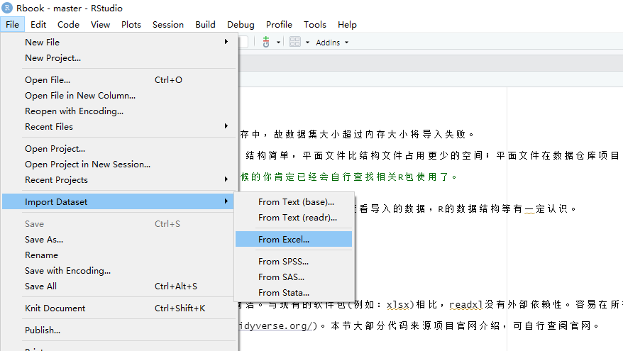
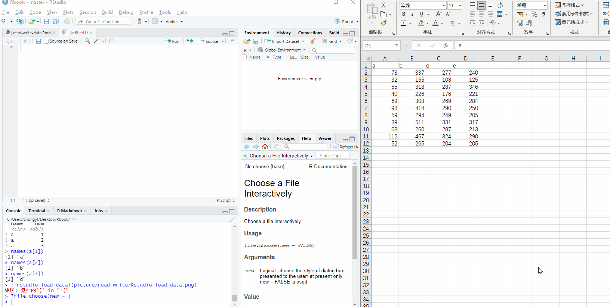
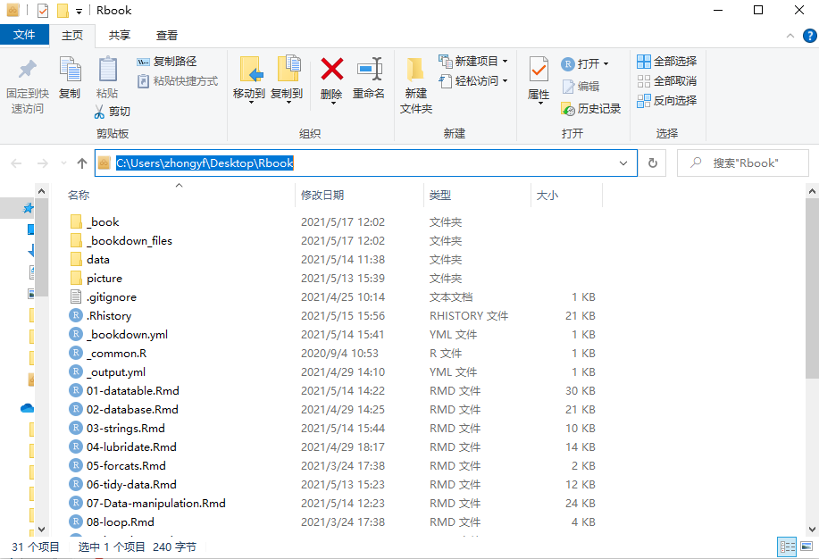
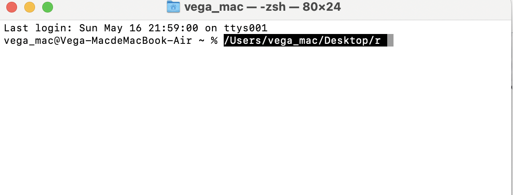

# 数据导入导出 {#data:read-write-description}


作为一名普通的数据分析师，我日常接触最多的数据是业务系统中的销售订单表、商品库存表、会员信息表，门店信息表，商品信息表等之类的业务表，但最初接触R时，看到的演示代码以及数据集大部分都是R包中内置的数据集，没有很明确操作数据的意义，没有代入感。在刚开始学习使用R做数据处理后，我就想使用自己的数据集来操作数据，用R去实现Excel的透视表或sql功能。这时就首先需要将原始数据导入[^loaddata]R中。

现实生活中数据来源复杂，商业环境中数据源同样具有多样性，如SAP,不同的数据库、OA系统、EXCEL手工文件等;我们想要统一数据做分析，就需要将不同的数据源整合导入R中。

我们从读取方式简单区分为本地文件数据、数据库数据，本章主要说明常用的Excel文件和csv[^csv]、txt等文本文件的读写方式。关于数据库的数据的读取，可以参照后续database章节。

相信大家随便使用搜索引擎搜索诸如"将Excel导入R"的关键词都能得到一些行之有效的方法，但是不够系统全面。本章主要简述R中数据导入导出的相关R包，如`readxl`,`writexl`,`openxlsx`,`readr`, `vroom`等主要处理csv或Excel的R包。


[^loaddata]:由于R是将数据加载至内存中，故数据集大小超过内存大小将导入失败。

[^csv]:csv即Comma-Separated Values，逗号分隔值，分隔符也可是不是逗号。
csv文件是一种以纯文本形式存储的表格数据,可以通过记事本打开。与Excel不同的是，CSV是一种文本格式，也不受Excel最大行数(1048576)限制。
csv文件也被称作平面文件，结构简单，平面文件比结构文件占用更少的空间；平面文件在数据仓库项目中广泛用于导入数据。 

>当有其它数据格式需求的时候，那时候的你肯定已经会自行查找相关R包使用了。


在本章开始前，假定已经有一些R相关基础。如使用Rstudio查看导入的数据，R的数据结构等有一定认识。本章节主要分为:

- excel读写
- csv等平面文件读写 
- 文件路径


## readxl {#readxl:description}

readxl软件包使R获取Excel数据变得方便简洁。与现有的软件包(例如：xlsx)相比，readxl没有外部依赖性，xlsx等包依赖java环境。readxl包容易在所有的操作系统安装使用。

readxl[项目地址](https://readxl.tidyverse.org/)，本节大部分代码来源项目官网介绍，可自行查阅官网。

### 安装{#readxl:install}

从CRAN安装最新发行版本的最简单方法是安装整个tidyverse。

```{r eval=FALSE}
install.packages("tidyverse")
```

> 由于readxl不是tidyverse核心加载包，使用时仅需加载library(readxl)

或者是从CRAN仅安装readxl;

```{r eval = FALSE}
install.packages("readxl")
```

从github安装开发版：

```{r eval = FALSE}
# install.packages("devtools")
devtools::install_github("tidyverse/readxl")
```


### 用法 {#readxl:usage}

readxl包的核心函数是读取函数`read_excel()`，该函数能将Excel文件数据加载到R中。readxl包中包含了几个示例文件，我们在接下来的案例中使用。


1.读取

通过`readxl_example()`查看readxl包中自带xlsx文件。

```{r}
library(readxl)
readxl_example()
readxl_example("clippy.xls")
```

需要注意`read_excel()`可读取xls和xlsx文件，函数会自动识别。

> xls和xlsx的区别: xls 是 excel2003 及以前版本生成的文件格式，而 xlsx 是 excel2007 及以后版本生成的文件格式。xlsx格式是向下兼容的，可兼容xls格式。老旧的业务使用的格式可能是xls格式。

```{r}
xlsx_example <- readxl_example("datasets.xlsx") #返回datasets.xlsx文件所在路径
dt <- read_excel(xlsx_example)
```

查看数据

```{r}
head(dt)
```

将Excel中的数据通过`read_excel()`读取保存到R中，该对象属于`tbl_df`类，是tidyverse系列的数据框结构，是对base R中的`data.frame`结构的改造，但是兼容`data.frame`。

```{r}
# 查看dt类
class(dt)

# 查看数据类型
str(dt)
```


> 关于`tbl_df`类，可以查阅`vignette("tibble")`。


2.指定sheet读取

通过函数`excel_sheets()`查看Excel的sheet名称

```{r}
excel_sheets(xlsx_example)
```


当我们要读取Excel文件有多个sheets时，通过指定sheet参数,读取指定的sheet，sheet参数可以是sheet的名称或顺序号。

```{r}
read_excel(xlsx_example, sheet = "chickwts")
# not run
#read_excel(xlsx_example, sheet = 1)
#read_excel(xlsx_example, sheet = 3)
```

3.指定读取范围

读取Excel文件指定范围。`read_excel()`中range参数接受单元格范围，最简单的表示方式即Excle中单元格表示方法,如 range = "D12:F15" or range = "R1C12:R6C15"。

```{r}
read_excel(xlsx_example, sheet = "iris")

dt1 <- read_excel(xlsx_example, sheet = "iris",range = 'a1:e6')

dt2 <- read_excel(xlsx_example, sheet = "iris",range = 'R1C1:R6C5')

# dt1 dt2 是否相等
identical(dt1,dt2)
```

4.read_excel参数

readxl::read_excel参数如下,请`?read_excel()`查看参数。

```{r eval=FALSE}
read_excel(path, sheet = NULL, range = NULL, col_names = TRUE,
  col_types = NULL, na = "", trim_ws = TRUE, skip = 0,
  n_max = Inf, guess_max = min(1000, n_max),
  progress = readxl_progress(), .name_repair = "unique")
```


| read_excel参数 | 解释                                                  |
| -------------- | ----------------------------------------------------- |
| path           | xls或xlsx文件的路径                                   |
| sheet          | 默认是第一个sheet，可以是数字或sheet的名称            |
| range          | Excel中表示范围的字符，或者通过cell_类方法指定        |
| col_name       | 默认为TRUE,用第一行做列名;或者用默认名称,或者指定列名 |
| col_types      | 默认为NULL，猜测各列类型，可指定各列的类型            |
| trim_ws        | 默认去掉表头字段中两边的空格                          |
| skip           | 读取之前要跳过的行数，默认为空                        |
| n_max          | 读取的最大行数                                        |
| guess_max      | 猜测列类型的最大行数,默认为1000                       |
| progress       | 读取过程是否显示进度                                  |
| .name_repair   | 自动处理列名，避免列名不为空以及不重复                |


col_types 参数个人觉得比较重要，可以指定列的类型，可以避免一些错误。可用选项:"skip", "guess", "logical", "numeric", "date", "text" or "list"。

.name_repair 参数能自动避免重复字段，可避免手工Excel出现字段名不唯一的情况。


### 批量读取

实际工作中，某文件夹下有相同格式的Excel文件(sheet名称以及列字段相同)，想要合并全部Excel数据，熟悉Excel的可以通过Excel的`power query`的获取数据完成合并，那么在R中该如何实现呢？

示例：

文件夹内 excel 文件

```{r echo=FALSE}
fs::dir_tree('data/read-write/',regexp = 'xlsx$')
```


R代码如下


```{r eval=FALSE}
allfiles <- list.files(path = './data/read-write/',pattern = '.xlsx$',full.names = T)
# 使用purrr包合并读取
purrr::map_dfr(allfiles,read_excel)
```

`list.files()`函数按照规则返回某文件目录下的全部文件。关于R语言中文件系统操作可以查看章节[R语言文件系统操作](#file:system-operation)

### 批量输出

我们按照一定条件拆解数据集，分别输出，代码如下：

```{r}
library(tidyverse)
library(readxl)

dt <- read_xlsx(path = './data/read-write/批量读写.xlsx')

dt %>% 
  group_by(name) %>% 
  group_walk(~ write.csv(.x,file = file.path('data/read-write',paste0(.y$name,'.csv'))))
list.files(path = 'data/read-write/')

```


> 暂时不用理解批量读取和输出的代码具体含义，可以先记住用法。


## writexl {#writexl}


截止到2021年5月17日，writexl包功能比较简单，仅有输出Excel功能。快速、不依赖java和Excle是它绝对的优势，并且输出文件相比`openxlsx`包较小。

[项目地址](https://docs.ropensci.org/writexl/)

### 用法 {#writexl:usage}

1.安装 

从CRAN安装发行版

```{r eval = FALSE}
install.packages("writexl")
```

2.函数参数

`write_xlsx()`函数参数如下：

```{r eval=FALSE}
write_xlsx(
  x,
  path = tempfile(fileext = ".xlsx"),
  col_names = TRUE,
  format_headers = TRUE,
  use_zip64 = FALSE
)
```


| write_xlsx参数 | 解释                                      |
| -------------- | ----------------------------------------- |
| x              | 要输出的数据框和数据框列表                |
| path           | 输出Excel的文件名称                       |
| col_names      | 是否输出表头，默认为TRUE                  |
| format_headers | 是否将表头居中并加粗，默认为TRUE          |
| use_zip64      | 是否支持4Gb文件大小，不是所有的系统都支持 |

> use_zip64:不确定该参数的理解是否正确，请自行阅读官方文档，绝大部分时候不用理解该参数。


3.输出Excel

`write_xlsx()`函数将数据框保存到Excel。如想要输出多个sheet时，用`list(mysheet1 = iris,mysheet2 = iris)`表示即可，代码如下：

```{r eval=FALSE}
library(writexl)
writexl::write_xlsx(iris,path = 'iris.xlsx')

# 输出多sheet
write_xlsx(list(mysheet1 = iris,mysheet2 = iris),path = 'iris.xlsx')

```


4.效率比较

和[`openxlsx`](#openxlsx:description)包比较输出效率。

```{r eval=FALSE }
library(microbenchmark)
library(nycflights13)
microbenchmark(
  writexl = writexl::write_xlsx(flights, tempfile()),
  openxlsx = openxlsx::write.xlsx(flights, tempfile()),
  times = 2
)
```

5.文件大小比较

和[`openxlsx`](#openxlsx:description)包比较输出后的Excel文件大小。

```{r}
library(nycflights13)
writexl::write_xlsx(flights, tmp1 <- tempfile())
file.info(tmp1)$size
```


```{r}
openxlsx::write.xlsx(flights, tmp2 <- tempfile())
file.info(tmp2)$size
```

按照`writexl`官方文档的说法，`writexl`输出的Excel文件应该较少，但实际上并不是，不确定是不是`openxlsx`更新优化过。

6.其它功能

Excel 公式以及超级链接格式。

```{r eval=FALSE}
df <- data.frame(
  name = c("UCLA", "Berkeley", "Jeroen"),
  founded = c(1919, 1868, 2030),
  website = xl_hyperlink(c("http://www.ucla.edu", "http://www.berkeley.edu", NA), "homepage")
)
df$age <- xl_formula('=(YEAR(TODAY()) - INDIRECT("B" & ROW()))')
write_xlsx(df, 'universities.xlsx')

# cleanup
unlink('universities.xlsx')
```


当需要输出大型Excel文件时，比如超过50万行，我会采用`writexl`包输出。但是在曾经使用过程中，定时任务采用writexl包输出Excel有时会报错，感觉不稳定，原因不明。现在一般临时性的输出我会采用`writexl`包，定时任务中采用[`openxlsx`](#openxlsx:description)

## openxlsx {#openxlsx:description}

openxlsx是当我需要定制输出Excel表格或报表时常用R包。目前该包的版本4.2.3，通过使用Rcpp加速，包的读写速度在Excel的百万级下是可接受状态，包的相关函数功能完善且简易好用，并且正在积极开发中，相信它以后功能会越来越强大。

项目官方地址:<https://ycphs.github.io/openxlsx/index.html>

openxlsx主要优势：

- 不依赖java环境
- 读写速度可接受
- 可设置条件格式，与Excel中『开始』选项卡的条件格式功能接近
- 可批量插入ggplot2图
- 可插入公式
- 可渲染大部分Excel格式，并且效率相比部分python包高效
- 可添加页眉页脚以及其他格式，方便直接打印
- 功能稳定可用并且在积极开发中

版本信息查看

```{r}
packageVersion("openxlsx")
```


关于openxlsx更加详细的阐述:<https://mp.weixin.qq.com/s/ZD0dJb0y8fsWGI1dCPh2mQ>

### 安装 {#openxlsx:install}

从CRAN安装发行版

```{r eval=FALSE}
# 稳定版
install.packages("openxlsx", dependencies = TRUE, repos = "https://mirrors.tuna.tsinghua.edu.cn/CRAN/")
```

从Github安装开发版

```{r eval = FALSE}
install.packages(c("Rcpp", "devtools"), dependencies = TRUE)
library(devtools)
install_github("ycphs/openxlsx")
```


### 基础功能 {#openxlsx:functions}

本文仅呈现基础功能部分，即读写EXCEL文件。其它功能，请查阅项目官方地址或微信公众号文章[R包-openxlsx-学习笔记](https://mp.weixin.qq.com/s/ZD0dJb0y8fsWGI1dCPh2mQ)

#### 读取Excel {#openxlsx:read-function}

read.xlsx()是读取函数，主要参数如下：

```{r eval=FALSE}
library(openxlsx)
read.xlsx(
  xlsxFile,
  sheet = 1,
  startRow = 1,
  colNames = TRUE,
  rowNames = FALSE,
  detectDates = FALSE,
  skipEmptyRows = TRUE,
  skipEmptyCols = TRUE,
  rows = NULL,
  cols = NULL,
  check.names = FALSE,
  sep.names = ".",
  namedRegion = NULL,
  na.strings = "NA",
  fillMergedCells = FALSE
)
```

以上参数中需要注意 ：

detecDates参数，当你的Excel表格中带日期列时需要将参数设置为TRUE,不然将会把日期识别为数字读入。


fillMergedCells参数，当你读取的表格中存在合并单元格，将用值填充其他全部单元格,如下所示：


```{r eval=FALSE}
read.xlsx('./test.xlsx',detectDates = TRUE,fillMergedCells = TRUE)
```

读取后如下所示：


readWorkbook()也可以读取Excel表格数据，参数与read.xlsx基本一致。

```{r eval=FALSE}
xlsxFile <- system.file("extdata", "readTest.xlsx", package = "openxlsx")
df1 <- readWorkbook(xlsxFile = xlsxFile, sheet = 1)
```

#### 写入Excel {#openxlsx:write-function}

数据清洗完之后，或者是透视表已经完成，需要将结果从R导出到Excle，这时就利用函数将结果数据集写入Excle中。

write.xlsx()函数写入

```{r eval=FALSE}
write.xlsx(iris, file = "writeXLSX1.xlsx", colNames = TRUE, borders = "columns")
```


带格式输出

```{r eval=FALSE}
hs <- createStyle(
  textDecoration = "BOLD", fontColour = "#FFFFFF", fontSize = 12,
  fontName = "Arial Narrow", fgFill = "#4F80BD"
)
## Not run: 
write.xlsx(iris,
  file = "writeXLSX3.xlsx",
  colNames = TRUE, borders = "rows", headerStyle = hs
)
```

[#4F80BD](https://www.sioe.cn/yingyong/yanse-rgb-16/)格式属于十六进制颜色码。


### 定制格式输出

openxlsx包有两套输出函数，`wrire.xlsx()`是其中一种，还有如下一种。

输出过程共分为四步，第一步创建workbook,第二步添加sheet,第三步写入数据，第四步保存workbook。在输出的过程中可以通过`addStyle()`、`createStyle()`或`conditionalFormatting`添加格式或条件格式。


```{r eval=FALSE}
df <- data.frame(a=1:10,b=1:10,d=1:10)
wb <- createWorkbook(creator = 'zhongyf',title = 'test')
addWorksheet(wb,sheetName = 'test')
writeDataTable(wb,sheet = 'test',x = df)
saveWorkbook(wb, "test.xlsx", overwrite = TRUE)
```


我们以上面四步输出的方式，查看包自带的例子。

- createWorkbook()

- addWorksheet()

- writeDataTable()

- saveWorkbook()


```{r eval=FALSE}
wb <- createWorkbook("Fred")

## Add 3 worksheets
addWorksheet(wb, "Sheet 1")
addWorksheet(wb, "Sheet 2", gridLines = FALSE)
addWorksheet(wb, "Sheet 3", tabColour = "red")
addWorksheet(wb, "Sheet 4", gridLines = FALSE, tabColour = "#4F81BD")

## Headers and Footers
addWorksheet(wb, "Sheet 5",
  header = c("ODD HEAD LEFT", "ODD HEAD CENTER", "ODD HEAD RIGHT"),
  footer = c("ODD FOOT RIGHT", "ODD FOOT CENTER", "ODD FOOT RIGHT"),
  evenHeader = c("EVEN HEAD LEFT", "EVEN HEAD CENTER", "EVEN HEAD RIGHT"),
  evenFooter = c("EVEN FOOT RIGHT", "EVEN FOOT CENTER", "EVEN FOOT RIGHT"),
  firstHeader = c("TOP", "OF FIRST", "PAGE"),
  firstFooter = c("BOTTOM", "OF FIRST", "PAGE")
)

addWorksheet(wb, "Sheet 6",
  header = c("&[Date]", "ALL HEAD CENTER 2", "&[Page] / &[Pages]"),
  footer = c("&[Path]&[File]", NA, "&[Tab]"),
  firstHeader = c(NA, "Center Header of First Page", NA),
  firstFooter = c(NA, "Center Footer of First Page", NA)
)

addWorksheet(wb, "Sheet 7",
  header = c("ALL HEAD LEFT 2", "ALL HEAD CENTER 2", "ALL HEAD RIGHT 2"),
  footer = c("ALL FOOT RIGHT 2", "ALL FOOT CENTER 2", "ALL FOOT RIGHT 2")
)

addWorksheet(wb, "Sheet 8",
  firstHeader = c("FIRST ONLY L", NA, "FIRST ONLY R"),
  firstFooter = c("FIRST ONLY L", NA, "FIRST ONLY R")
)

addWorksheet(wb,'dataframe')

## Need data on worksheet to see all headers and footers
writeData(wb, sheet = 5, 1:400)
writeData(wb, sheet = 6, 1:400)
writeData(wb, sheet = 7, 1:400)
writeData(wb, sheet = 8, 1:400)
writeDataTable(wb,sheet = 'dataframe',iris)
## Save workbook
## Not run: 
saveWorkbook(wb, "addWorksheetExample.xlsx", overwrite = TRUE)
```

### 函数参数


本小节主要讲`createWorkbook()`，` addWorksheet()`,`writeDataTable()`,`saveWorkbook()`四个函数的参数以及用法。

- createWorkbook

```{r eval=FALSE }
createWorkbook(
  creator = ifelse(.Platform$OS.type == "windows", Sys.getenv("USERNAME"),
    Sys.getenv("USER")),
  title = NULL,
  subject = NULL,
  category = NULL
)
```

```{r eval=FALSE}
wb <- createWorkbook(
  creator = "宇飞的世界",
  title = "标题",
  subject = "主题",
  category = "类别目录"
)

```


- addWorksheet


```{r eval=FALSE}
addWorksheet(
  wb,
  sheetName,
  gridLines = TRUE,
  tabColour = NULL,
  zoom = 100,
  header = NULL,
  footer = NULL,
  evenHeader = NULL,
  evenFooter = NULL,
  firstHeader = NULL,
  firstFooter = NULL,
  visible = TRUE,
  paperSize = getOption("openxlsx.paperSize", default = 9),
  orientation = getOption("openxlsx.orientation", default = "portrait"),
  vdpi = getOption("openxlsx.vdpi", default = getOption("openxlsx.dpi", default = 300)),
  hdpi = getOption("openxlsx.hdpi", default = getOption("openxlsx.dpi", default = 300))
)
```


```{r eval=FALSE}
gridLines参数：表格中是否有网格线，在Excle『视图』选项卡下面的网格线去除打勾的效果一致

tabColour参数：输出表格sheet标签颜色

zoom：发大缩小，默认是100，可选范围10-400

header:页眉 长度为3的字符向量，左、中、右三个位置，用Na可跳过一位置，以下页眉页脚相同。

footer: 页脚

evenHeader: 每页页眉

evenFooter: 每页页脚

firstHeader: 第一页页眉

firstFooter: 第一页页脚

visible:sheet是否隐藏，如果为否sheet将被隐藏

paperSize:页面大小,详见 ?pageSetup 

orientation:One of "portrait" or "landscape" 不清楚干嘛用

vdpi: 屏幕分辨率 默认值即可，不用调整

hdpi: 屏幕分辨率 默认值即可，不用调整
```


- writeDataTable

writeDataTable()函数将data.frame写入Excel。

```{r eval=FALSE}
writeDataTable(
  wb,
  sheet,
  x,
  startCol = 1,
  startRow = 1,
  xy = NULL,
  colNames = TRUE,
  rowNames = FALSE,
  tableStyle = "TableStyleLight9",
  tableName = NULL,
  headerStyle = NULL,
  withFilter = TRUE,
  keepNA = FALSE,
  na.string = NULL,
  sep = ", ",
  stack = FALSE,
  firstColumn = FALSE,
  lastColumn = FALSE,
  bandedRows = TRUE,
  bandedCols = FALSE
)
```


- saveWorkbook

```{r eval=FALSE}
saveWorkbook(wb, file, overwrite = FALSE, returnValue = FALSE)
```

参数较为简单，wb即上文中的workbook对象，file即输出的文件名，overwrite即如果存在是否覆盖，returnValue如果设置为TRUE，返回TRUE代表保存成功

### 总结

openxlsx包功能较为强大，更多详细用法大家可自行探索，或关注我的语雀笔记，笔记会不定期持续更新。

R包openxlsx学习笔记:<https://www.yuque.com/docs/share/7a768e6f-95e0-417c-a9b5-dfc8862dc6be?#>

语雀个人主页:<https://www.yuque.com/zyufei>


## readr {#readr:package}


readr提供了一种快速友好的方式读取矩形数据[^矩形数据](如：csv,tsv,fwf)，且当读取大型数据集时默认有进度条显示。

[^矩形数据]:矩形数据英文中表示为 rectangular data，矩形数据每一列都是变量(特征)，而每一行都是案例或记录,关系数据库中的单表就是矩形数据的一种。


如果对readr包不熟悉，可以直接阅读包作者，大神Hadley Wickham的书R for data science 中[data import chapter](https://r4ds.had.co.nz/data-import.html)章节。


### 安装 {#readr:install}

由于readr包是tidyverse系列核心包，可以直接安装tidyverse使用，或者单独安装readr。

```{r eval= FALSE}
# 安装整个tidyverse
install.packages("tidyverse")

# 仅安装readr
install.packages("readr")

# 从github安装开发版
# install.packages("devtools")
devtools::install_github("tidyverse/readr")
```


### 用法 {#readr:usage}

readr包是tidyverse系列的核心包，可以加载tidyverse使用。

```{r}
library(tidyverse)
# 或者
library(readr)
```

#### 主要函数

readr包支持七种`read_`功能的文件格式。

— `read_csv()`:逗号分隔符文件
- `read_tsv()`:制表符分割文件
- `read_delim()`:规定分隔符文件
- `read_fwf()`:固定宽度文件
- `read_table()`:表格文件，列间用空格隔开
- `read_log()`:Web日志文件


在大多数情况下，我们常使用`read_csv()`，提供文件路径，将得到数据表。示例如下:

```{r}
mtcars <- read_csv(readr_example("mtcars.csv"))
```

通过上述输出反馈，我们可以知道读进去的数据集每列类型。如果发现不对可以通过`col_types`参数修改。大多数情况下，我们并不需要指定列的类型，readr会自动猜测列类型。

```{r}
mtcars <- read_csv(readr_example("mtcars.csv"), col_types = 
  cols(
    mpg = col_double(),
    cyl = col_integer(),
    disp = col_double(),
    hp = col_integer(),
    drat = col_double(),
    vs = col_integer(),
    wt = col_double(),
    qsec = col_double(),
    am = col_integer(),
    gear = col_integer(),
    carb = col_integer()
  )
)
```

#### 参数

`read_csv()`的参数如下：

```{r eval =FALSE}
read_csv(
  file,
  col_names = TRUE,
  col_types = NULL,
  locale = default_locale(),
  na = c("", "NA"),
  quoted_na = TRUE,
  quote = "\"",
  comment = "",
  trim_ws = TRUE,
  skip = 0,
  n_max = Inf,
  guess_max = min(1000, n_max),
  progress = show_progress(),
  skip_empty_rows = TRUE
)
```

通过对前文readxl的了解，我们发现两个函数的部分参数是一致的。

col_types :指定列类型，可用项如下所示(含简写):
c = character，i = integer，n = number，d = double，l = logical，f = factor，D = date，T = date time，t = time，默认值为guess.
  
locale:locale参数是readr中很重要的一个参数，指定日期使用的月和日的名称，时区，字符编码，日期格式，数字的小数和点位数和分隔符。


`locale()`的第一个参数是date_names，控制月份和日期的名称，指定最简单的方式[ ISO 639 language code](https://en.wikipedia.org/wiki/List_of_ISO_639-1_codes)

```{r}
locale('zh') # 中文
locale('ja') #日本
locale('ko') #韩国
```

编码和时区问题是我们常面临的问题， 不正确设定导致我们的数据读取错误。

```{r eval=FALSE}
read_csv(readr_example("mtcars.csv"),locale = locale(encoding = 'UTF-8',tz = 'Asia/Shanghai'))
```

关于locales,详细信息查看手册`vignette("locales")`。


### 导出功能 {#readr:write-function}

由于系统缘故，在win系统下可能面临编码问题。我用readr导出数据时一般采用`write_excel_csv()`功能导出，目前还未遇到乱码情况。

需要说明的是`write_`系列函数可以将输出文件压缩。

```{r eval=FALSE}
data(storms, package = "dplyr")
write_csv(storms, "storms.csv")
write_csv(storms, "storms.csv.gz")
```

### 总结

大部分情况下，当数据整洁时且不涉及时间(日期不影响)时，采用默认参数读取数据即可。当数据集前面行缺失值较多，readr自动猜数据列类型错误时，需要我们人为指定列类型。

```{r eval=FALSE}
read_csv('test.csv',col_types = 'cccnnnnDcnn')
```


由于Excel数字位数限制，在输出数字订单号或身份证时需要注意,:

```{r eval=FALSE}
id_card <- c('440327199910010123','440327199910010125')
write_excel_csv(data.frame(id_card),'test.csv')
```

> Excel最多只能存储15位数字型数字，15为之后都为0。

上面的输出显然会改变真实的身份证号码，这时我们就建议输出为xlsx的字符型或者是txt等格式，因为输出CSV会导致后面的全部变成0。

当编码时区不一致时，需指定`locale()`，如下：

```{r eval=FALSE}
read_csv(readr_example("mtcars.csv"),locale = locale(encoding = 'UTF-8',tz = 'Asia/Shanghai'))
```


## vroom {#data:vroom} 

vroom实现读取矩形数据到R中,如 comma separated(csv),tab separated(tsv), fixed width files(fwf)。该包的功能类似`readr::read_csv()`,`data.table::fread()`和`read.csv()`,但是对于许多数据集来说，`vroom::vroom()`读取速度会快得多。

[vroom项目地址](https://vroom.r-lib.org/index.html)

### 安装


```{r eval=FALSE}
# 从cran安装
install.packages("vroom")
# install.packages("devtools")
devtools::install_dev("vroom")
```

### 用法

1. 读取文件

```{r}
library(vroom)
file <- vroom_example("mtcars.csv")
file

vroom(file)
vroom(file, delim = ",")
```

2. 读取多文件

即`vroom::vroom()`具备迭代效果,具体情况如下：

```{r eval=FALSE}
mt <- tibble::rownames_to_column(mtcars, "model")
purrr::iwalk(
  split(mt, mt$cyl),
  ~ vroom_write(.x, glue::glue("mtcars_{.y}.csv"), "\t")
)

files <- fs::dir_ls(glob = "mtcars*csv")
files

# read_csv

purrr::map_dfr(files,readr::read_delim,delim="\t")

# vroom same above
vroom(files) 
```

3. 读取压缩文件

vroom支持zip,gz,bz2,xz等压缩文件，只需要将压缩文件名称传递给vroom即可。

```{r eval=FALSE}
file <- vroom_example("mtcars.csv.gz")

vroom(file)
```

4. 读取网络文件

```{r}
#file <- "https://raw.githubusercontent.com/r-lib/vroom/master/inst/extdata/mtcars.csv"
file <- "http://www.zhongyufei.com/Rbook/data/data-table-groupingsets.csv"
vroom(file)

```

5. 选择列读取

room提供了与`dplyr::select()`相同的列选择和重命名接口

```{r}
file <- vroom_example("mtcars.csv.gz")

vroom(file, col_select = c(model, cyl, gear))

# vroom(file, col_select = c(1, 3, 11))

# vroom(file, col_select = list(car = model, everything()))
```


## Rstudio导入 {#data:rstudio-addins}


### 利用rstudio工具栏导入

本质也是调用`readr`和`readxl`包，如下所示：




### 插件导入

[项目地址](https://github.com/milesmcbain/datapasta)

datapasta是一个addins插件，方便将数据复制到R。

1.安装

```{r eval=FALSE}
install.packages("datapasta")
```

2.使用


 
 
## 文件路径 {#data:file-path}


我们读取数据时都是读取某路径下的某文件，但是由于系统等原因，路径在不同系统下的表示方式不一致。

### 指定路径

- win 路径

winOS系统：`C:\Users\zhongyf\Desktop\Rbook`，注意路径中是一个反斜杠(\)。



在R中读取时需要用一个正斜杠或两个反斜杠。

```{r eval=FALSE}
readr::read_csv('C:/Users/zhongyf/Desktop/Rbook/data/flights.csv')
readr::read_csv('C:\\Users\\zhongyf\\Desktop\\Rbook\\data\flights.csv') # same above
readr:::read_csv(file = r"(C:\Users\zhongyf\Desktop\Rbook\data\flights.csv)") # same above
```

工作中，当需要读取或写入共享盘[^共享盘]中文件时，路径表示方式为：

[^共享盘]:共享盘的地址即某电脑(服务器)的地址，知道共享盘在局域网中的ip地址后在 开始->运行中输入\\192.168.1.247即可打开共享盘。

```{r eval=FALSE}
the_shared_disk <- r"(\\192.168.2.117\公司A-新\01事业部\)"

# load data into R

readr::read_csv(file = "\\\\192.168.2.117\\公司A-新\\01事业部\\flights.csv")
readr::read_csv(file = r"(\\192.168.2.117\公司A-新\01事业部\)")

```

> r"()"用法是R-4.0-之后的特性。在win系统下表示路径特别有用


- mac 路径

macOS系统: `/User/vega_mac/Desktop/r`,路径中是一个正斜杠。



```{r eval=FALSE}
readr::read_csv('/User/vega_mac/Desktop/r/Rbook/data/flights.csv')
```

### 默认路径

`getwd()`是查看当前工作目录的函数，在进行文件读写时的默认路径，也就是当没有明确指定路径时，读取导出的默认路径是`getwd()`。想要改变工作目录，通过设定`setwd()`即可。


```{r}
getwd()
```

```{r eval=FALSE}
# not run
setwd('C:/Users/zhongyf/Desktop/Rbook/data')
getwd()
```

## 拓展 {#data:expand}

1. feather项目地址<https://github.com/wesm/feather>

2. qs提供接口，用于快速将R对象保存到磁盘以及从磁盘读取。该包的目标是替换R中的`saveRDS`和`readRDS`。项目地址<https://github.com/traversc/qs>

3. arrow是feather的接替项目，地址<https://arrow.apache.org/docs/r/>

4. 其它统计学软件数据如spss，stata,SAs等可用`foreign`包读取
